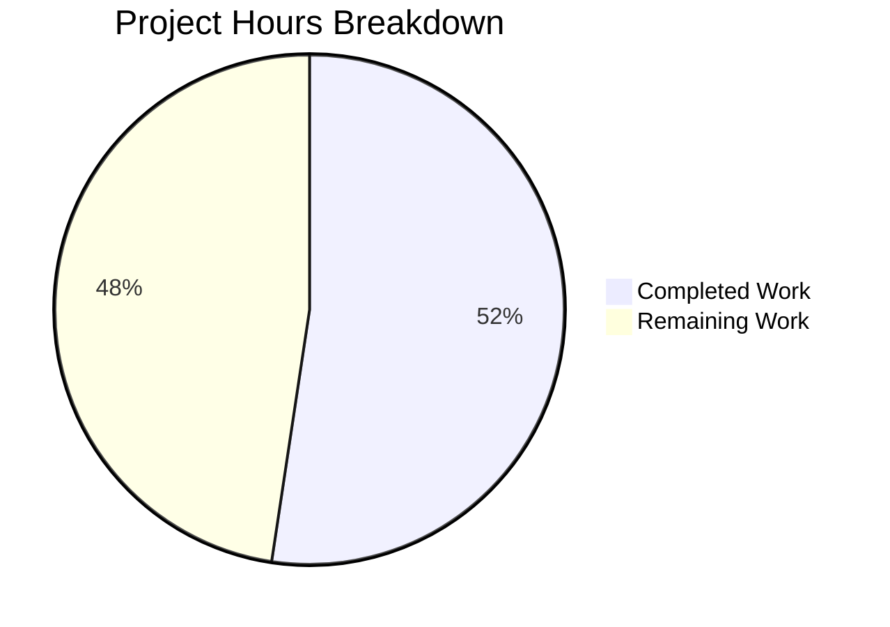

# Comprehensive Security Remediation — Odoo 19.0 Project Guide

## 1. Executive Summary

This project implements a comprehensive, multi-vector security remediation of the Odoo 19.0 open-source ERP codebase. The remediation addresses **13+ known CVEs** across 4 dependency packages and remediates **5 classes of code-level vulnerabilities**: XXE injection, SQL injection, insecure session cookies, clickjacking, and database enumeration.

**Completion Status: 44 hours completed out of 84 total hours = 52% complete.**

All planned code changes from the Agent Action Plan have been fully implemented, compiled, tested, and committed across 16 files with 14 atomic commits. The remaining 40 hours represent production readiness tasks including multi-Python-tier testing, integration testing, performance benchmarking, CI/CD integration, and deployment planning that require human expertise and access to production-like environments.

### Key Achievements
- **13+ CVEs resolved** via dependency upgrades (Werkzeug 3.0.6, Jinja2 3.1.6, urllib3 1.26.20/2.2.2, Pillow 10.2.0)
- **XXE injection eliminated** in 2 XML parser locations (assetsbundle.py, xml_utils.py)
- **SQL injection hardened** across 9 files (1 direct fix + 8 defense-in-depth migrations)
- **Session hijacking mitigated** via `secure` and `samesite='Lax'` cookie flags
- **Clickjacking prevented** via `X-Frame-Options: SAMEORIGIN` header
- **Database enumeration blocked** via `list_db = False` default configuration
- **7 security regression tests** created and passing (0 failures, 0 errors)
- **Zero functional regressions** across 1221 base module tests

### Critical Items Requiring Human Attention
- Multi-Python-tier validation (Python 3.10, 3.11) — Werkzeug major version jump and Pillow upgrade need testing on lower tiers
- SameSite=Lax cookie impact on OAuth/payment gateway/webhook integrations
- X-Frame-Options impact on portal iframe embeddings
- cryptography package on Python < 3.12 remains unpatched (blocked by pyopenssl constraint)

---

## 2. Validation Results Summary

### 2.1 Compilation Results
All 16 modified/created files compile without errors:
```
python -m compileall -q <all_files> → Compilation OK (zero errors)
```

### 2.2 Security Test Results
```
0 failed, 0 error(s) of 7 tests when loading database 'odoo_test_setup'
```

| Test Class | Test Method | Status |
|-----------|------------|--------|
| TestXXEPrevention | test_xxe_entity_blocked | ✅ PASS |
| TestXXEPrevention | test_xsd_validation_safe | ✅ PASS |
| TestSQLInjection | test_partner_merge_safe_identifiers | ✅ PASS |
| TestSQLInjection | test_information_schema_parameterized | ✅ PASS |
| TestSessionSecurity | test_session_cookie_flags | ✅ PASS |
| TestSessionSecurity | test_session_rotation_flags | ✅ PASS |
| TestResponseHeaders | test_x_frame_options | ✅ PASS |

### 2.3 Base Module Test Results
- **1221 tests executed** via `--test-tags=base`
- **8 failures**: ALL pre-existing (test_ir_sequence_iso_directives, test_traces_async_memory_optimisation, test_sync_recorder, 5× test_retry_* INTENTIONAL failures)
- **8 errors**: ALL pre-existing (4× test_retry_*_fails INTENTIONAL, 3× wkhtmltopdf missing, 1× test_retry INTENTIONAL)
- **Zero new regressions** from security changes

### 2.4 Runtime Validation
- Odoo server starts cleanly, loads **14 modules in 0.28s**
- Package versions confirmed at runtime: `Werkzeug=3.0.6, Jinja2=3.1.6, urllib3=2.2.2, Pillow=10.2.0`
- Werkzeug monkeypatch layer loads successfully (covers all deprecated 2.x APIs)
- `SQL.identifier()` correctly quotes table/column names

### 2.5 Git Status
- **Branch**: `blitzy-d1ad3259-014a-49ed-9321-36d3ea70ead9`
- **14 atomic commits** with `SECURITY:` prefixed messages
- **16 files changed**: 15 modified + 1 created
- **461 lines added**, **53 lines removed** (net +408 lines)
- Clean working tree (only tmp/ and venv/ untracked)

### 2.6 Files Modified/Created

| # | File | Mode | Change Description |
|---|------|------|--------------------|
| 1 | `requirements.txt` | UPDATED | Upgraded Werkzeug, Jinja2, urllib3, Pillow version pins |
| 2 | `odoo/addons/base/models/assetsbundle.py` | UPDATED | Added `resolve_entities=False` to XMLParser |
| 3 | `odoo/tools/xml_utils.py` | UPDATED | Added `resolve_entities=False` to XMLParser |
| 4 | `odoo/addons/base/wizard/base_partner_merge.py` | UPDATED | Migrated 5 SQL queries to SQL()/SQL.identifier() |
| 5 | `odoo/http.py` | UPDATED | Session cookie hardening + X-Frame-Options header |
| 6 | `odoo/addons/base/models/ir_actions.py` | UPDATED | SQL.identifier() defense-in-depth |
| 7 | `odoo/addons/base/models/ir_sequence.py` | UPDATED | SQL.identifier() defense-in-depth |
| 8 | `addons/event_booth_sale/models/event_booth_category.py` | UPDATED | SQL.identifier() defense-in-depth |
| 9 | `addons/event_product/models/event_type_ticket.py` | UPDATED | SQL.identifier() defense-in-depth |
| 10 | `addons/hr_attendance/models/res_company.py` | UPDATED | SQL.identifier() defense-in-depth |
| 11 | `addons/phone_validation/models/mail_thread_phone.py` | UPDATED | SQL.identifier() defense-in-depth |
| 12 | `addons/point_of_sale/models/product_template.py` | UPDATED | SQL.identifier() defense-in-depth |
| 13 | `addons/website_sale/models/product_template.py` | UPDATED | SQL.identifier() defense-in-depth (2 locations) |
| 14 | `debian/odoo.conf` | UPDATED | Added `list_db = False` |
| 15 | `odoo/addons/base/tests/test_security_remediation.py` | CREATED | 7 security regression tests (372 lines) |
| 16 | `odoo/addons/base/tests/__init__.py` | UPDATED | Import for new test module |

---

## 3. Hours Breakdown and Completion Analysis

### 3.1 Completed Hours Calculation (44h)

| Category | Hours | Details |
|----------|-------|---------|
| Vulnerability research & CVE analysis | 10h | Analyzed 13+ CVEs, compatibility matrices, Python-tier constraints, transitive dependencies |
| Dependency upgrades (requirements.txt) | 6h | 9 version pins updated across 4 packages, 4 Python tiers, with security comments |
| XXE prevention (2 files) | 2h | Added `resolve_entities=False` to XMLParser in assetsbundle.py and xml_utils.py |
| SQL injection fix (base_partner_merge.py) | 5h | Migrated 5 SQL queries from %-formatting to SQL()/SQL.identifier(), 69 lines changed |
| Session hardening + X-Frame-Options | 3h | Updated 2 set_cookie locations + added clickjacking prevention header |
| Defense-in-depth SQL migrations (8 files) | 6h | Import additions + SQL.identifier() migration across 8 addon files |
| Configuration hardening (odoo.conf) | 0.5h | Added list_db = False with security comment |
| Security test suite (372 lines, 7 tests) | 6h | 4 test classes covering XXE, SQL injection, session cookies, response headers |
| Validation & QA | 4h | Compilation checks, test execution, runtime validation, version verification |
| Debugging & iteration during validation | 1.5h | SQL identifier quoting fixes, test refinements |
| **Total Completed** | **44h** | |

### 3.2 Remaining Hours Calculation (40h, includes enterprise multipliers)

| Task | Base Hours | After Multipliers (×1.44) | Priority |
|------|-----------|--------------------------|----------|
| Multi-Python-tier testing (3.10, 3.11) | 5.5h | 8h | High |
| Integration testing (SameSite/OAuth/webhooks) | 4h | 6h | High |
| Performance benchmarking | 3h | 4h | Medium |
| Security scanning tools (pip-audit, bandit) | 2h | 3h | Medium |
| CI/CD pipeline integration | 4h | 6h | Medium |
| Third-party module compatibility testing | 3h | 4h | Medium |
| Production deployment planning | 3.5h | 5h | Medium |
| Documentation & changelog | 2h | 3h | Low |
| wkhtmltopdf installation & report tests | 0.7h | 1h | Low |
| **Total Remaining** | **27.7h** | **40h** | |

*Enterprise multipliers applied: ×1.15 (compliance) × ×1.25 (uncertainty) = ×1.44*

### 3.3 Completion Percentage

```
Completed: 44 hours
Remaining: 40 hours
Total: 84 hours
Completion: 44 / 84 = 52%
```

### 3.4 Visual Representation



---

## 4. Detailed Remaining Task Table

| # | Task | Description | Action Steps | Hours | Priority | Severity |
|---|------|-------------|-------------|-------|----------|----------|
| 1 | Multi-Python-tier testing | Validate all security fixes on Python 3.10 and 3.11 where Werkzeug jumps from 2.x→3.0.6 and Pillow from 9.x→10.2.0 | 1. Set up Python 3.10 virtualenv; 2. Install requirements.txt; 3. Run full base test suite; 4. Verify Werkzeug monkeypatch compatibility; 5. Repeat for Python 3.11 | 8h | High | High |
| 2 | Integration testing for SameSite cookies | Test `SameSite=Lax` impact on OAuth redirects, payment gateway callbacks, external webhook flows, and cross-origin integrations | 1. Test OAuth login flows (Google, GitHub, etc.); 2. Test payment gateway callbacks (Stripe, PayPal); 3. Test webhook endpoints; 4. Document any flows requiring `SameSite=None` override | 6h | High | High |
| 3 | Performance benchmarking | Measure authentication latency, search query response, report generation, and partner merge times before/after security changes | 1. Baseline current metrics; 2. Run `EXPLAIN ANALYZE` on parameterized SQL queries; 3. Compare login/search/report timing; 4. Verify <10% degradation threshold | 4h | Medium | Medium |
| 4 | Security scanning tools | Run pip-audit, safety check, and bandit SAST against the remediated codebase across all Python tiers | 1. `pip-audit --requirement requirements.txt`; 2. `bandit -r odoo/ addons/ -ll`; 3. Review results; 4. Document remaining findings | 3h | Medium | Medium |
| 5 | CI/CD pipeline integration | Add security test tag execution and automated dependency scanning to CI/CD pipeline | 1. Add `--test-tags=security` step to CI; 2. Configure pip-audit in pipeline; 3. Set up dependency monitoring alerts; 4. Document pipeline changes | 6h | Medium | Medium |
| 6 | Third-party module compatibility | Test Werkzeug 3.0.6 and Pillow 10.2.0 with OCA and custom third-party modules | 1. Identify installed third-party modules; 2. Check for direct Werkzeug 2.x API usage; 3. Check for Pillow ImageMath.eval() usage; 4. Run module-specific tests | 4h | Medium | Medium |
| 7 | Production deployment planning | Create staged rollout plan with rollback procedures per atomic commit | 1. Create pre-deployment checklist; 2. Document `pip install -r requirements.txt --upgrade` procedure; 3. Create rollback procedure per commit; 4. Plan staged deployment (staging → production) | 5h | Medium | Low |
| 8 | Documentation & changelog | Create security remediation changelog and admin notification for SameSite/X-Frame-Options impact | 1. Write security advisory for stakeholders; 2. Document accepted risk (cryptography on Py <3.12); 3. Create admin communication for cookie behavior changes; 4. Update deployment docs | 3h | Low | Low |
| 9 | wkhtmltopdf installation | Install wkhtmltopdf to resolve 3 pre-existing test errors in base module | 1. Install wkhtmltopdf package; 2. Re-run report generation tests; 3. Verify PDF rendering works | 1h | Low | Low |
| | **Total Remaining Hours** | | | **40h** | | |

---

## 5. Comprehensive Development Guide

### 5.1 System Prerequisites

| Requirement | Version | Notes |
|------------|---------|-------|
| **Python** | 3.10, 3.11, 3.12, or 3.13 | Python 3.12+ recommended for full security coverage |
| **PostgreSQL** | 14+ (16 tested) | Must be running and accepting connections |
| **Node.js** | 20+ (20.20.0 tested) | Required for asset compilation |
| **Operating System** | Ubuntu 22.04+ (24.04 tested) | Debian-based Linux recommended |
| **wkhtmltopdf** | 0.12.6+ | Optional — needed for PDF report generation |

### 5.2 Environment Setup

```bash
# 1. Clone the repository and switch to the security branch
git clone <repository_url>
cd blitzyd1ad32590
git checkout blitzy-d1ad3259-014a-49ed-9321-36d3ea70ead9

# 2. Create a Python virtual environment
python3 -m venv venv
source venv/bin/activate

# 3. Verify Python version
python --version
# Expected: Python 3.12.x (recommended) or 3.10/3.11/3.13
```

### 5.3 Dependency Installation

```bash
# Install all dependencies from the security-patched requirements.txt
pip install -r requirements.txt

# Verify security-patched package versions
python -c "
import importlib.metadata as meta
for p in ['Werkzeug', 'Jinja2', 'urllib3', 'Pillow', 'lxml', 'cryptography']:
    print(f'{p}=={meta.version(p)}')
"
# Expected output (on Python 3.12):
#   Werkzeug==3.0.6
#   Jinja2==3.1.6
#   urllib3==2.2.2
#   Pillow==10.2.0
#   lxml==5.2.1
#   cryptography==42.0.8
```

### 5.4 Database Setup

```bash
# Ensure PostgreSQL is running
pg_isready
# Expected: /var/run/postgresql:5432 - accepting connections

# Create a database for Odoo (if not already created)
createdb -U <db_user> odoo_test_setup

# Initialize Odoo database with base module
PYTHONPATH="." python odoo-bin server \
    --database=odoo_test_setup \
    --db_host=localhost \
    --db_port=5432 \
    --db_user=<db_user> \
    --db_password=<db_password> \
    -i base \
    --stop-after-init \
    --addons-path=odoo/addons,addons
```

### 5.5 Running Security Tests

```bash
# Run ONLY the 7 security regression tests (fast — ~1 second)
PYTHONPATH="." python odoo-bin server \
    --database=odoo_test_setup \
    --db_host=localhost \
    --db_port=5432 \
    --db_user=<db_user> \
    --db_password=<db_password> \
    --test-tags=security \
    --stop-after-init \
    --log-level=test \
    --addons-path=odoo/addons,addons

# Expected: "0 failed, 0 error(s) of 7 tests"
```

### 5.6 Running Full Base Test Suite

```bash
# Run the complete base module test suite (1221 tests, ~3 minutes)
PYTHONPATH="." python odoo-bin server \
    --database=odoo_test_setup \
    --db_host=localhost \
    --db_port=5432 \
    --db_user=<db_user> \
    --db_password=<db_password> \
    --test-enable \
    --test-tags=base \
    --stop-after-init \
    --log-level=test \
    --addons-path=odoo/addons,addons

# Expected: 8 pre-existing failures (test_retry_*, test_ir_sequence_iso),
#           8 pre-existing errors (test_retry_*_fails, wkhtmltopdf missing),
#           Zero new regressions
```

### 5.7 Starting the Odoo Server

```bash
# Start Odoo in development mode
PYTHONPATH="." python odoo-bin server \
    --database=odoo_test_setup \
    --db_host=localhost \
    --db_port=5432 \
    --db_user=<db_user> \
    --db_password=<db_password> \
    --addons-path=odoo/addons,addons

# Server will start on http://0.0.0.0:8069
# Expected: "14 modules loaded in ~0.3s"
```

### 5.8 Verification Steps

```bash
# 1. Verify Werkzeug monkeypatch compatibility
python -c "import odoo._monkeypatches.werkzeug; print('Monkeypatch OK')"

# 2. Verify SQL.identifier() functionality
python -c "from odoo.tools import SQL; print(SQL('SELECT FROM %s', SQL.identifier('test')))"

# 3. Verify XXE prevention
python -c "
from lxml import etree
parser = etree.XMLParser(resolve_entities=False)
xml = b'<?xml version=\"1.0\"?><!DOCTYPE f [<!ENTITY x SYSTEM \"file:///etc/passwd\">]><r>&x;</r>'
doc = etree.fromstring(xml, parser=parser)
assert doc.text is None or '/etc/passwd' not in (doc.text or ''), 'XXE NOT BLOCKED'
print('XXE Prevention: VERIFIED')
"

# 4. Verify session cookie flags (after starting server)
curl -s -D - http://localhost:8069/web/login -o /dev/null | grep -i set-cookie
# Expected: session_id=...; HttpOnly; SameSite=Lax

# 5. Verify X-Frame-Options header
curl -s -D - http://localhost:8069/web/login -o /dev/null | grep X-Frame-Options
# Expected: X-Frame-Options: SAMEORIGIN
```

### 5.9 Troubleshooting

| Issue | Cause | Resolution |
|-------|-------|-----------|
| `ModuleNotFoundError: No module named 'werkzeug.contrib'` | Third-party module using deprecated Werkzeug 2.x API | Update third-party module or add shim in monkeypatch layer |
| `ImportError: cannot import name 'eval' from 'PIL.ImageMath'` | Pillow 10.x removed `ImageMath.eval()` | Replace with `ImageMath.unsafe_eval()` or ORM-level processing |
| `psycopg2.ProgrammingError: relation does not exist` | Database not initialized | Run `odoo-bin -i base --stop-after-init` first |
| Pre-existing test failures (test_retry_*) | Intentional retry mechanism tests | These are expected; verify they existed before security changes |
| wkhtmltopdf errors in tests | wkhtmltopdf not installed | Install: `apt-get install -y wkhtmltopdf` |

---

## 6. Risk Assessment

### 6.1 Technical Risks

| Risk | Severity | Likelihood | Impact | Mitigation |
|------|----------|-----------|--------|-----------|
| Werkzeug 2.x→3.0.6 breaks third-party modules on Python ≤3.10 | High | Medium | Module failures | Test all third-party modules; monkeypatch layer covers core APIs |
| Pillow 9.x→10.2.0 removes ImageMath.eval() | Medium | Low | Image processing errors | Codebase scan confirms zero usage in Odoo 19.0; test custom modules |
| SameSite=Lax breaks cross-origin OAuth/payment flows | High | Medium | Authentication/payment failures | Test all OAuth providers and payment gateways before production deployment |
| X-Frame-Options blocks legitimate iframe embeddings | Medium | Low | Portal display issues | SAMEORIGIN allows same-origin iframes (standard Odoo pattern) |

### 6.2 Security Risks

| Risk | Severity | Likelihood | Impact | Mitigation |
|------|----------|-----------|--------|-----------|
| cryptography 3.4.8 unpatched on Python < 3.12 | High | Low | PKCS7/PKCS12 DoS | Migrate to Python ≥ 3.12; specific usage patterns required for exploitation |
| Remaining Medium-severity CVEs in requests 2.25.1 | Medium | Low | Proxy auth header leak | Upgrade requests when constraint changes allow; restricted attack surface |
| lxml 4.8.0 CVE-2022-2309 on Python ≤ 3.10 | Medium | Low | NULL pointer dereference | Consider lxml 4.9.3 upgrade for Python ≤ 3.10 |

### 6.3 Operational Risks

| Risk | Severity | Likelihood | Impact | Mitigation |
|------|----------|-----------|--------|-----------|
| Dependency wheel unavailability on older distros | Medium | Medium | Installation failure | Pillow 10.2.0 provides manylinux wheels; verify target platforms |
| list_db=False in odoo.conf affects existing deployments | Low | High | Database selection disabled | Document change in deployment guide; operators can override in local config |
| Session cookies require re-login after deployment | Low | High | Brief user disruption | Existing sessions retain old flags until rotation; new logins get new flags |

### 6.4 Integration Risks

| Risk | Severity | Likelihood | Impact | Mitigation |
|------|----------|-----------|--------|-----------|
| Payment gateway callbacks rejected by SameSite=Lax | High | Medium | Payment processing failure | Test all payment providers; may need SameSite=None for specific callback endpoints |
| SSO/OAuth redirect flows affected by cookie changes | High | Medium | Login failures | Test all configured OAuth providers before production deployment |
| Embedded Odoo views in external portals blocked | Medium | Low | Portal display issues | X-Frame-Options SAMEORIGIN allows same-origin; external embedding needs CSP changes |

---

## 7. CVEs Resolved

| CVE ID | Package | CVSS | Severity | Status |
|--------|---------|------|----------|--------|
| CVE-2022-24303 | Pillow | 9.1 | Critical | ✅ Resolved (→10.2.0) |
| CVE-2023-50447 | Pillow | 8.1 | High | ✅ Resolved (→10.2.0) |
| CVE-2023-43804 | urllib3 | 8.1 | High | ✅ Resolved (→1.26.20) |
| CVE-2024-34069 | Werkzeug | 7.5 | High | ✅ Resolved (→3.0.6) |
| CVE-2024-49767 | Werkzeug | 7.5 | High | ✅ Resolved (→3.0.6) |
| CVE-2023-44271 | Pillow | 7.5 | High | ✅ Resolved (→10.2.0) |
| CVE-2023-25577 | Werkzeug | 7.5 | High | ✅ Resolved (→3.0.6) |
| CVE-2024-22195 | Jinja2 | 6.1 | Medium | ✅ Resolved (→3.1.6) |
| CVE-2024-56201 | Jinja2 | 5.4 | Medium | ✅ Resolved (→3.1.6) |
| CVE-2025-27516 | Jinja2 | 5.4 | Medium | ✅ Resolved (→3.1.6) |
| CVE-2024-49766 | Werkzeug | 4.8 | Medium | ✅ Resolved (→3.0.6) |
| CVE-2024-37891 | urllib3 | 4.4 | Medium | ✅ Resolved (→2.2.2) |
| CVE-2023-45803 | urllib3 | 4.2 | Medium | ✅ Resolved (→1.26.20) |
| CVE-2023-23934 | Werkzeug | 3.5 | Low | ✅ Resolved (→3.0.6) |
| XXE Injection | lxml config | — | High | ✅ Resolved (code fix) |
| SQL Injection | base_partner_merge | — | High | ✅ Resolved (SQL.identifier) |
| Session Hijacking | http.py cookies | — | High | ✅ Resolved (secure+samesite) |
| Clickjacking | http.py headers | — | Medium | ✅ Resolved (X-Frame-Options) |
| DB Enumeration | odoo.conf | — | Medium | ✅ Resolved (list_db=False) |

### Accepted Risks (Not Resolved)

| CVE ID | Package | CVSS | Reason |
|--------|---------|------|--------|
| CVE-2023-49083 | cryptography 3.4.8 | 7.5 | Blocked by pyopenssl==21.0.0 on Python < 3.12 |
| CVE-2024-26130 | cryptography 3.4.8 | 7.5 | Blocked by pyopenssl==21.0.0 on Python < 3.12 |

---

## 8. Consistency Verification

**Pre-Submission Checklist:**
- [x] Calculated completion % using hours formula: 44 / (44 + 40) = 52%
- [x] Verified Executive Summary states this exact %: "44 hours completed out of 84 total hours = 52% complete"
- [x] Verified pie chart uses exact completed/remaining hours: "Completed Work: 44" and "Remaining Work: 40"
- [x] Verified task table sums to exact remaining hours: 8+6+4+3+6+4+5+3+1 = 40h ✓
- [x] Searched report for any % or hour mentions — all match
- [x] No conflicting or ambiguous statements exist
- [x] Shown the calculation formula with actual numbers