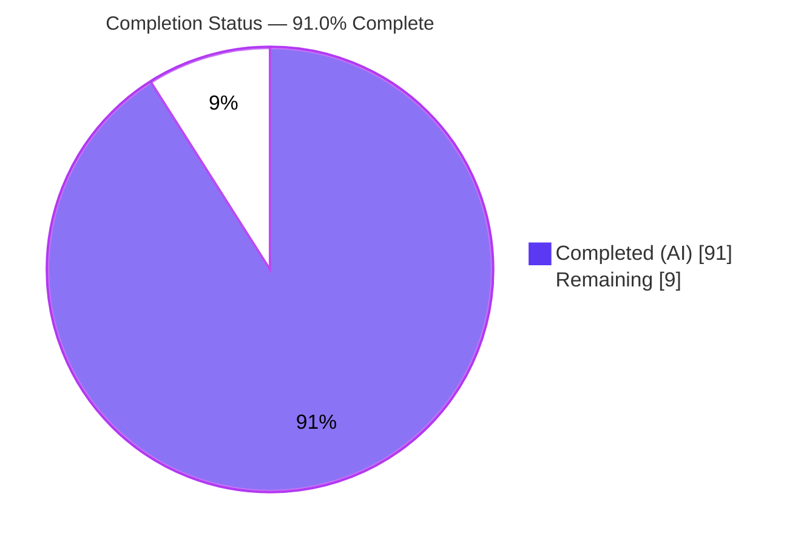
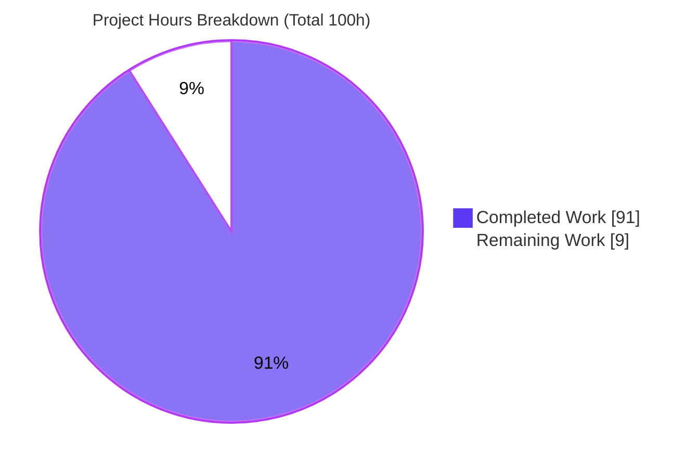
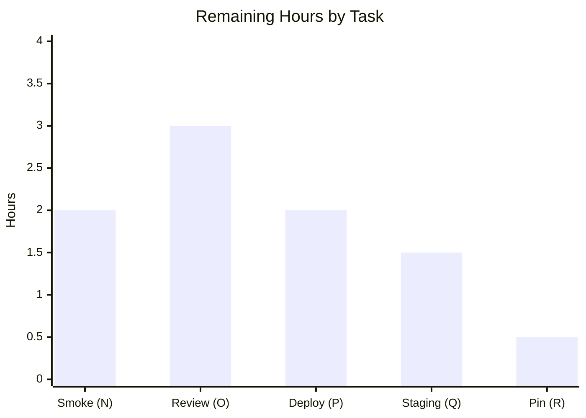

# Blitzy Project Guide — Claude Assistant for Odoo 19.0

> **Project:** `addons/claude_assistant/` — an Anthropic Claude conversational assistant embedded in the Odoo 19.0 backend
> **Branch:** `blitzy-22e66e50-7982-47f7-8245-f97816b4d19d` · **HEAD:** `a5f5a2471ff` · **Base:** `0b61d1675c8`
> **Status legend / brand colors:** <span style="color:#5B39F3">**Completed / AI Work = Dark Blue `#5B39F3`**</span> · Remaining / Not Completed = White `#FFFFFF` · Headings/Accents = Violet-Black `#B23AF2` · Highlight = Mint `#A8FDD9`

---

## 1. Executive Summary

### 1.1 Project Overview

This project delivers a single, self-contained Odoo 19.0 addon that surfaces an Anthropic Claude AI chat assistant inside the Odoo web client. The assistant is exposed through one OWL systray entry visible to every internal user and serves four stakeholder groups — System Administrators, Business Users, Developers, and Partners/Integrators — each offered a tailored set of "modes" (fifteen in total). Each mode injects live Odoo ORM context into the Claude system prompt. The Anthropic API key is stored in configuration (`ir.config_parameter`), and conversation state is ephemeral and client-side only. The technical scope is intentionally narrow: 17 new files under `addons/claude_assistant/` plus one appended dependency line, with a strict authority boundary forbidding edits to any other existing file.

### 1.2 Completion Status

The project is **91.0% complete** on an AAP-scoped basis. All thirteen implementation deliverables are fully delivered, validated, and committed; the remaining 9 hours are genuine path-to-production activities (real-key smoke test, human review, deployment, staging verification, dependency pinning) that cannot be performed autonomously in the build environment.



| Metric | Hours |
| --- | --- |
| **Total Hours** | **100** |
| Completed Hours (AI 91 + Manual 0) | 91 |
| Remaining Hours | 9 |
| **Percent Complete** | **91.0%** |

> Calculation (PA1): `Completion % = Completed / (Completed + Remaining) = 91 / (91 + 9) = 91 / 100 = 91.0%`.

### 1.3 Key Accomplishments

- ✅ Full addon scaffolding — package `__init__.py` chain, manifest with correctly **ordered** `data` list (security → ACL → data → view) and `web.assets_backend` glob asset declarations.
- ✅ `POST /claude_assistant/chat` implementing the mandated **9-step sequence** end-to-end, including SDK exception mapping in the correct order (Authentication→401, RateLimit→429, APIConnection→504, APIError→502).
- ✅ `GET /claude_assistant/status` returning `api_key_configured` (boolean only), `odoo_version`, and authorized `user_roles` — with a verified **no-credential-leak** guarantee.
- ✅ **15-mode authorization table** (developer modes = 2048 max_tokens, all others 1024), four **verbatim** role statements, and 15 per-mode ORM context builders with `'<model>' in request.env` guards over 9 optional models.
- ✅ Two new security groups (`group_developer`, `group_partner`) placed under the "Technical" category and four read-only ACL rows.
- ✅ Settings integration: `res.config.settings` extension with a password-masked, `config_parameter`-bound key field injected into General Settings via xpath.
- ✅ OWL frontend: systray entry gated by `hasGroup('base.group_user')`, a role-aware 350px chat panel with ephemeral conversation state, and scoped SCSS that overrides no existing Odoo CSS.
- ✅ Automated test suite — **10/10 passing** across 3 test classes; clean install on a fresh database; `ruff` lint clean; live runtime HTTP verification.

### 1.4 Critical Unresolved Issues

| Issue | Impact | Owner | ETA |
| --- | --- | --- | --- |
| Live Anthropic round-trip never executed (tests mock the SDK) | Real API behavior (incl. model-id validity) unverified until a real key is used | Backend / DevOps | 2h |
| Human security sign-off pending | Security-sensitive authorization + credential egress not yet peer-reviewed | Security / Tech Lead | 3h |

> No blocking defects exist in the code itself — the addon installs, compiles, lints clean, and passes 100% of its tests. The two items above are path-to-production gates, not code defects.

### 1.5 Access Issues

| System/Resource | Type of Access | Issue Description | Resolution Status | Owner |
| --- | --- | --- | --- | --- |
| Anthropic API | Service credential (API key) | No real key available in the build environment; the live HTTPS call has never been exercised (SDK mocked in tests) | Open — provision in target env | DevOps |
| Optional feature addons (crm, sale, account, hr, stock, purchase) | Module availability in staging | Not installed in the validation DB, so only the "model-absent" branch of context builders was exercised | Open — verify on staging | QA |

### 1.6 Recommended Next Steps

1. **[High]** Provision a real Anthropic API key in the target environment and run a live end-to-end smoke test across one mode per role (confirms the `claude-sonnet-4-6` model id and the real round-trip). — 2h
2. **[High]** Complete human code & security review (authorization gating, credential handling/leak guard, ORM-context egress to a third party) and approve the PR. — 3h
3. **[Medium]** Perform deployment configuration: confirm `anthropic` in the production image, set the key parameter, and restart workers (ormcache). — 2h
4. **[Medium]** Verify the 9 optional-model context branches on a staging database with the feature addons installed. — 1.5h
5. **[Low]** Decide whether to pin `anthropic` to an exact version (repo convention) versus keeping the `>=0.25.0` floor; document the choice. — 0.5h

---

## 2. Project Hours Breakdown

### 2.1 Completed Work Detail

All rows below were delivered autonomously and validated (install + tests + lint + runtime). Each traces to an AAP deliverable (A–M).

| Component | Hours | Description |
| --- | --- | --- |
| Module scaffolding, manifest & dependency (A, M) | 4 | Package `__init__.py` chain, manifest (ordered `data`, asset globs), `requirements.txt += anthropic>=0.25.0` |
| Chat controller & 9-step Anthropic integration (B) | 16 | Route, mode validation, group gating, key read, prompt composition, history truncation, `messages.create` (28s timeout), exception→HTTP mapping |
| Status controller (C) | 3 | Role computation via `has_group`, metadata response, credential-leak guard |
| Mode authorization model + 15 context builders (D) | 14 | 15-mode `(group, max_tokens)` table, 4 verbatim role statements, 15 guarded `sudo()` ORM context builders (9 optional-model guards) |
| Settings model + parameter seed (E, G) | 2 | `res.config.settings` Char field bound to `config_parameter`; `noupdate` seed of `claude_assistant.api_key` |
| Security groups & ACL grants (F) | 4 | Two `res.groups` via the privilege mechanism; four read-only ACL rows |
| General Settings view integration (H) | 3 | xpath injection into `base_setup` form; password masking; icon-404 avoidance |
| OWL systray entry (I) | 4 | Component + QWeb template, systray registry registration, `base.group_user` gating |
| OWL role-aware chat panel (J) | 16 | Component + QWeb template, role/mode state, RPC/fetch, ephemeral `{roleId}:{modeId}` conversations, accessibility |
| Scoped panel SCSS (K) | 4 | Token-based, dark-mode aware, override-free styling under `.o_claude_assistant_panel` |
| Automated test suite (L) | 12 | 3 classes / 10 methods, SDK mocking, `HttpCase` + `TransactionCase` |
| Autonomous validation & QA remediation | 9 | 5-gate validation, review/QA fixes (a11y, icon-404, ruff lint cleanup), full test re-verification |
| **Total Completed** | **91** | |

### 2.2 Remaining Work Detail

All rows are path-to-production activities (items N–R); none represent code rework.

| Category | Hours | Priority |
| --- | --- | --- |
| Provision real Anthropic API key + live end-to-end smoke test (N) | 2.0 | High |
| Human code review / security sign-off + PR approval (O) | 3.0 | High |
| Deployment configuration: prod deps, set key, worker restart (P) | 2.0 | Medium |
| Staging verification of 9 optional-model context branches (Q) | 1.5 | Medium |
| Dependency pinning decision for `anthropic` floor (R) | 0.5 | Low |
| **Total Remaining** | **9.0** | |

### 2.3 Hours Reconciliation

- Completed (2.1) **91** + Remaining (2.2) **9** = Total **100** (matches Section 1.2).
- Remaining **9** is identical across Section 1.2, Section 2.2, and the Section 7 pie chart.
- Completion = 91 / 100 = **91.0%**, used consistently throughout this guide.

---

## 3. Test Results

All tests below originate exclusively from Blitzy's autonomous validation logs and were independently re-executed this session on a fresh database with `--test-tags claude_assistant` → **exit 0, "0 failed, 0 error(s) of 10 tests"**.

| Test Category | Framework | Total Tests | Passed | Failed | Coverage % | Notes |
| --- | --- | --- | --- | --- | --- | --- |
| Controller (HTTP) | Odoo `HttpCase` | 7 | 7 | 0 | Routes fully exercised | Anthropic SDK mocked |
| Status (HTTP) | Odoo `HttpCase` | 2 | 2 | 0 | Status route + role logic | Includes credential-leak guard |
| Config (ORM) | Odoo `TransactionCase` | 1 | 1 | 0 | Parameter round-trip | Key write/read-back |
| **Total** | — | **10** | **10** | **0** | — | 100% pass rate |

**Test methods (10):**

- `ClaudeAssistantControllerTest` (HttpCase, 7): `test_chat_invalid_mode_returns_400`, `test_chat_unauthorized_mode_returns_403`, `test_chat_api_key_not_configured_returns_503`, `test_chat_happy_path_returns_200`, `test_chat_truncates_history_to_last_10`, `test_chat_maps_sdk_exceptions`, `test_chat_developer_mode_uses_max_tokens_2048`
- `ClaudeAssistantStatusTest` (HttpCase, 2): `test_status_reports_api_key_and_version`, `test_status_user_roles_reflect_groups`
- `ClaudeAssistantConfigTest` (TransactionCase, 1): `test_api_key_config_parameter_roundtrip`

All classes are decorated `@tagged('post_install', '-at_install', 'claude_assistant')`. The happy-path test asserts `timeout=28` and `model='claude-sonnet-4-6'`; the exception test asserts the 401/429/504/502 mapping; the developer-mode test asserts `max_tokens=2048`.

---

## 4. Runtime Validation & UI Verification

Verified live this session (server booted on `127.0.0.1`, authenticated as `admin`, then shut down by exact PID):

- ✅ **Server boot** — `HTTP service (werkzeug) running`; 15 modules loaded; registry loaded; zero `ERROR`/`CRITICAL`/`Traceback`.
- ✅ **Login** — `GET /web/login` → HTTP 200.
- ✅ **Status route** — authenticated `GET /claude_assistant/status` → 200 with `{api_key_configured: false, odoo_version: "19.0", user_roles: [admin (4 modes), business (4 modes)]}`. Admin correctly sees **both** roles (because `base.group_system` implies `base.group_user`).
- ✅ **Credential safety** — response body contains no `sk-ant` token (leak check passed).
- ✅ **Chat validation** — `POST /claude_assistant/chat` with an invalid mode → HTTP 400.
- ✅ **Install integrity** — fresh-DB install loads all four data files in the correct order; both new groups land under "Technical"; four ACL rows are read-only; the key parameter is seeded empty.
- ✅ **UI (per autonomous browser validation logs)** — configured state shows the systray entry, role selector, and mode tabs with role-switch behavior; empty state shows only the "API key not configured" warning + "Open General Settings" link. Zero console errors and zero network 404s in both states.
- ⚠ **Live Anthropic call** — Partial: the happy-path round-trip is exercised only against a mocked SDK; the real HTTPS call awaits a provisioned key (see Sections 1.4 / 6).

---

## 5. Compliance & Quality Review

| AAP Requirement / Benchmark | Status | Evidence / Notes |
| --- | --- | --- |
| Authority boundary — only `addons/claude_assistant/**` + 1 line in `requirements.txt` | ✅ Pass | Diff: 18 files, 1,568 insertions, 0 deletions; all addon files added, only `requirements.txt` modified |
| 9-step chat control flow preserved | ✅ Pass | Implemented in `controllers/main.py`; covered by 7 controller tests + live HTTP |
| Exception mapping order (401/429/504/502) | ✅ Pass | `test_chat_maps_sdk_exceptions` passes; `APIError` mapped last |
| 15-mode table; developer = 2048 tokens | ✅ Pass | `MODE_AUTHORIZATION`; `test_chat_developer_mode_uses_max_tokens_2048` |
| Four role statements used verbatim | ✅ Pass | `ROLE_STATEMENTS` strings preserved exactly |
| Optional models guarded with `'<model>' in request.env` | ✅ Pass | 9 guards confirmed (crm/sale/account×2/hr×3/stock/purchase) |
| `sudo()` reads with explicit field lists | ✅ Pass | `search_read` with explicit `fields=` throughout context builders |
| API key never returned/logged | ✅ Pass | `status` returns boolean only; leak check passed live |
| `auth='user'` on both routes (no public/none) | ✅ Pass | Both routes declared `auth='user'` |
| History truncated to last 10 | ✅ Pass | `test_chat_truncates_history_to_last_10` passes |
| 28-second transport timeout | ✅ Pass | `test_chat_happy_path_returns_200` asserts `timeout=28` |
| Settings via xpath into `base_setup` form; password masking | ✅ Pass | `views/res_config_settings_views.xml`; `password="True"` |
| Manifest `data` ordered (security → ACL → data → view) | ✅ Pass | Install loads files in order with no FK errors |
| Panel styles override no Odoo CSS | ✅ Pass | All rules scoped under `.o_claude_assistant_panel`; tokens only |
| No DB persistence of conversations | ✅ Pass | State held in OWL `useState` only; no model/table added |
| No `ir.cron`/migrations/background workers | ✅ Pass | None present |
| `res.groups` categorization | ✅ Pass (adapted) | AAP's literal `category_id` does not exist on Odoo 19 `res.groups`; addon correctly uses `res.groups.privilege`/`privilege_id`; both groups verified under "Technical". Documented in the security XML. |
| Lint / compile cleanliness | ✅ Pass | `ruff` "All checks passed!"; `py_compile` ×8 OK; `node --check` ×2 OK |

**Fixes applied during autonomous validation:** 15 changes, all cosmetic/style (import re-ordering, multi-space-after-comma normalization, trailing commas) plus review-finding fixes (accessibility, settings icon-404 avoidance). **Zero functional defects** were found; the full test suite was re-verified 10/10 after the edits.

---

## 6. Risk Assessment

| Risk | Category | Severity | Probability | Mitigation | Status |
| --- | --- | --- | --- | --- | --- |
| Model id `claude-sonnet-4-6` is a user-supplied passthrough; may not resolve at the API | Technical | Medium | Medium | Verify against Anthropic's model list before go-live (single constant) | Open (needs live key) |
| `type='json'` route DeprecationWarning | Technical | Low | Certain | None required; framework auto-aliases to `jsonrpc`; AAP-mandated verbatim | Accepted |
| `ir.config_parameter` ormcache — running worker won't see key change until restart | Technical | Low–Med | High | Documented: restart workers after setting the key | Mitigated (docs) |
| API key stored plaintext in `ir.config_parameter` | Security | Medium | Low | AAP-mandated/standard Odoo; restrict DB access; key never returned/logged | Mitigated (design + leak-guard test) |
| Authorization gating could regress in future edits | Security | Medium | Low | `test_chat_unauthorized_mode_returns_403` guards the order | Mitigated |
| ORM context (possibly business data) sent to third-party Anthropic API | Security | Medium | Medium | Data-governance/compliance review of context payload | Open (task O) |
| Unconfigured key → assistant unavailable | Operational | Low | High (initially) | Graceful 503 + empty-state panel with settings link | Mitigated |
| No monitoring/alerting on Anthropic latency/failures | Operational | Low–Med | Medium | Add ops logging/metrics on the chat route (outside addon scope) | Open (optional) |
| Token cost / rate exposure; 429 mapped but no client backoff | Operational | Low–Med | Medium | Usage monitoring / quotas | Open (optional) |
| Live Anthropic round-trip never executed (SDK mocked) | Integration | Medium | Medium | Live smoke test (task N) | Open |
| Optional-model branches only exercised in "absent" path | Integration | Medium | Low–Med | Staging verification with feature addons (task Q) | Open |
| `anthropic>=0.25.0` unpinned vs repo's exact-pin convention | Integration | Low–Med | Low | Pin the version (task R); resolved 0.111.0 works | Open |

---

## 7. Visual Project Status



**Remaining hours by task (path-to-production):**



> Integrity: pie "Remaining Work" = **9** = Section 1.2 Remaining Hours = sum of Section 2.2 = sum of the bar chart (2 + 3 + 2 + 1.5 + 0.5).

---

## 8. Summary & Recommendations

The Claude Assistant addon is **91.0% complete** on an AAP-scoped basis and is functionally finished: every implementation deliverable in the Agent Action Plan is delivered, the module installs cleanly on a fresh database, all 10 autonomous tests pass, the code lints and compiles without error, and the runtime HTTP routes and UI behave correctly with no credential leakage. One AAP instruction (`res.groups.category_id`) was correctly adapted to Odoo 19's `res.groups.privilege` mechanism — an intent-preserving fix that prevents an install-time `ValueError`.

**Remaining gaps (9 hours)** are exclusively path-to-production activities that require resources unavailable to an autonomous build: a real Anthropic API key for a live smoke test, a human security sign-off, deployment configuration, staging verification of the optional-model context branches, and a dependency-pinning decision.

**Critical path to production:** provision the API key and run the live smoke test (2h) → human security review and PR approval (3h) → deployment configuration (2h). Staging verification (1.5h) and the pinning decision (0.5h) can proceed in parallel.

**Production-readiness assessment:** **Ready for human review and staged rollout.** The code is production-grade; the outstanding work is verification and operationalization, not development. Success metrics for go-live: a successful live Claude round-trip in every role, approved security review, and confirmed key configuration with worker restart in the target environment.

| Dimension | Status |
| --- | --- |
| Implementation completeness (AAP A–M) | ✅ 100% |
| Automated tests | ✅ 10/10 pass |
| Lint / compile | ✅ Clean |
| Runtime (mocked) | ✅ Verified |
| Live Anthropic round-trip | ⚠ Pending real key |
| Security sign-off | ⚠ Pending |
| **Overall (AAP-scoped)** | **91.0% complete** |

---

## 9. Development Guide

All commands below were executed and verified this session against PostgreSQL 17 and the in-repo `.venv`. Run them from the repository root: `/tmp/blitzy/blitzy-odoo/blitzy-22e66e50-7982-47f7-8245-f97816b4d19d_3a3059`.

### 9.1 System Prerequisites

- **OS:** Linux (validated on Ubuntu 25.10).
- **Python:** 3.10–3.13 (validated on 3.13.7).
- **PostgreSQL:** ≥ 13 (validated on 17, listening on `127.0.0.1:5432`).
- **Node.js:** present (used only for `node --check` of OWL JS; not required at runtime).
- **Python venv:** `./.venv` with Odoo's dependencies + `anthropic` (0.111.0) already installed.

### 9.2 Environment Setup

```bash
# From the repository root
cd /tmp/blitzy/blitzy-odoo/blitzy-22e66e50-7982-47f7-8245-f97816b4d19d_3a3059

# Confirm toolchain
./.venv/bin/python --version                                   # Python 3.13.7
./.venv/bin/python -c "import anthropic; print(anthropic.__version__)"   # 0.111.0
./.venv/bin/python -c "from odoo import release; print(release.version)" # 19.0
pg_isready -h 127.0.0.1 -p 5432                                # accepting connections
```

### 9.3 Dependency Installation

The only new dependency is the Anthropic SDK (already satisfied in `.venv`). To (re)install into a fresh venv:

```bash
python -m venv .venv
source .venv/bin/activate
pip install -r requirements.txt          # includes: anthropic>=0.25.0
```

### 9.4 Application Startup

**Install the addon on a fresh database:**

```bash
sudo -u postgres createdb claude_demo
./.venv/bin/python odoo-bin -d claude_demo -i claude_assistant \
  --stop-after-init --max-cron-threads=0 \
  --http-interface=127.0.0.1 --http-port=8185
# Expected: exit 0; "Module claude_assistant loaded in ~0.51s"; "15 modules loaded"; 0 errors
```

**Run the web server:**

```bash
nohup ./.venv/bin/python odoo-bin -d claude_demo \
  --http-interface=127.0.0.1 --http-port=8069 --max-cron-threads=0 \
  > /tmp/claude_runtime.log 2>&1 &
echo "pid=$!"        # capture the EXACT pid for a clean shutdown later
# Web client: http://127.0.0.1:8069/web/login?db=claude_demo  (admin / admin)
```

### 9.5 Verification Steps

```bash
# 1) Login page is served
curl -s -o /dev/null -w "%{http_code}\n" http://127.0.0.1:8069/web/login        # 200

# 2) Authenticate and call the status route
curl -s -c /tmp/cj.txt -H "Content-Type: application/json" \
  -d '{"jsonrpc":"2.0","params":{"db":"claude_demo","login":"admin","password":"admin"}}' \
  http://127.0.0.1:8069/web/session/authenticate >/dev/null

curl -s -b /tmp/cj.txt -H "Content-Type: application/json" -d '{"jsonrpc":"2.0","params":{}}' \
  http://127.0.0.1:8069/claude_assistant/status
# Expected result: {"api_key_configured": false, "odoo_version": "19.0", "user_roles": [admin..., business...]}

# 3) Invalid mode is rejected
curl -s -b /tmp/cj.txt -o /dev/null -w "%{http_code}\n" -H "Content-Type: application/json" \
  -d '{"jsonrpc":"2.0","params":{"mode":"__bad__","messages":[]}}' \
  http://127.0.0.1:8069/claude_assistant/chat                                   # 400
```

**Run the test suite:**

```bash
sudo -u postgres createdb claude_test
./.venv/bin/python odoo-bin -d claude_test -i claude_assistant \
  --test-enable --test-tags claude_assistant \
  --stop-after-init --max-cron-threads=0 \
  --http-interface=127.0.0.1 --http-port=8186
# Expected: "0 failed, 0 error(s) of 10 tests"
```

**Quality gates:**

```bash
./.venv/bin/python -m ruff check addons/claude_assistant/           # "All checks passed!"
./.venv/bin/python -m py_compile $(find addons/claude_assistant -name "*.py")   # silent OK
for f in $(find addons/claude_assistant -name "*.js"); do node --check "$f"; done
```

### 9.6 Example Usage (post key-provisioning)

1. In the web client, open **Settings → General Settings → Claude Assistant** and paste your Anthropic API key into the (masked) field; save.
2. **Restart the server worker** (the key is cached via `@ormcache('stable')`).
3. Click the Claude systray icon (top bar), pick a role and mode, type a message, and Send. The reply is appended to the per-`{role}:{mode}` conversation (client-side only).

### 9.7 Troubleshooting

- **`psql: FATAL: Peer authentication failed for user "postgres"`** → use `sudo -u postgres psql` instead of `psql -U postgres`.
- **API key set but assistant still returns 503** → restart the worker; `ir.config_parameter._get_param` is `@ormcache('stable')` and a running process keeps the old (empty) value.
- **Boot-time `type='json'` DeprecationWarning** → expected and benign; it is AAP-mandated verbatim and the framework auto-aliases to `jsonrpc`. Do not change it.
- **Generic `--http-interface` default warning** → avoided by passing `--http-interface=127.0.0.1`.
- **Cron noise during init/tests** → pass `--max-cron-threads=0` for deterministic runs.
- **Clean shutdown** → `kill <exact_pid>` captured from `echo "pid=$!"`. Never use `pkill python`.

---

## 10. Appendices

### A. Command Reference

| Purpose | Command |
| --- | --- |
| Install addon (fresh DB) | `./.venv/bin/python odoo-bin -d <db> -i claude_assistant --stop-after-init --max-cron-threads=0 --http-interface=127.0.0.1 --http-port=8185` |
| Run tagged tests | `./.venv/bin/python odoo-bin -d <db> -i claude_assistant --test-enable --test-tags claude_assistant --stop-after-init --max-cron-threads=0 --http-interface=127.0.0.1 --http-port=8186` |
| Start server | `nohup ./.venv/bin/python odoo-bin -d <db> --http-interface=127.0.0.1 --http-port=8069 --max-cron-threads=0 &` |
| Lint | `./.venv/bin/python -m ruff check addons/claude_assistant/` |
| Compile check (Py) | `./.venv/bin/python -m py_compile $(find addons/claude_assistant -name "*.py")` |
| Compile check (JS) | `node --check <file.js>` |
| Inspect DB as postgres | `sudo -u postgres psql -d <db>` |

### B. Port Reference

| Port | Use |
| --- | --- |
| 5432 | PostgreSQL (host) |
| 8069 | Odoo web client (runtime) |
| 8185 | Install/verification run (example) |
| 8186 | Test run (example) |

### C. Key File Locations

| Path | Purpose |
| --- | --- |
| `addons/claude_assistant/__manifest__.py` | Module metadata, ordered `data` list, asset bundles |
| `addons/claude_assistant/controllers/main.py` | `chat` + `status` routes, 15-mode auth table, role statements, context builders (589 LOC) |
| `addons/claude_assistant/models/res_config_settings.py` | Settings extension with the key field |
| `addons/claude_assistant/security/claude_assistant_security.xml` | Two new groups (privilege mechanism) |
| `addons/claude_assistant/security/ir.model.access.csv` | Four read-only ACL rows |
| `addons/claude_assistant/data/ir_config_parameter.xml` | Seeds `claude_assistant.api_key` (empty, `noupdate`) |
| `addons/claude_assistant/views/res_config_settings_views.xml` | xpath injection of the Claude block (masked key) |
| `addons/claude_assistant/static/src/systray/` | OWL systray item (`.js` + `.xml`) |
| `addons/claude_assistant/static/src/panel/` | OWL chat panel (`.js` + `.xml`) |
| `addons/claude_assistant/static/src/scss/claude_assistant.scss` | Scoped panel styling |
| `addons/claude_assistant/tests/test_claude_assistant.py` | 3 classes / 10 methods (346 LOC) |
| `requirements.txt` | `anthropic>=0.25.0` (appended) |

### D. Technology Versions

| Component | Version |
| --- | --- |
| Odoo | 19.0 |
| Python | 3.13.7 (supported 3.10–3.13) |
| PostgreSQL | 17 (required ≥13) |
| Anthropic SDK | 0.111.0 (required ≥0.25.0) |
| Claude model id | `claude-sonnet-4-6` (passthrough) |
| ruff | 0.15.19 |
| Addon version | 19.0.1.0.0 |

### E. Environment Variable Reference

This addon uses no OS environment variables; runtime configuration is via Odoo system parameters.

| Parameter (`ir.config_parameter`) | Purpose | Default |
| --- | --- | --- |
| `claude_assistant.api_key` | Anthropic API key (read with `sudo()`; never returned/logged) | `""` (empty, seeded) |
| `web.base.url` | Instance URL composed into the system prompt | Odoo-managed |

### F. Developer Tools Guide

- **Force-recompile backend assets** (after JS/SCSS edits): restart the server or bump assets; the bundle includes `static/src/**/*.{js,xml,scss}` via the manifest globs.
- **Run a single test class:** `--test-tags claude_assistant` selects all 10; narrow further by editing the tag filter.
- **DB record inspection:** `sudo -u postgres psql -d <db> -c "SELECT name,state FROM ir_module_module WHERE name='claude_assistant';"`.
- **Verify groups under Technical:** query `res_groups` joined to the privilege records (both new groups are categorized via `res.groups.privilege`).

### G. Glossary

| Term | Definition |
| --- | --- |
| **AAP** | Agent Action Plan — the binding specification for this feature |
| **OWL** | Odoo Web Library — the component framework for the Odoo web client |
| **Systray** | The Odoo top-bar icon tray; the assistant registers one entry there |
| **Mode** | One of 15 assistant contexts (e.g., `sales`, `module_dev`), each with a required group and `max_tokens` |
| **Role** | One of 4 stakeholder categories (Admin, Business, Developer, Partner) |
| **ormcache** | Odoo's in-memory cache; `ir.config_parameter._get_param` uses the `stable` cache (requires restart on change) |
| **ir.config_parameter** | Odoo's system-parameter store (used for the API key) |
| **Ephemeral conversation** | Chat history kept only in client `useState`, never persisted to the database |

---

*Generated by the Blitzy Platform. Completion percentage (91.0%) and all hour figures are AAP-scoped and consistent across Sections 1.2, 2.1, 2.2, 7, and 8.*