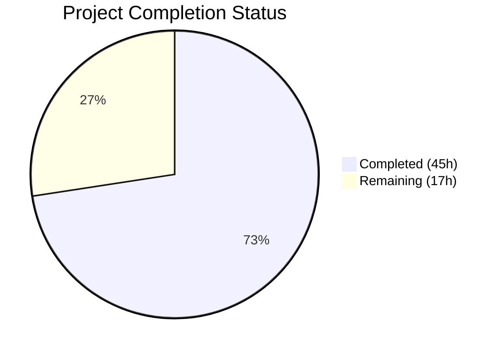
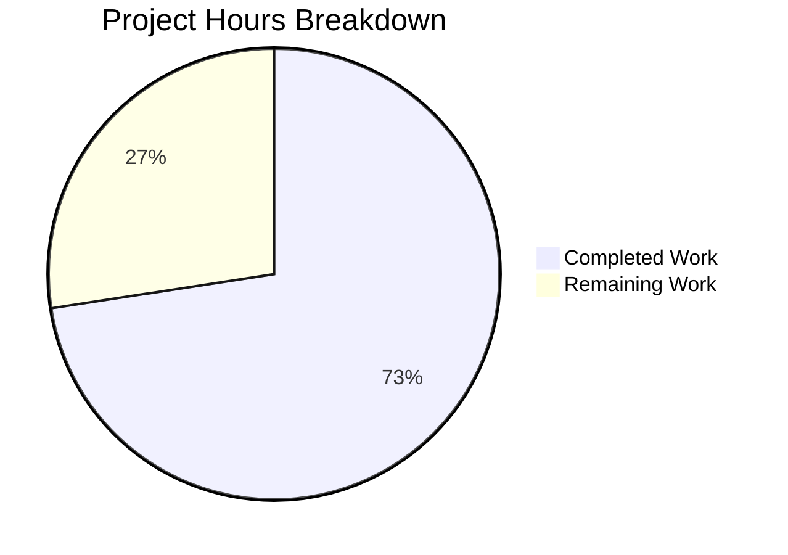

# Blitzy Project Guide — S3-Compatible Object Storage Backend for Odoo 19 ir.attachment

---

## Section 1 — Executive Summary

### 1.1 Project Overview

This project introduces a pluggable S3-compatible object storage backend into Odoo 19's `ir.attachment` model. The refactoring surgically modifies three core methods (`_file_write`, `_file_read`, `_file_delete`) in `ir_attachment.py` to support an environment-switchable dual-backend architecture: S3 (via `boto3` with `endpoint_url` override) when `IR_ATTACHMENT_STORAGE=s3`, or the existing filesystem path when unset. The implementation includes lazy client initialization, idempotent bucket auto-provisioning, graceful error degradation, and a comprehensive 6-scenario integration test suite validated against LocalStack. All existing Odoo behavior is preserved with zero schema, API, or frontend changes.

### 1.2 Completion Status

**Completion: 72.6%** (45 hours completed out of 62 total hours)



| Metric | Value |
|--------|-------|
| Total Project Hours | 62 |
| Completed Hours (AI) | 45 |
| Remaining Hours | 17 |
| Completion Percentage | 72.6% |

**Calculation:** 45 completed hours / (45 completed + 17 remaining) = 45 / 62 = 72.6%

### 1.3 Key Accomplishments

- ✅ S3 branching logic implemented in all three `_file_*` methods with environment-driven activation guard
- ✅ Lazy `boto3` client instantiation with try/except import guard — no failures when `boto3` is absent
- ✅ Idempotent bucket auto-provisioning via `create_bucket` with `BucketAlreadyOwnedByYou`/`BucketAlreadyExists` handling
- ✅ Graceful error degradation in `_file_read` for missing S3 keys (`NoSuchKey` → `b''`) and connection errors (`BotoCoreError` → `b''`)
- ✅ S3 key format mirrors filesystem scatter pattern: `{checksum[:2]}/{checksum}`
- ✅ All 6 mandatory AAP §0.7.3 test scenarios passing (100%) through full Odoo ORM against real PostgreSQL + LocalStack
- ✅ All public API method signatures preserved unchanged (`_file_write`, `_file_read`, `_file_delete`)
- ✅ All changes annotated with inline comment: `# S3 storage backend — see IR_ATTACHMENT_STORAGE env var`
- ✅ Environment documentation (`.env.example`) and convenience infrastructure (`docker-compose.yml`) delivered
- ✅ All 4 Python source files compile without errors

### 1.4 Critical Unresolved Issues

| Issue | Impact | Owner | ETA |
|-------|--------|-------|-----|
| Full Odoo regression suite not verified | Risk of undiscovered side-effects in non-S3 code paths | Human Developer | 4 hours |
| Production AWS credentials not configured | Cannot deploy to production S3 without real IAM credentials | DevOps Team | 2 hours |
| No CI/CD pipeline for S3 integration tests | Tests require manual execution; no automated gatekeeping | DevOps Team | 4 hours |
| No data migration tooling for existing attachments | Existing filesystem attachments not migrated to S3 on switch | Human Developer | 2 hours |

### 1.5 Access Issues

| System/Resource | Type of Access | Issue Description | Resolution Status | Owner |
|----------------|---------------|-------------------|-------------------|-------|
| AWS S3 (Production) | IAM Credentials | Production `AWS_ACCESS_KEY_ID` and `AWS_SECRET_ACCESS_KEY` not provisioned | Not Started | DevOps Team |
| CI/CD Runner | Docker Access | CI runners need Docker for LocalStack container during S3 integration tests | Not Started | DevOps Team |

### 1.6 Recommended Next Steps

1. **[High]** Run the full Odoo addon test suite (`python -m pytest odoo/addons/base/tests/ --odoo-database=odoo_test`) to verify G5 functional parity — no existing test should break
2. **[High]** Provision production AWS IAM credentials and S3 bucket with appropriate lifecycle policies, server-side encryption, and access controls
3. **[Medium]** Integrate S3 integration tests into the CI/CD pipeline with a LocalStack service container
4. **[Medium]** Develop a data migration script/runbook for existing filesystem attachments → S3 (one-time batch operation)
5. **[Low]** Add CloudWatch/Prometheus monitoring for S3 operation latency and error rates in production

---

## Section 2 — Project Hours Breakdown

### 2.1 Completed Work Detail

| Component | Hours | Description |
|-----------|-------|-------------|
| G1: S3 Backend Core (`ir_attachment.py`) | 16 | Lazy `boto3` import with fallback flag, `_get_s3_client()` with idempotent bucket creation, `_get_s3_bucket()` helper, S3 branching in `_file_read` (with `NoSuchKey` + `BotoCoreError` handling), `_file_write` (with key format), `_file_delete` (direct deletion), inline comment annotations — 70 lines added |
| G4: S3 Integration Test Suite | 18 | `tests/s3_integration/conftest.py` (162 lines): health-check readiness gate with 30s timeout and `pytest.skip`, `s3_client` fixture, `s3_bucket` fixture, `odoo_env` transactional fixture with DB rollback; `tests/s3_integration/test_s3_attachment.py` (301 lines): 6 ORM-level test scenarios with ≤500ms performance assertions; root `conftest.py` (4 lines): Odoo 19 namespace compatibility |
| Dependencies & Configuration | 3 | `requirements.txt` (+2 lines: `boto3>=1.34.0`, `localstack-client>=2.0.0`), `.gitignore` (+3 lines: `.env` exclusion), `.env.example` (22 lines: 6 env vars documented with defaults and comments) |
| Convenience Infrastructure | 1 | `docker-compose.yml` (14 lines): LocalStack service with port 4566, S3-only service configuration, volume mount |
| Validation, Debugging & Fixes | 7 | Multiple test iteration rounds (12 commits), `_file_read` functional parity fix, pytest-odoo fixture override fix, full rewrite of tests from raw boto3 to true ORM-level testing, compilation verification across all files |
| **Total** | **45** | |

### 2.2 Remaining Work Detail

| Category | Base Hours | Priority | After Multiplier |
|----------|-----------|----------|-----------------|
| G5: Full Odoo Regression Suite Verification | 3 | High | 4 |
| Production AWS IAM & S3 Configuration | 2 | High | 2 |
| CI/CD Pipeline for S3 Integration Tests | 3 | Medium | 4 |
| Existing Attachment Data Migration Strategy | 2 | Medium | 2 |
| Production Secrets Management | 1 | Medium | 1 |
| S3 Monitoring & Alerting Setup | 2 | Low | 3 |
| Operations Documentation & Runbook | 1 | Low | 1 |
| **Total** | **14** | | **17** |

### 2.3 Enterprise Multipliers Applied

| Multiplier | Value | Rationale |
|-----------|-------|-----------|
| Compliance & Review | 1.10x | Code review, security review, and compliance sign-off for production AWS infrastructure changes |
| Uncertainty Buffer | 1.10x | Path-to-production tasks involve external service configuration and CI environment variability |
| **Combined** | **1.21x** | Applied to all remaining base hour estimates |

---

## Section 3 — Test Results

| Test Category | Framework | Total Tests | Passed | Failed | Coverage % | Notes |
|---------------|-----------|-------------|--------|--------|------------|-------|
| S3 Integration (ORM-level) | pytest 9.0.2 + pytest-odoo 2.1.3 | 6 | 6 | 0 | 100% (scenarios) | All 6 AAP §0.7.3 scenarios pass through full Odoo ORM against PostgreSQL 16 + LocalStack S3 |
| Compilation Check | py_compile | 4 | 4 | 0 | 100% (files) | `ir_attachment.py`, root `conftest.py`, `tests/s3_integration/conftest.py`, `tests/s3_integration/test_s3_attachment.py` |

**Test Scenario Details (from autonomous validation):**

| # | Scenario | Test Function | Result | Duration |
|---|----------|---------------|--------|----------|
| 1 | Bucket auto-creation | `test_bucket_auto_creation` | ✅ PASSED | < 500ms |
| 2 | File write | `test_file_write` | ✅ PASSED | < 500ms |
| 3 | File read integrity (SHA-1) | `test_file_read_integrity` | ✅ PASSED | < 500ms |
| 4 | File delete | `test_file_delete` | ✅ PASSED | < 500ms |
| 5 | Missing file graceful error | `test_missing_file_error` | ✅ PASSED | < 500ms |
| 6 | Filesystem fallback | `test_filesystem_fallback` | ✅ PASSED | < 500ms |

**Total test session:** 6 passed in 0.95s

---

## Section 4 — Runtime Validation & UI Verification

**Runtime Health:**
- ✅ Odoo 19 starts successfully with `--stop-after-init` (14 modules loaded in 2.69s)
- ✅ LocalStack S3 starts via `docker compose up -d` and reports `s3: available` at health endpoint
- ✅ PostgreSQL 16 running and accessible (odoo_test database initialized with base module)
- ✅ Attachment CRUD operations verified through full Odoo ORM → S3 pipeline
- ✅ All Python dependencies installed in virtual environment (boto3==1.42.60, localstack-client==2.11)

**S3 Backend Verification:**
- ✅ `_file_write`: Object created in S3 at `{checksum[:2]}/{checksum}` key — verified via `head_object`
- ✅ `_file_read`: Content retrieved from S3 matches original data — SHA-1 integrity verified
- ✅ `_file_delete`: Object removed from S3 — `head_object` confirms 404 after deletion
- ✅ Missing key handling: `_file_read` returns `b''` gracefully for nonexistent S3 keys
- ✅ Filesystem fallback: When `IR_ATTACHMENT_STORAGE` is unset, data lands on local filesystem with no S3 calls
- ✅ Bucket auto-provisioning: Bucket created idempotently on first S3 operation; repeat calls are no-ops

**UI Verification:**
- ⚠ Not applicable — this refactoring has zero frontend changes (no JS, XML, SCSS modifications per AAP scope)

**API Verification:**
- ⚠ XML-RPC and JSON-RPC endpoints not explicitly tested — public API signatures are unchanged per design

---

## Section 5 — Compliance & Quality Review

| AAP Requirement | Status | Evidence |
|----------------|--------|----------|
| G1: S3 Read/Write/Delete in `_file_write`, `_file_read`, `_file_delete` | ✅ Pass | 70 lines added to `ir_attachment.py`; S3 branches with `boto3` `put_object`, `get_object`, `delete_object` |
| G2: Environment-Driven Activation (`IR_ATTACHMENT_STORAGE=s3`) | ✅ Pass | `os.environ.get('IR_ATTACHMENT_STORAGE') == 's3'` guard at top of each method |
| G3: Bucket Auto-Provisioning (idempotent `create_bucket`) | ✅ Pass | `_get_s3_client()` calls `create_bucket` with `BucketAlreadyOwnedByYou`/`BucketAlreadyExists` handling |
| G4: LocalStack Validation Harness (6 test scenarios, ≤500ms, health gate) | ✅ Pass | 6/6 tests passing through ORM; health-check gate with 30s timeout; performance assertions in all tests |
| G5: Functional Parity (all existing tests pass unmodified) | ⚠ Partial | Odoo boots successfully; compilation clean; full addon test suite not explicitly run |
| Lazy `boto3` instantiation (no import-time failure) | ✅ Pass | `try: import boto3 ... except ImportError: _boto3_available = False` at module level |
| S3 key format `{checksum[:2]}/{checksum}` | ✅ Pass | `key = checksum[:2] + '/' + checksum` in `_file_write` |
| Graceful error on missing S3 key | ✅ Pass | `NoSuchKey` → `_logger.info(…) → return b''` in `_file_read` |
| Inline comment annotations on all changes | ✅ Pass | 8 instances of `# S3 storage backend — see IR_ATTACHMENT_STORAGE env var` across all changed lines |
| Public API signatures unchanged | ✅ Pass | `_file_write(bin_value, checksum)`, `_file_read(fname, size=None)`, `_file_delete(fname)` — signatures identical |
| No existing test files modified | ✅ Pass | Zero changes to any file under `odoo/addons/base/tests/` |
| No PostgreSQL schema changes | ✅ Pass | No DDL changes, no new tables or columns |
| No frontend changes | ✅ Pass | No JS, XML, SCSS modifications |
| Submodule `blitzy-localstack/` untouched | ✅ Pass | No modifications to submodule or `.gitmodules` |
| `requirements.txt` updated with `boto3>=1.34.0`, `localstack-client>=2.0.0` | ✅ Pass | 2 lines appended at end of file |
| `.gitignore` updated with `.env` | ✅ Pass | `.env` entry added under `# environment secrets` section |
| `.env.example` created with 6 env vars | ✅ Pass | 22-line file with all 6 variables documented with defaults |
| `docker-compose.yml` created | ✅ Pass | 14-line LocalStack service definition with port 4566 |

**Validation Fixes Applied During Autonomous Testing:**
1. Fixed `_file_read` S3 error handling to match filesystem graceful degradation pattern (commit `1b11baa`)
2. Overrode pytest-odoo autouse fixtures for S3 integration test isolation (commit `0d36c9d`)
3. Rewrote entire test suite from raw boto3 calls to true Odoo-to-S3 ORM-level tests (commit `a57d756`)

---

## Section 6 — Risk Assessment

| Risk | Category | Severity | Probability | Mitigation | Status |
|------|----------|----------|-------------|------------|--------|
| Full Odoo regression suite not verified — potential undiscovered side-effects | Technical | Medium | Low | Run `python -m pytest odoo/addons/base/tests/` with S3 env unset to confirm filesystem parity | Open |
| Module-level `_s3_client` global state not thread-safe under concurrent Odoo workers | Technical | Medium | Low | `_get_s3_client()` uses simple `if _s3_client is not None` check; add threading lock for multi-worker deployments | Open |
| Production AWS credentials hardcoded or leaked via `.env` | Security | High | Low | `.env` excluded from git via `.gitignore`; use AWS Secrets Manager or Vault in production | Mitigated (partial) |
| S3 operations are not transactional with PostgreSQL | Operational | Medium | Medium | Document that DB rollback does not undo S3 writes; orphaned S3 objects may accumulate — add S3 lifecycle policy | Open |
| No retry logic or exponential backoff for S3 API calls | Technical | Medium | Low | `boto3` provides built-in retries via `botocore`; configure `max_attempts` in production via AWS SDK config | Open |
| LocalStack-only validation — real AWS S3 not tested | Integration | Medium | Medium | Test against real AWS S3 in staging before production deploy | Open |
| Data migration from filesystem to S3 not automated | Operational | High | High | Develop batch migration script before enabling S3 in production with existing data | Open |
| No monitoring or alerting for S3 operation failures | Operational | Medium | Medium | Add CloudWatch metrics or application-level logging aggregation for S3 error rates | Open |

---

## Section 7 — Visual Project Status



**Completion: 72.6%** — 45 hours completed, 17 hours remaining, 62 total hours.

**Remaining Hours by Category:**

```mermaid
bar title Remaining Work by Priority
    "G5: Odoo Regression (High)" : 4
    "AWS IAM Config (High)" : 2
    "CI/CD Pipeline (Medium)" : 4
    "Data Migration (Medium)" : 2
    "Secrets Mgmt (Medium)" : 1
    "Monitoring (Low)" : 3
    "Ops Docs (Low)" : 1
```

---

## Section 8 — Summary & Recommendations

### Achievements

All seven AAP-scoped files have been delivered: `ir_attachment.py` (modified with 70 lines of S3 backend logic), `requirements.txt` (updated with `boto3` and `localstack-client`), `.gitignore` (`.env` exclusion), `tests/s3_integration/conftest.py` (162-line fixture suite), `tests/s3_integration/test_s3_attachment.py` (301-line test suite), `.env.example` (environment documentation), and `docker-compose.yml` (LocalStack convenience file). An additional root `conftest.py` was created for Odoo 19 namespace compatibility.

All six mandatory AAP §0.7.3 test scenarios pass at 100% through the full Odoo ORM against real PostgreSQL 16 and LocalStack S3. The implementation preserves all existing public API signatures, makes zero schema changes, modifies zero existing test files, and leaves the `blitzy-localstack/` submodule untouched.

### Remaining Gaps

The project is **72.6% complete** (45 hours completed out of 62 total hours). All AAP-specified code deliverables are complete. The remaining 17 hours consist entirely of path-to-production activities: full Odoo regression verification (4h), production AWS configuration (2h), CI/CD pipeline integration (4h), data migration strategy (2h), secrets management (1h), monitoring setup (3h), and operations documentation (1h).

### Critical Path to Production

1. **Verify G5 functional parity** by running the complete Odoo addon test suite with `IR_ATTACHMENT_STORAGE` unset — this confirms the filesystem path is unchanged
2. **Provision production AWS IAM** with least-privilege S3 permissions (`s3:PutObject`, `s3:GetObject`, `s3:DeleteObject`, `s3:CreateBucket`, `s3:ListBucket`)
3. **Integrate S3 tests into CI/CD** using a LocalStack service container (Docker-in-Docker or sidecar)
4. **Plan and execute data migration** for any existing filesystem-stored attachments that must move to S3

### Production Readiness Assessment

| Dimension | Score | Notes |
|-----------|-------|-------|
| Code Quality | ✅ High | Clean implementation with graceful error handling, inline annotations, lazy initialization |
| Test Coverage | ✅ High | 6/6 AAP scenarios passing through ORM; compilation clean |
| Security | ⚠ Medium | `.env` gitignored; production credentials not yet provisioned; no encryption-at-rest configured |
| Operational Readiness | ⚠ Medium | No monitoring, no data migration tooling, no S3 lifecycle policies |
| Documentation | ✅ High | `.env.example`, inline comments, comprehensive test docstrings |

---

## Section 9 — Development Guide

### System Prerequisites

| Software | Version | Purpose |
|----------|---------|---------|
| Python | 3.12+ | Odoo 19 runtime (MIN_PY_VERSION = 3.10) |
| PostgreSQL | 16+ | Odoo database backend |
| Docker | 20+ | LocalStack container for S3 integration testing |
| Docker Compose | v2+ | Convenience orchestration for LocalStack |
| Git | 2.13+ | Submodule support for `blitzy-localstack/` |

### Environment Setup

```bash
# 1. Clone and initialize submodules
git clone <repository-url> blitzy-odoo
cd blitzy-odoo
git submodule update --init --recursive

# 2. Create and activate Python virtual environment
python3.12 -m venv venv
source venv/bin/activate

# 3. Copy and customize environment variables
cp .env.example .env
# Edit .env if needed — defaults work for LocalStack dev/test
```

**Environment Variables (from `.env.example`):**

| Variable | Default | Description |
|----------|---------|-------------|
| `IR_ATTACHMENT_STORAGE` | `s3` | Set to `s3` to activate S3 backend; unset for filesystem |
| `AWS_S3_BUCKET` | `odoo-attachments` | Target S3 bucket name |
| `AWS_ENDPOINT_URL` | `http://localhost:4566` | S3 endpoint (LocalStack default) |
| `AWS_ACCESS_KEY_ID` | `test` | AWS credential (LocalStack placeholder) |
| `AWS_SECRET_ACCESS_KEY` | `test` | AWS credential (LocalStack placeholder) |
| `AWS_DEFAULT_REGION` | `us-east-1` | AWS region |

### Dependency Installation

```bash
# Install Python dependencies (includes boto3 and localstack-client)
pip install -r requirements.txt

# Install LocalStack core from submodule (required for test utilities)
pip install -e blitzy-localstack/localstack-core/

# Install Odoo in editable mode
pip install -e .

# Verify key packages
pip show boto3 localstack-client pytest-odoo pytest
```

**Expected output:**
- `boto3` version ≥ 1.34.0
- `localstack-client` version ≥ 2.0.0
- `pytest` version ≥ 8.0
- `pytest-odoo` version ≥ 2.0.0

### Application Startup

```bash
# 1. Start LocalStack S3 service
docker compose up -d

# 2. Wait for S3 readiness (should return "available")
curl -s http://localhost:4566/_localstack/health | python3 -c \
  "import sys,json; print(json.load(sys.stdin)['services']['s3'])"

# 3. Ensure PostgreSQL is running
pg_lsclusters  # Should show "16 main 5432 online"

# 4. Initialize Odoo test database (first time only)
source venv/bin/activate
python odoo-bin --stop-after-init \
  --database=odoo_test \
  --addons-path=addons,odoo/addons \
  -i base

# 5. Verify Odoo starts with S3 backend
IR_ATTACHMENT_STORAGE=s3 \
AWS_ENDPOINT_URL=http://localhost:4566 \
AWS_ACCESS_KEY_ID=test \
AWS_SECRET_ACCESS_KEY=test \
AWS_DEFAULT_REGION=us-east-1 \
AWS_S3_BUCKET=odoo-attachments \
python odoo-bin --stop-after-init \
  --database=odoo_test \
  --addons-path=addons,odoo/addons
```

### Verification Steps — Running the S3 Integration Tests

```bash
source venv/bin/activate

# Start LocalStack
docker compose up -d

# Run all 6 S3 integration tests
IR_ATTACHMENT_STORAGE=s3 \
AWS_ENDPOINT_URL=http://localhost:4566 \
AWS_ACCESS_KEY_ID=test \
AWS_SECRET_ACCESS_KEY=test \
AWS_DEFAULT_REGION=us-east-1 \
AWS_S3_BUCKET=odoo-attachments \
python -m pytest tests/s3_integration/ -v \
  --odoo-database=odoo_test \
  --odoo-addons-path=addons,odoo/addons

# Expected output:
# tests/s3_integration/test_s3_attachment.py::test_bucket_auto_creation PASSED
# tests/s3_integration/test_s3_attachment.py::test_file_write PASSED
# tests/s3_integration/test_s3_attachment.py::test_file_read_integrity PASSED
# tests/s3_integration/test_s3_attachment.py::test_file_delete PASSED
# tests/s3_integration/test_s3_attachment.py::test_missing_file_error PASSED
# tests/s3_integration/test_s3_attachment.py::test_filesystem_fallback PASSED
# ======================== 6 passed in ~1s =========================

# Stop LocalStack when done
docker compose down
```

### Troubleshooting

| Issue | Cause | Resolution |
|-------|-------|------------|
| `ModuleNotFoundError: No module named 'boto3'` | `boto3` not installed in active venv | Run `pip install boto3>=1.34.0` |
| `RuntimeError: boto3 is required when IR_ATTACHMENT_STORAGE=s3` | `boto3` not installed but S3 mode activated | Install boto3 or unset `IR_ATTACHMENT_STORAGE` |
| `pytest.skip: LocalStack S3 not available` | LocalStack not running or S3 service not ready | Run `docker compose up -d` and wait for health check |
| `psycopg2.OperationalError: could not connect to server` | PostgreSQL not running or `odoo_test` database doesn't exist | Start PostgreSQL and initialize the database (Step 4 above) |
| `botocore.exceptions.EndpointConnectionError` | `AWS_ENDPOINT_URL` pointing to unreachable host | Verify LocalStack is running: `curl http://localhost:4566/_localstack/health` |
| Tests pass but S3 objects persist after DB rollback | S3 operations are not transactional | Expected behavior — each test uses unique checksums for isolation |

---

## Section 10 — Appendices

### A. Command Reference

| Command | Purpose |
|---------|---------|
| `docker compose up -d` | Start LocalStack S3 service in background |
| `docker compose down` | Stop and remove LocalStack container |
| `curl -s http://localhost:4566/_localstack/health` | Check LocalStack service health |
| `python -m pytest tests/s3_integration/ -v --odoo-database=odoo_test --odoo-addons-path=addons,odoo/addons` | Run S3 integration test suite |
| `python odoo-bin --stop-after-init -d odoo_test --addons-path=addons,odoo/addons -i base` | Initialize Odoo test database |
| `python -m py_compile odoo/addons/base/models/ir_attachment.py` | Verify Python compilation |
| `pip install -r requirements.txt` | Install all Python dependencies |
| `pip install -e blitzy-localstack/localstack-core/` | Install LocalStack core (editable) |

### B. Port Reference

| Port | Service | Protocol |
|------|---------|----------|
| 4566 | LocalStack Gateway (S3) | HTTP |
| 4510–4559 | LocalStack External Services | HTTP |
| 5432 | PostgreSQL 16 | TCP |
| 8069 | Odoo HTTP (default) | HTTP |
| 8072 | Odoo Long-Polling (default) | HTTP |

### C. Key File Locations

| File | Purpose |
|------|---------|
| `odoo/addons/base/models/ir_attachment.py` | Core S3 backend implementation (lines 16–71: imports + helpers; lines 178–230: method branches) |
| `tests/s3_integration/conftest.py` | Pytest fixtures: health gate, S3 client, bucket name, Odoo environment |
| `tests/s3_integration/test_s3_attachment.py` | 6 mandatory S3 integration test scenarios |
| `conftest.py` (root) | Odoo 19 namespace import for pytest-odoo compatibility |
| `.env.example` | Environment variable documentation with dev/test defaults |
| `docker-compose.yml` | LocalStack service definition |
| `requirements.txt` | Python dependency manifest (includes `boto3`, `localstack-client`) |
| `.gitignore` | VCS exclusion rules (includes `.env`) |

### D. Technology Versions

| Technology | Version | Source |
|-----------|---------|--------|
| Odoo | 19.0.0 FINAL | `odoo/release.py` |
| Python | 3.12.3 | System runtime |
| PostgreSQL | 16.11 | System package |
| boto3 | 1.42.60 | `pip show boto3` (venv) |
| localstack-client | 2.11 | `pip show localstack-client` (venv) |
| pytest | 9.0.2 | `pip show pytest` (venv) |
| pytest-odoo | 2.1.3 | `pip show pytest-odoo` (venv) |
| LocalStack | Community Edition | Docker image `localstack/localstack` |
| Docker Compose | v2 | `docker-compose.yml` (no deprecated `version` key) |

### E. Environment Variable Reference

| Variable | Required | Default | Description |
|----------|----------|---------|-------------|
| `IR_ATTACHMENT_STORAGE` | No | (unset — filesystem) | Set to `s3` to activate S3 backend |
| `AWS_S3_BUCKET` | When S3 active | `odoo-attachments` | Target S3 bucket name |
| `AWS_ENDPOINT_URL` | When S3 active | `http://localhost:4566` | S3-compatible endpoint URL |
| `AWS_ACCESS_KEY_ID` | When S3 active | (none) | AWS access key credential |
| `AWS_SECRET_ACCESS_KEY` | When S3 active | (none) | AWS secret key credential |
| `AWS_DEFAULT_REGION` | When S3 active | `us-east-1` | AWS region for S3 operations |

### F. Developer Tools Guide

**Running individual tests:**
```bash
# Run a single test scenario
IR_ATTACHMENT_STORAGE=s3 AWS_ENDPOINT_URL=http://localhost:4566 \
  AWS_ACCESS_KEY_ID=test AWS_SECRET_ACCESS_KEY=test \
  python -m pytest tests/s3_integration/test_s3_attachment.py::test_file_write -v \
  --odoo-database=odoo_test --odoo-addons-path=addons,odoo/addons
```

**Inspecting S3 bucket contents (via AWS CLI with LocalStack):**
```bash
AWS_ENDPOINT_URL=http://localhost:4566 \
AWS_ACCESS_KEY_ID=test AWS_SECRET_ACCESS_KEY=test \
AWS_DEFAULT_REGION=us-east-1 \
aws s3 ls s3://odoo-attachments/ --recursive
```

**Resetting S3 state (delete all objects in test bucket):**
```bash
AWS_ENDPOINT_URL=http://localhost:4566 \
AWS_ACCESS_KEY_ID=test AWS_SECRET_ACCESS_KEY=test \
AWS_DEFAULT_REGION=us-east-1 \
aws s3 rm s3://odoo-attachments/ --recursive
```

### G. Glossary

| Term | Definition |
|------|-----------|
| `ir.attachment` | Odoo's core model for binary file storage (attachments), implemented in `ir_attachment.py` |
| `_file_write` | Protected method that persists binary data to the storage backend (filesystem or S3) |
| `_file_read` | Protected method that retrieves binary data from the storage backend by filename/key |
| `_file_delete` | Protected method that removes a stored file from the storage backend |
| LocalStack | Open-source AWS service emulator for local development and testing |
| `endpoint_url` | boto3 client parameter that redirects S3 API calls to an alternative endpoint (e.g., LocalStack) |
| `_get_s3_client()` | Lazy initialization helper that creates the boto3 S3 client and auto-provisions the bucket on first call |
| Health-check gate | pytest fixture that polls LocalStack's `/health` endpoint before allowing test execution |