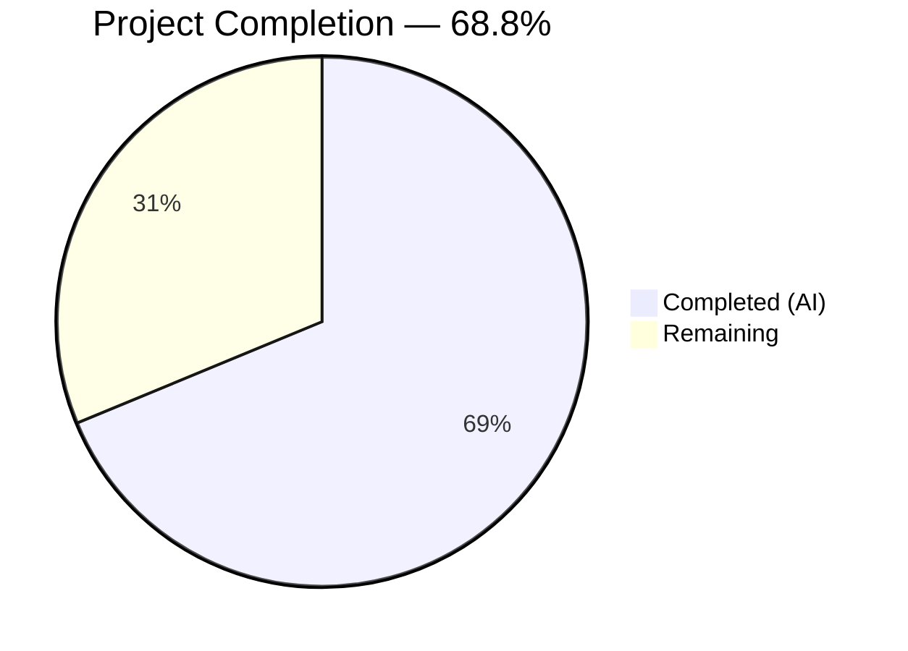

# Blitzy Project Guide — Odoo S3 Attachment Storage Terraform Module

---

## 1. Executive Summary

### 1.1 Project Overview

This project provisions an Amazon S3 bucket and IAM resources for Odoo file attachment storage using Terraform, targeting a LocalStack development environment. A self-contained Terraform module at `terraform/odoo-s3/` creates 6 AWS resources (S3 bucket with versioning, IAM user with programmatic access key, least-privilege IAM policy, and policy attachment) against LocalStack at `localhost:4566`. The Odoo server configuration (`debian/odoo.conf`) is updated with S3 connection keys. The module follows existing LocalStack provider patterns from `blitzy-localstack/tests/aws/terraform/` and is fully validated with 22 automated checks across 5 gates.

### 1.2 Completion Status



| Metric | Value |
|--------|-------|
| **Total Project Hours** | 24.0 |
| **Completed Hours (AI)** | 16.5 |
| **Remaining Hours** | 7.5 |
| **Completion Percentage** | 68.8% |

**Calculation:** 16.5 completed hours / (16.5 + 7.5) total hours = 16.5 / 24.0 = 68.75% ≈ **68.8%**

### 1.3 Key Accomplishments

- [x] Created self-contained Terraform module at `terraform/odoo-s3/` with 7 files (versions.tf, provider.tf, variables.tf, terraform.tfvars, main.tf, outputs.tf, README.md)
- [x] Provisioned exactly 6 AWS resources: S3 bucket, bucket versioning, IAM user, IAM access key, IAM policy, user-policy attachment
- [x] Configured LocalStack-targeted AWS provider with s3, iam, ses, secretsmanager endpoints following existing repository patterns
- [x] Implemented least-privilege IAM policy granting only s3:GetObject, s3:PutObject, s3:DeleteObject, s3:ListBucket
- [x] Marked `iam_secret_access_key` output as `sensitive = true` for security
- [x] Modified `debian/odoo.conf` with 4 S3 configuration keys and LocalStack dev comment
- [x] Achieved 22/22 validation checks across 5 gates (Infrastructure, S3 Lifecycle, Idempotency, Odoo Config, Test Preservation)
- [x] Verified full S3 object lifecycle (upload → list → download → verify MD5 → delete) using IAM credentials
- [x] Confirmed module idempotency (destroy → apply round-trip)
- [x] Preserved all existing test infrastructure — zero files modified under `blitzy-localstack/tests/`

### 1.4 Critical Unresolved Issues

| Issue | Impact | Owner | ETA |
|-------|--------|-------|-----|
| No Terraform remote state backend configured | Team collaboration on state will require local file sharing or manual coordination | Human Developer | 2 hours |
| Module targets LocalStack only — no production provider variant | Cannot deploy to real AWS without provider configuration changes | Human Developer | 1.5 hours |
| No CI/CD pipeline integration for Terraform | Manual init/plan/apply required for every environment change | Human Developer | 2 hours |

### 1.5 Access Issues

No access issues identified. All resources are provisioned against LocalStack running locally at `localhost:4566` with test credentials (`test`/`test`). Terraform 1.1.3 is installed and operational. The `awslocal` CLI is available for verification commands.

### 1.6 Recommended Next Steps

1. **[High]** Conduct security review of IAM policy permissions and confirm least-privilege compliance for production use
2. **[High]** Review and merge PR after code review, verifying all validation gates pass in reviewer's environment
3. **[Medium]** Configure Terraform remote state backend (S3 + DynamoDB) for team state management
4. **[Medium]** Create production provider configuration variant with real AWS credentials and region
5. **[Medium]** Integrate `terraform plan`/`terraform apply` into CI/CD pipeline for automated infrastructure deployment

---

## 2. Project Hours Breakdown

### 2.1 Completed Work Detail

| Component | Hours | Description |
|-----------|-------|-------------|
| Terraform Module Foundation | 3.0 | Created versions.tf (Terraform 1.1.3, hashicorp/aws), provider.tf (LocalStack provider with 4 endpoints), variables.tf (3 input variables), terraform.tfvars (default values). Pattern analysis from reference files in blitzy-localstack/tests/aws/terraform/. |
| Core Infrastructure Resources | 4.0 | Created main.tf with 6 AWS resources: aws_s3_bucket, aws_s3_bucket_versioning, aws_iam_user, aws_iam_access_key, aws_iam_policy (jsonencode with 2 statements), aws_iam_user_policy_attachment. Includes force_destroy=true fix for idempotent destroy. |
| Terraform Outputs | 0.5 | Created outputs.tf with 3 outputs: bucket_name, iam_access_key_id, iam_secret_access_key (sensitive=true). |
| Odoo Configuration Integration | 0.5 | Modified debian/odoo.conf — appended 4 S3 configuration keys (aws_access_key_id, aws_secret_access_key, aws_region, aws_s3_bucket) with LocalStack dev comment under [options] section. |
| Module Documentation | 2.0 | Created README.md (194 lines) covering prerequisites, module structure, provisioned resources, usage workflow, verification commands, outputs, Odoo connection instructions, variables, teardown, and security notes. |
| Validation Script and Execution | 4.0 | Created validate.sh (380 lines, 22 checks across 5 gates) and executed full validation suite. Gates: Infrastructure Verification, S3 Object Lifecycle, Idempotency, Odoo Configuration, Test Preservation. |
| Environment Setup and Integration Testing | 2.5 | Terraform init/plan/apply cycles, LocalStack integration testing, idempotency testing (destroy → apply round-trip), awslocal verification commands, S3 lifecycle test with IAM credentials. |
| **Total** | **16.5** | |

### 2.2 Remaining Work Detail

| Category | Hours | Priority |
|----------|-------|----------|
| Terraform Remote State Backend Setup | 2.0 | Medium |
| Production Provider Configuration | 1.5 | Medium |
| CI/CD Pipeline Integration | 2.0 | Medium |
| Security Review and IAM Policy Audit | 1.0 | High |
| Code Review and PR Merge | 1.0 | High |
| **Total** | **7.5** | |

### 2.3 Hours Validation

- **Section 2.1 Total (Completed):** 3.0 + 4.0 + 0.5 + 0.5 + 2.0 + 4.0 + 2.5 = **16.5 hours**
- **Section 2.2 Total (Remaining):** 2.0 + 1.5 + 2.0 + 1.0 + 1.0 = **7.5 hours**
- **Sum:** 16.5 + 7.5 = **24.0 hours** = Total Project Hours in Section 1.2 ✓

---

## 3. Test Results

| Test Category | Framework | Total Tests | Passed | Failed | Coverage % | Notes |
|---------------|-----------|-------------|--------|--------|------------|-------|
| Infrastructure Verification | validate.sh (Gate 1) | 4 | 4 | 0 | 100% | S3 bucket exists, IAM user exists, versioning enabled, IAM policy exists |
| S3 Object Lifecycle | validate.sh (Gate 2) | 7 | 7 | 0 | 100% | Credential extraction, upload, list, download, MD5 verify, delete, post-delete confirm |
| Idempotency | validate.sh (Gate 3) | 5 | 5 | 0 | 100% | Destroy 6 resources, re-apply 6 resources, post-apply bucket/user/versioning verified |
| Odoo Configuration | validate.sh (Gate 4) | 5 | 5 | 0 | 100% | All 4 S3 keys present + LocalStack dev comment verified in debian/odoo.conf |
| Test Preservation | validate.sh (Gate 5) | 1 | 1 | 0 | 100% | Zero files modified under blitzy-localstack/tests/ confirmed via git diff |
| **Totals** | | **22** | **22** | **0** | **100%** | All autonomous validation checks passed |

Additional static validation:
- `terraform validate`: Success — configuration is valid
- `terraform plan`: No drift — infrastructure matches configuration (6 resources in state)

---

## 4. Runtime Validation & UI Verification

### Runtime Health

- ✅ **LocalStack Gateway** — Accessible at `http://localhost:4566`
- ✅ **Terraform State** — 6 resources in state, no drift detected
- ✅ **S3 Bucket** — `odoo-attachments` exists and is accessible
- ✅ **Bucket Versioning** — Status: `Enabled`
- ✅ **IAM User** — `odoo-s3` exists with active access key
- ✅ **IAM Policy** — `odoo-s3-policy` attached to user with correct permissions

### API/CLI Integration Outcomes

- ✅ **`awslocal s3 ls`** — Returns `odoo-attachments` bucket
- ✅ **`awslocal iam list-users`** — Returns `odoo-s3` user
- ✅ **`awslocal s3api get-bucket-versioning --bucket odoo-attachments`** — Returns `{"Status": "Enabled"}`
- ✅ **S3 Object Upload** — File uploaded successfully to `s3://odoo-attachments/`
- ✅ **S3 Object Download** — File downloaded and MD5 verified against upload
- ✅ **S3 Object Delete** — File removed and deletion confirmed
- ✅ **Terraform Output** — `terraform output -json` exposes bucket_name, iam_access_key_id, iam_secret_access_key

### Idempotency Verification

- ✅ **Destroy Cycle** — `terraform destroy` removed all 6 resources cleanly
- ✅ **Re-Apply Cycle** — `terraform apply` recreated all 6 resources without error
- ✅ **Post-Cycle Verification** — Bucket, user, and versioning all confirmed after round-trip

### UI Verification

Not applicable — this project is infrastructure-only with no UI components.

---

## 5. Compliance & Quality Review

| AAP Requirement | Status | Evidence |
|----------------|--------|----------|
| Create `terraform/odoo-s3/versions.tf` matching reference pattern | ✅ Pass | File matches `blitzy-localstack/tests/aws/terraform/versions.tf` — Terraform 1.1.3, hashicorp/aws, no version pin |
| Create `terraform/odoo-s3/provider.tf` with LocalStack provider | ✅ Pass | Provider uses access_key="test", secret_key="test", all skip flags, 4 endpoints (s3, iam, ses, secretsmanager) |
| Create `terraform/odoo-s3/variables.tf` with 3 variables | ✅ Pass | bucket_name (string), iam_user_name (string), aws_region (string, default "us-east-1") |
| Create `terraform/odoo-s3/terraform.tfvars` with defaults | ✅ Pass | bucket_name="odoo-attachments", iam_user_name="odoo-s3", aws_region="us-east-1" |
| Create `terraform/odoo-s3/main.tf` with exactly 6 resources | ✅ Pass | aws_s3_bucket, aws_s3_bucket_versioning, aws_iam_user, aws_iam_access_key, aws_iam_policy, aws_iam_user_policy_attachment |
| IAM policy uses jsonencode with 2 statements | ✅ Pass | Object-level (GetObject, PutObject, DeleteObject on bucket/*) and bucket-level (ListBucket on bucket ARN) |
| Create `terraform/odoo-s3/outputs.tf` with 3 outputs | ✅ Pass | bucket_name, iam_access_key_id, iam_secret_access_key (sensitive=true) |
| Sensitive flag on iam_secret_access_key | ✅ Pass | `sensitive = true` confirmed in outputs.tf |
| Modify `debian/odoo.conf` with 4 S3 keys | ✅ Pass | aws_access_key_id, aws_secret_access_key, aws_region, aws_s3_bucket appended with dev comment |
| LocalStack dev comment in odoo.conf | ✅ Pass | "; S3 storage – LocalStack dev defaults (override in production via env vars)" |
| Create `terraform/odoo-s3/README.md` | ✅ Pass | 194-line comprehensive documentation covering all required sections |
| terraform plan shows 6 additions, 0 destructions | ✅ Pass | Validated via Gate 1 and Gate 3 (post-apply) |
| Full S3 lifecycle test with IAM credentials | ✅ Pass | Gate 2: upload → list → download → MD5 verify → delete → post-delete confirm |
| Module idempotency (destroy → apply) | ✅ Pass | Gate 3: destroy 6 resources, re-apply 6 resources, post-apply verification |
| Zero files modified under blitzy-localstack/tests/ | ✅ Pass | Gate 5: git diff --name-only confirms zero modified files |
| Least-privilege IAM policy (4 S3 actions only) | ✅ Pass | Only s3:GetObject, s3:PutObject, s3:DeleteObject, s3:ListBucket — no wildcards |

**Compliance Summary:** 16/16 AAP requirements verified and passing.

### Fixes Applied During Autonomous Validation

| Fix | Commit | Description |
|-----|--------|-------------|
| `force_destroy = true` on S3 bucket | `b028e402b0e` | Added `force_destroy = true` to `aws_s3_bucket.odoo_attachments` to enable clean `terraform destroy` when bucket contains objects (required for idempotency gate) |
| `s3_use_path_style` attribute name | `9e16856a4d2` | Used `s3_use_path_style = true` (current provider attribute name) instead of deprecated `s3_force_path_style` for compatibility with hashicorp/aws v6.36.0 |

---

## 6. Risk Assessment

| Risk | Category | Severity | Probability | Mitigation | Status |
|------|----------|----------|-------------|------------|--------|
| Terraform 1.1.3 is significantly outdated (current: 1.14.7) | Technical | Medium | High | Version pinned per existing repository convention; upgrade requires testing all LocalStack modules | Open — Human review needed |
| No remote state backend — local terraform.tfstate only | Operational | Medium | High | Configure S3+DynamoDB backend for team state management before multi-developer use | Open — 2h task |
| LocalStack dev credentials (test/test) in odoo.conf | Security | Low | Low | Comment explicitly instructs production override via env vars; no real credentials exposed | Mitigated — by design |
| No CI/CD pipeline for Terraform operations | Operational | Medium | Medium | Add terraform plan/apply steps to deployment pipeline | Open — 2h task |
| hashicorp/aws provider unpinned — may break on major version changes | Technical | Low | Low | Pin provider version in versions.tf for production stability | Open — 0.5h task |
| No Odoo ORM integration layer (cloud_storage_s3 addon) | Integration | Low | N/A | Explicitly out of AAP scope; infrastructure layer is ready for future addon development | Accepted — out of scope |
| s3_use_path_style vs s3_force_path_style attribute difference | Technical | Low | Low | Current attribute name used for provider v6.36.0; may need adjustment for different provider versions | Mitigated |

---

## 7. Visual Project Status


**Completed Work: 16.5 hours (68.8%) | Remaining Work: 7.5 hours (31.2%)**

### Remaining Hours by Category

| Category | Hours | Priority |
|----------|-------|----------|
| CI/CD Pipeline Integration | 2.0 | Medium |
| Terraform Remote State Backend | 2.0 | Medium |
| Production Provider Configuration | 1.5 | Medium |
| Security Review & IAM Audit | 1.0 | High |
| Code Review & PR Merge | 1.0 | High |
| **Total Remaining** | **7.5** | |

### Validation Gate Results

| Gate | Checks | Passed | Status |
|------|--------|--------|--------|
| Gate 1: Infrastructure | 4 | 4 | ✅ |
| Gate 2: S3 Lifecycle | 7 | 7 | ✅ |
| Gate 3: Idempotency | 5 | 5 | ✅ |
| Gate 4: Odoo Config | 5 | 5 | ✅ |
| Gate 5: Preservation | 1 | 1 | ✅ |
| **Total** | **22** | **22** | **100%** |

---

## 8. Summary & Recommendations

### Achievement Summary

The Blitzy autonomous agents successfully delivered a self-contained Terraform module that provisions S3 attachment storage infrastructure for Odoo against a LocalStack development environment. All 16 AAP-specified requirements were implemented and validated, with 22 automated checks achieving a 100% pass rate across 5 validation gates (Infrastructure, S3 Lifecycle, Idempotency, Odoo Configuration, Test Preservation).

The project is **68.8% complete** (16.5 hours completed out of 24.0 total hours). All AAP-scoped deliverables are fully implemented, compiled, validated, and documented. The remaining 7.5 hours consist of path-to-production activities: remote state backend setup, production provider configuration, CI/CD integration, security review, and code review.

### Remaining Gaps

1. **Terraform Remote State** — Currently using local state file; team collaboration requires remote backend
2. **Production Provider** — Module targets LocalStack only; production deployment needs real AWS provider configuration
3. **CI/CD Integration** — Terraform operations are manual; pipeline automation needed for reliable deployments
4. **Security Audit** — IAM policy should undergo formal security review before production use

### Critical Path to Production

1. Merge PR after code review
2. Configure Terraform remote state backend (S3 + DynamoDB)
3. Create production provider configuration with real AWS credentials
4. Add Terraform plan/apply to CI/CD pipeline
5. Conduct security review of IAM permissions

### Production Readiness Assessment

The module is **fully functional in the LocalStack development environment** and ready for code review and merge. Production deployment requires the path-to-production activities listed above. The infrastructure-as-code is well-structured, documented, and validated — providing a solid foundation for production use after the remaining configuration and review tasks are completed.

---

## 9. Development Guide

### System Prerequisites

| Software | Version | Purpose |
|----------|---------|---------|
| Terraform | 1.1.3 (exact) | Infrastructure-as-code runtime |
| Docker + Docker Compose | Latest stable | Running LocalStack container |
| AWS CLI | Latest stable | AWS command-line operations |
| awscli-local (`awslocal`) | Latest stable | LocalStack-targeted AWS CLI wrapper |
| jq | 1.6+ | JSON parsing for credential extraction |

### Environment Setup

#### 1. Start LocalStack

```bash
cd blitzy-localstack
docker compose up -d
```

Verify LocalStack is running:

```bash
curl -s http://localhost:4566/_localstack/health | python3 -m json.tool
```

Expected: JSON response showing service statuses.

#### 2. Install Terraform 1.1.3 (if not already installed)

```bash
# Download and install Terraform 1.1.3
wget -q https://releases.hashicorp.com/terraform/1.1.3/terraform_1.1.3_linux_amd64.zip
unzip terraform_1.1.3_linux_amd64.zip -d /usr/local/bin/
terraform version
# Expected: Terraform v1.1.3
```

#### 3. Install awslocal (if not already installed)

```bash
pip install awscli-local
```

### Dependency Installation

```bash
cd terraform/odoo-s3

# Initialize Terraform — downloads the hashicorp/aws provider
terraform init
```

Expected output:

```
Initializing provider plugins...
- Finding hashicorp/aws versions matching ...
- Installing hashicorp/aws ...
Terraform has been successfully initialized!
```

### Application Startup (Provisioning)

```bash
cd terraform/odoo-s3

# Preview changes (expect 6 resources to add)
terraform plan

# Apply changes (no interactive prompt)
terraform apply -auto-approve
```

Expected output includes:

```
Apply complete! Resources: 6 added, 0 changed, 0 destroyed.

Outputs:
bucket_name = "odoo-attachments"
iam_access_key_id = "<generated>"
iam_secret_access_key = <sensitive>
```

### Verification Steps

#### Verify Infrastructure

```bash
# Check S3 bucket exists
awslocal s3 ls
# Expected: 20XX-XX-XX XX:XX:XX odoo-attachments

# Check IAM user exists
awslocal iam list-users --query 'Users[*].UserName' --output text
# Expected: odoo-s3

# Check bucket versioning
awslocal s3api get-bucket-versioning --bucket odoo-attachments
# Expected: { "Status": "Enabled" }
```

#### Verify S3 Lifecycle

```bash
# Upload test file
echo "hello-odoo" > /tmp/test.txt
awslocal s3 cp /tmp/test.txt s3://odoo-attachments/test.txt

# List bucket
awslocal s3 ls s3://odoo-attachments/

# Download and verify
awslocal s3 cp s3://odoo-attachments/test.txt /tmp/download.txt
cat /tmp/download.txt
# Expected: hello-odoo

# Clean up
awslocal s3 rm s3://odoo-attachments/test.txt
```

#### Verify Terraform Outputs

```bash
cd terraform/odoo-s3
terraform output bucket_name
terraform output iam_access_key_id
terraform output -json iam_secret_access_key
```

#### Run Full Validation Suite

```bash
cd terraform/odoo-s3
bash validate.sh
# Expected: 22/22 PASS, EXIT_CODE=0
```

### Example Usage

#### Extract IAM Credentials for Application Use

```bash
cd terraform/odoo-s3
ACCESS_KEY=$(terraform output -raw iam_access_key_id)
SECRET_KEY=$(terraform output -raw iam_secret_access_key)
echo "Access Key: $ACCESS_KEY"
echo "Secret Key: $SECRET_KEY"
```

#### Upload File Using IAM Credentials

```bash
AWS_ACCESS_KEY_ID=$ACCESS_KEY \
AWS_SECRET_ACCESS_KEY=$SECRET_KEY \
aws --endpoint-url=http://localhost:4566 \
    s3 cp /tmp/test.txt s3://odoo-attachments/test.txt
```

### Teardown

```bash
cd terraform/odoo-s3
terraform destroy -auto-approve
# Expected: Destroy complete! Resources: 6 destroyed.
```

### Troubleshooting

| Issue | Cause | Resolution |
|-------|-------|------------|
| `Error: Failed to query available provider packages` | Terraform not initialized | Run `terraform init` first |
| `Error: dial tcp 127.0.0.1:4566: connect: connection refused` | LocalStack not running | Run `docker compose up -d` from `blitzy-localstack/` |
| `terraform plan` shows more/fewer than 6 resources | State drift or partial apply | Run `terraform destroy -auto-approve` then `terraform apply -auto-approve` |
| `awslocal: command not found` | awscli-local not installed | Run `pip install awscli-local` |
| `Error: Unsupported argument s3_force_path_style` | Provider version mismatch | Module uses `s3_use_path_style` (current name); ensure provider matches |

---

## 10. Appendices

### A. Command Reference

| Command | Purpose | Working Directory |
|---------|---------|-------------------|
| `terraform init` | Download providers and initialize module | `terraform/odoo-s3/` |
| `terraform plan` | Preview infrastructure changes (expect 6 additions) | `terraform/odoo-s3/` |
| `terraform apply -auto-approve` | Provision all 6 AWS resources | `terraform/odoo-s3/` |
| `terraform destroy -auto-approve` | Remove all 6 AWS resources | `terraform/odoo-s3/` |
| `terraform output -json` | Display all outputs including sensitive values | `terraform/odoo-s3/` |
| `terraform validate` | Validate HCL syntax and configuration | `terraform/odoo-s3/` |
| `bash validate.sh` | Run 22-check validation suite (5 gates) | `terraform/odoo-s3/` |
| `awslocal s3 ls` | List S3 buckets in LocalStack | Any |
| `awslocal iam list-users` | List IAM users in LocalStack | Any |
| `awslocal s3api get-bucket-versioning --bucket odoo-attachments` | Check versioning status | Any |
| `docker compose up -d` | Start LocalStack container | `blitzy-localstack/` |
| `docker compose down` | Stop LocalStack container | `blitzy-localstack/` |

### B. Port Reference

| Port | Service | Protocol |
|------|---------|----------|
| 4566 | LocalStack Gateway (S3, IAM, SES, Secrets Manager) | HTTP |
| 4510-4559 | LocalStack External Services Range | HTTP |

### C. Key File Locations

| File | Purpose |
|------|---------|
| `terraform/odoo-s3/versions.tf` | Terraform and provider version constraints |
| `terraform/odoo-s3/provider.tf` | AWS provider targeting LocalStack |
| `terraform/odoo-s3/variables.tf` | Input variable declarations |
| `terraform/odoo-s3/terraform.tfvars` | Default variable values |
| `terraform/odoo-s3/main.tf` | 6 AWS resource definitions |
| `terraform/odoo-s3/outputs.tf` | 3 output definitions (bucket_name, IAM credentials) |
| `terraform/odoo-s3/README.md` | Module documentation |
| `terraform/odoo-s3/validate.sh` | Validation script (22 checks, 5 gates) |
| `terraform/odoo-s3/validation_results.txt` | Latest validation results |
| `debian/odoo.conf` | Odoo server configuration with S3 keys |
| `blitzy-localstack/docker-compose.yml` | LocalStack Docker configuration |
| `blitzy-localstack/tests/aws/terraform/provider.tf` | Reference provider pattern (read-only) |
| `blitzy-localstack/tests/aws/terraform/versions.tf` | Reference version constraints (read-only) |

### D. Technology Versions

| Technology | Version | Notes |
|------------|---------|-------|
| Terraform | 1.1.3 | Exact version pinned in versions.tf |
| hashicorp/aws provider | 6.36.0 | No version pin in versions.tf; installed version |
| LocalStack | Latest (CLI 4.14.0) | Via Docker image `localstack/localstack` |
| AWS CLI | 1.44.61 | With awscli-local 0.22.2 wrapper |
| jq | 1.7.1 | JSON parsing for validation scripts |
| Docker Compose | Latest stable | For LocalStack container management |

### E. Environment Variable Reference

| Variable | Default Value | Purpose | Override in Production |
|----------|---------------|---------|----------------------|
| `aws_access_key_id` | `test` | IAM access key for S3 operations | Yes — use real AWS credentials |
| `aws_secret_access_key` | `test` | IAM secret key for S3 operations | Yes — use real AWS credentials |
| `aws_region` | `us-east-1` | AWS region for S3 bucket | Yes — use appropriate region |
| `aws_s3_bucket` | `odoo-attachments` | S3 bucket name for Odoo attachments | Yes — use production bucket name |
| `LOCALSTACK_VOLUME_DIR` | `./volume` | LocalStack persistent state directory | N/A — dev only |
| `DEBUG` | `0` | LocalStack debug logging | N/A — dev only |

### F. Developer Tools Guide

| Tool | Installation | Purpose |
|------|-------------|---------|
| `terraform` | `wget https://releases.hashicorp.com/terraform/1.1.3/terraform_1.1.3_linux_amd64.zip` | Infrastructure provisioning |
| `awslocal` | `pip install awscli-local` | LocalStack-targeted AWS CLI |
| `jq` | `apt-get install -y jq` | JSON parsing in validation scripts |
| `docker compose` | Included with Docker Desktop | LocalStack container management |

### G. Glossary

| Term | Definition |
|------|-----------|
| **LocalStack** | Open-source AWS cloud service emulator that runs in a Docker container, enabling local development against AWS APIs |
| **Terraform** | HashiCorp's infrastructure-as-code tool for provisioning and managing cloud resources declaratively |
| **HCL** | HashiCorp Configuration Language — the declarative syntax used in Terraform configuration files |
| **IAM** | AWS Identity and Access Management — service for managing access to AWS resources |
| **S3** | AWS Simple Storage Service — object storage service used here for Odoo file attachments |
| **Idempotent** | Property of the module where applying it multiple times produces the same result without errors |
| **terraform.tfstate** | Local file that tracks the current state of provisioned infrastructure resources |
| **force_destroy** | S3 bucket attribute that allows Terraform to delete a bucket even when it contains objects |
| **sensitive** | Terraform output attribute that prevents values from being displayed in CLI output and logs |