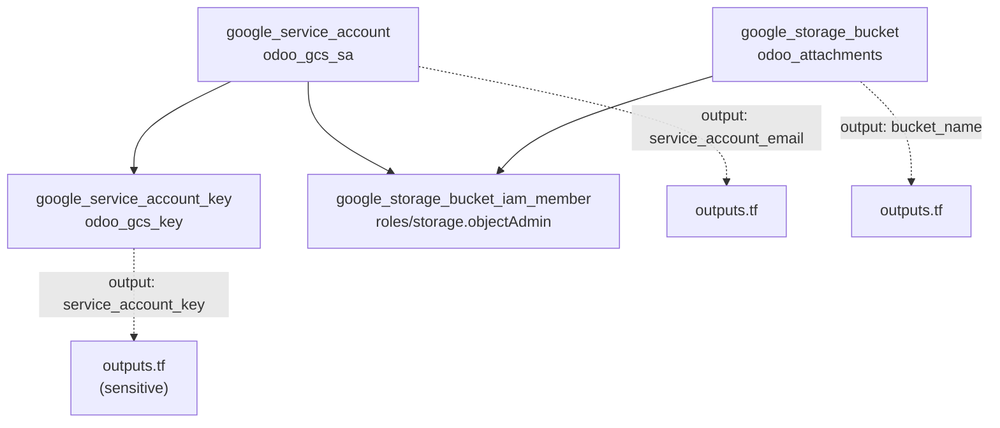
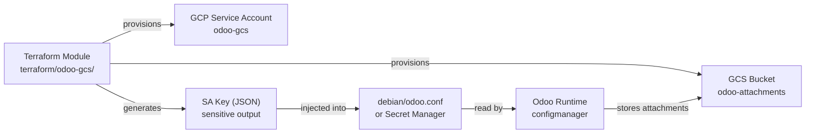

# Technical Specification

# 0. Agent Action Plan

## 0.1 Intent Clarification


### 0.1.1 Core Feature Objective

Based on the prompt, the Blitzy platform understands that the new feature requirement is to **provision a complete Terraform infrastructure module** that automates the creation of a Google Cloud Storage (GCS) bucket, a dedicated GCP service account, and the associated IAM bindings required for Odoo 19.0 to store file attachments externally in GCS—replacing or augmenting the default filesystem-based attachment storage.

The specific feature requirements are:

- **Create a self-contained Terraform module** at the path `./terraform/odoo-gcs/` consisting of seven files (`provider.tf`, `versions.tf`, `main.tf`, `outputs.tf`, `variables.tf`, `terraform.tfvars`, `README.md`) that together provision GCP infrastructure for Odoo attachment storage
- **Provision a GCS bucket** (`google_storage_bucket`) with versioning enabled, `force_destroy = false`, and uniform bucket-level access enabled, named via a configurable variable defaulting to `odoo-attachments`
- **Provision a GCP service account** (`google_service_account`) with a configurable `account_id` defaulting to `odoo-gcs` and a display name of `"Odoo GCS Service Account"`
- **Generate a service account key** (`google_service_account_key`) for the provisioned service account, enabling programmatic access from Odoo
- **Bind IAM permissions** (`google_storage_bucket_iam_member`) granting `roles/storage.objectAdmin` on the bucket to the service account
- **Expose critical outputs** (`bucket_name`, `service_account_email`, `service_account_key` marked as `sensitive = true`, and `project`) for consumption by Odoo configuration workflows
- **Update the Odoo Debian configuration** (`./debian/odoo.conf`) with GCS-related placeholder settings (`ir_attachment_location`, `google_drive_client_id`, `google_drive_client_secret`, `google_drive_token`) including a comment noting that these are placeholders to be overridden in production
- **Produce a README.md** documenting prerequisites (gcloud auth, project setup, enabling Storage and IAM APIs), standard Terraform workflow steps (init/plan/apply), instructions for extracting the service account key from `terraform output`, and Odoo connection instructions

Implicit requirements detected:

- The `provider.tf` must support Application Default Credentials (ADC) for CI/CD environments by defaulting `credentials = var.credentials_file` to `null`
- The `versions.tf` must pin the `hashicorp/google` provider to `>= 5.0` as specified, ensuring compatibility with the `uniform_bucket_level_access` and `google_service_account_key` resource schemas
- The `terraform.tfvars` file must supply concrete default values matching the variable declarations so that `terraform plan` can succeed without additional input (except for the required `project` variable)
- The Odoo configuration update in `debian/odoo.conf` must be additive—preserving all existing settings while appending the new GCS-related directives

### 0.1.2 Special Instructions and Constraints

- **Exclusion Directive**: The user explicitly states: *"Do not touch anything under `./blitzy-localstack/tests/`."* This means all files under `blitzy-localstack/tests/` (including the existing Terraform files at `blitzy-localstack/tests/aws/terraform/*.tf`) are strictly off-limits for any modification
- **Backward Compatibility**: The existing `debian/odoo.conf` contains production-critical Odoo server settings (`db_host`, `db_port`, `db_user`, `db_password`, `default_productivity_apps`). All additions must be appended without altering or removing any existing directives
- **Infrastructure-as-Code Convention**: The module follows standard Terraform conventions with separated concern files (`provider.tf`, `versions.tf`, `main.tf`, `outputs.tf`, `variables.tf`) rather than monolithic configuration
- **Security Pattern**: The `service_account_key` output must be marked `sensitive = true` to prevent accidental exposure in Terraform plan/apply output and CI/CD logs
- **ADC Support**: The `credentials_file` variable defaults to `null` to support Application Default Credentials in CI/CD pipelines where explicit credential files are not used

### 0.1.3 Technical Interpretation

These feature requirements translate to the following technical implementation strategy:

- To **provision the GCS infrastructure**, we will create a new Terraform module directory at `./terraform/odoo-gcs/` containing HCL configuration files that declare four GCP resources: a storage bucket, a service account, a service account key, and an IAM member binding
- To **configure the Terraform provider**, we will create `provider.tf` with the `google` provider block using variable references for `project`, `region`, and `credentials` (defaulting to `null` for ADC), and `versions.tf` with a `required_providers` block specifying `hashicorp/google >= 5.0`
- To **parameterize the module**, we will create `variables.tf` with five variable declarations (`project`, `region`, `bucket_name`, `service_account_id`, `credentials_file`) and `terraform.tfvars` with concrete default assignments
- To **expose provisioned resource attributes**, we will create `outputs.tf` with four output blocks referencing the created resource attributes, with the service account key marked as sensitive
- To **integrate with Odoo's attachment system**, we will modify `./debian/odoo.conf` to append GCS-related configuration parameters (`ir_attachment_location = gs://odoo-attachments`) that align with how Odoo's `IrAttachment._storage()` method reads the `ir_attachment.location` system parameter
- To **document the module**, we will create a comprehensive `README.md` covering prerequisites, usage workflow, key extraction, and Odoo integration steps


## 0.2 Repository Scope Discovery


### 0.2.1 Comprehensive File Analysis

The repository is an **Odoo 19.0** monolithic ERP platform comprising a core Python server runtime (`odoo/`), 596 addon modules (`addons/`), Debian packaging (`debian/`), operational tooling (`setup/`), and a LocalStack-based development submodule (`blitzy-localstack/`). The Terraform module being created is entirely new infrastructure — no `./terraform/` directory currently exists at the repository root.

**Existing Files Requiring Modification:**

| File Path | Current Purpose | Required Change |
|---|---|---|
| `debian/odoo.conf` | Odoo server INI configuration for Debian packaging; contains `db_host`, `db_port`, `db_user`, `db_password`, `default_productivity_apps` | Append GCS attachment storage settings (`ir_attachment_location`, `google_drive_client_id`, `google_drive_client_secret`, `google_drive_token`) with placeholder comment |

**Existing Files Evaluated and Determined Unchanged:**

| File Path | Evaluation Reason | Decision |
|---|---|---|
| `odoo/addons/base/models/ir_attachment.py` | Contains `_storage()` method reading `ir_attachment.location` system parameter — the Odoo runtime side that reads the config. No code change needed since this feature is infrastructure-only | No change |
| `addons/cloud_storage_google/models/ir_attachment.py` | Existing Odoo addon for Google Cloud Storage via signed URLs — different integration path from what the Terraform module provisions | No change |
| `addons/cloud_storage_google/models/res_config_settings.py` | Settings model for cloud storage Google configuration — operates at the application layer, not infrastructure | No change |
| `addons/cloud_storage/__manifest__.py` | Base cloud storage addon manifest — not affected by Terraform infrastructure provisioning | No change |
| `blitzy-localstack/tests/aws/terraform/*.tf` | Existing Terraform files for LocalStack AWS integration testing — **explicitly excluded by user directive** | No change |
| `requirements.txt` | Python dependency manifest — no new Python packages required | No change |
| `setup.py` | Python packaging configuration — no changes to package metadata | No change |
| `README.md` | Root project README — Terraform module has its own README | No change |

**Integration Point Discovery:**

- **Odoo Configuration System**: The `debian/odoo.conf` file feeds into Odoo's `configmanager` (`odoo/tools/config.py`) which supports arbitrary key-value pairs in the `[options]` section. The `ir_attachment.location` system parameter is read by `IrAttachment._storage()` at `odoo/addons/base/models/ir_attachment.py:76` to determine attachment storage mode
- **GCP IAM & Storage APIs**: The Terraform module provisions resources through GCP APIs (Cloud Storage API, IAM API) that must be enabled on the target GCP project before `terraform apply`
- **Service Account Key Lifecycle**: The `google_service_account_key` resource generates a private key that Odoo's `cloud_storage_google` addon can consume via the `cloud_storage_google_account_info` system parameter

### 0.2.2 New File Requirements

**New Source Files to Create:**

| File Path | Purpose | Content Type |
|---|---|---|
| `terraform/odoo-gcs/provider.tf` | Google Cloud provider configuration with ADC support; references `var.project`, `var.region`, `var.credentials_file` | HCL |
| `terraform/odoo-gcs/versions.tf` | Terraform version constraints; requires `hashicorp/google >= 5.0` | HCL |
| `terraform/odoo-gcs/main.tf` | Core resource definitions: GCS bucket (`google_storage_bucket`), service account (`google_service_account`), service account key (`google_service_account_key`), IAM binding (`google_storage_bucket_iam_member`) | HCL |
| `terraform/odoo-gcs/outputs.tf` | Output declarations for `bucket_name`, `service_account_email`, `service_account_key` (sensitive), `project` | HCL |
| `terraform/odoo-gcs/variables.tf` | Variable declarations for `project`, `region`, `bucket_name`, `service_account_id`, `credentials_file` with types, descriptions, and defaults | HCL |
| `terraform/odoo-gcs/terraform.tfvars` | Concrete variable assignments: `region`, `bucket_name`, `service_account_id`; `project` intentionally omitted to force user input | HCL tfvars |
| `terraform/odoo-gcs/README.md` | Documentation covering prerequisites, init/plan/apply workflow, key extraction, and Odoo connection instructions | Markdown |

### 0.2.3 Web Search Research Conducted

- **Terraform Google Provider Version**: The latest stable release is v7.24.0 (released March 17, 2026). The user specifies `>= 5.0`, which is compatible with all current versions including the v7.x line
- **GCS Bucket Best Practices**: Google's official documentation recommends `uniform_bucket_level_access = true` for simplified IAM management and `versioning { enabled = true }` for data protection — both align with the user's requirements
- **Service Account IAM Binding Pattern**: The `google_storage_bucket_iam_member` resource with `roles/storage.objectAdmin` is the standard pattern for granting object-level CRUD permissions on a specific bucket without granting project-wide storage access
- **Application Default Credentials**: Setting `credentials = null` in the provider block causes Terraform to fall back to ADC, which is the recommended authentication method for CI/CD pipelines running on GCP (e.g., Cloud Build, GitHub Actions with Workload Identity Federation)


## 0.3 Dependency Inventory


### 0.3.1 Private and Public Packages

This feature addition is purely infrastructure-as-code (Terraform HCL) and Odoo configuration — no new Python, JavaScript, or system-level packages are introduced to the Odoo application itself. The only dependency is the Terraform provider plugin, which is managed by Terraform's own dependency resolution mechanism.

| Registry | Package Name | Version Constraint | Resolved Version | Purpose |
|---|---|---|---|---|
| Terraform Registry | `hashicorp/google` | `>= 5.0` | 5.0+ (latest stable: 7.24.0) | Google Cloud Platform provider for provisioning GCS bucket, service account, IAM binding |
| Terraform CLI | `terraform` | (implicit) | >= 1.0 (recommended) | Infrastructure-as-code execution engine; required to run `init`, `plan`, `apply` |

**Existing Odoo Dependencies Relevant to GCS Integration (Unchanged):**

| Registry | Package Name | Version | Purpose |
|---|---|---|---|
| PyPI | `google-auth` | (system) | External dependency of `cloud_storage_google` addon; used for signed URL generation via `google.oauth2.service_account` |
| PyPI | `requests` | 2.25.1–2.31.0 | HTTP client used by `cloud_storage_google` addon for bucket CORS configuration and upload/download verification |

These existing Python packages are already declared in `addons/cloud_storage_google/__manifest__.py` under `external_dependencies` and in `requirements.txt` respectively. No modifications to dependency manifests are required.

### 0.3.2 Dependency Updates

**No dependency updates are required for this feature.** The Terraform module is self-contained within `./terraform/odoo-gcs/` and declares its own provider dependencies via `versions.tf`. The Odoo application's Python dependency graph (`requirements.txt`, `setup.py`) remains untouched.

**Import Updates:** Not applicable — no Python source files are being created or modified.

**External Reference Updates:** Not applicable — no changes to `setup.py`, `pyproject.toml`, `package.json`, or CI/CD workflow files.

**Configuration File Update (debian/odoo.conf):** The only modification to an existing file is appending INI-format configuration directives. This does not introduce or alter any package dependencies; it configures Odoo's runtime behavior to reference the GCS bucket provisioned by the Terraform module.


## 0.4 Integration Analysis


### 0.4.1 Existing Code Touchpoints

**Direct Modification Required:**

- **`debian/odoo.conf`**: Append four new configuration directives and a comment block below the existing `default_productivity_apps = True` line. The current file contains:
  ```ini
  [options]
  db_host = False
  db_port = False
  db_user = odoo
  db_password = False
  default_productivity_apps = True
  ```
  The new GCS settings (`ir_attachment_location`, `google_drive_client_id`, `google_drive_client_secret`, `google_drive_token`) will be appended after the existing options, with a comment noting they are placeholders for production override.

**Indirect Integration Points (Read-Only — No Modifications):**

- **`odoo/addons/base/models/ir_attachment.py` (line 76)**: The `_storage()` method reads the `ir_attachment.location` system parameter via `self.env['ir.config_parameter'].sudo().get_param('ir_attachment.location', 'file')`. While the `debian/odoo.conf` sets `ir_attachment_location` as a file-level config, the actual runtime behavior depends on the `ir.config_parameter` database record. The configuration in `odoo.conf` serves as the deployment template — administrators must ensure the corresponding system parameter is set in the Odoo database
- **`addons/cloud_storage_google/models/ir_attachment.py`**: This addon implements Google Cloud Storage integration via signed URLs. The Terraform-provisioned service account key can be loaded into Odoo's `cloud_storage_google_account_info` system parameter to enable this addon's functionality
- **`addons/cloud_storage_google/models/res_config_settings.py`**: The settings model reads `cloud_storage_google_bucket_name` and `cloud_storage_google_account_info` from `ir.config_parameter`. After Terraform provisions the bucket, the administrator configures these values through Odoo's Settings UI or database directly

### 0.4.2 Terraform Resource Dependency Graph

The four resources in `main.tf` have the following dependency chain:



- **`google_service_account`** is the root dependency — both the service account key and the IAM member binding depend on its `email` attribute
- **`google_storage_bucket`** is independent of the service account — the bucket and service account can be provisioned in parallel
- **`google_storage_bucket_iam_member`** depends on both the bucket (for the `bucket` attribute) and the service account (for the `member` attribute)
- **`google_service_account_key`** depends solely on the service account

### 0.4.3 Odoo Configuration Integration Flow



The integration flow is as follows: Terraform provisions the GCS infrastructure and outputs the service account key. The key is then manually or programmatically injected into Odoo's configuration (either via `debian/odoo.conf` for development, or via GCP Secret Manager / environment variables for production). The Odoo runtime reads this configuration at startup and uses the credentials to store and retrieve file attachments from the GCS bucket.


## 0.5 Technical Implementation


### 0.5.1 File-by-File Execution Plan

Every file listed below MUST be created or modified as specified.

**Group 1 — Terraform Module Foundation:**

| Action | File Path | Purpose |
|---|---|---|
| CREATE | `terraform/odoo-gcs/versions.tf` | Declare `terraform.required_providers` block with `hashicorp/google` source and `>= 5.0` version constraint |
| CREATE | `terraform/odoo-gcs/provider.tf` | Configure the `google` provider with `project = var.project`, `region = var.region`, `credentials = var.credentials_file` (defaulting to `null` for ADC) |
| CREATE | `terraform/odoo-gcs/variables.tf` | Define five input variables: `project` (required, no default), `region` (default `"us-central1"`), `bucket_name` (default `"odoo-attachments"`), `service_account_id` (default `"odoo-gcs"`), `credentials_file` (default `null`) |
| CREATE | `terraform/odoo-gcs/terraform.tfvars` | Provide concrete assignments: `region = "us-central1"`, `bucket_name = "odoo-attachments"`, `service_account_id = "odoo-gcs"` |

**Group 2 — Core Infrastructure Resources:**

| Action | File Path | Purpose |
|---|---|---|
| CREATE | `terraform/odoo-gcs/main.tf` | Define four GCP resources: (1) `google_storage_bucket "odoo_attachments"` with `name = var.bucket_name`, `location = var.region`, versioning enabled, `force_destroy = false`, `uniform_bucket_level_access = true`; (2) `google_service_account "odoo_gcs_sa"` with `account_id = var.service_account_id`, `display_name = "Odoo GCS Service Account"`; (3) `google_service_account_key "odoo_gcs_key"` referencing the service account; (4) `google_storage_bucket_iam_member` granting `roles/storage.objectAdmin` to the service account on the bucket |
| CREATE | `terraform/odoo-gcs/outputs.tf` | Export four outputs: `bucket_name` (from bucket resource), `service_account_email` (from SA resource), `service_account_key` (from SA key resource, `sensitive = true`), `project` (from `var.project`) |

**Group 3 — Odoo Configuration Update:**

| Action | File Path | Purpose |
|---|---|---|
| MODIFY | `debian/odoo.conf` | Append GCS configuration block below existing `[options]` section: `ir_attachment_location = gs://odoo-attachments`, `google_drive_client_id`, `google_drive_client_secret`, `google_drive_token` with a comment marking these as placeholders for production override |

**Group 4 — Documentation:**

| Action | File Path | Purpose |
|---|---|---|
| CREATE | `terraform/odoo-gcs/README.md` | Comprehensive documentation: prerequisites (gcloud auth, GCP project, enable Cloud Storage and IAM APIs), Terraform init/plan/apply workflow, extracting the service account key from `terraform output -raw service_account_key`, and Odoo connection instructions |

### 0.5.2 Implementation Approach per File

**Terraform Module Foundation:**

- Establish the module structure by creating `versions.tf` first, which gates the provider compatibility. The `required_providers` block specifies `hashicorp/google` with `source = "hashicorp/google"` and `version = ">= 5.0"` to ensure access to uniform bucket-level access and service account key resources
- Configure the provider in `provider.tf` with variable references. The `credentials` argument uses `var.credentials_file` which defaults to `null`, causing Terraform to use Application Default Credentials when no explicit path is provided
- Define all input variables in `variables.tf` with appropriate types (`string` for all), descriptions, and defaults. The `project` variable intentionally has no default, making it required input
- Populate `terraform.tfvars` with the non-sensitive defaults so that `terraform plan` works with minimal user configuration (only `project` must be supplied)

**Core Infrastructure Resources:**

- The `main.tf` file follows the dependency order: bucket and service account first (parallel), then service account key and IAM binding. The bucket uses `location = var.region` (not a multi-region like `"US"`) to keep data in the specified region
- The `google_storage_bucket` resource enables `versioning { enabled = true }` to protect against accidental deletions, sets `force_destroy = false` to prevent Terraform from destroying a bucket containing objects, and enables `uniform_bucket_level_access = true` to enforce IAM-only access control
- The `google_service_account_key` resource generates a JSON private key for the service account. This key is exposed as a sensitive output and must be securely stored
- The `google_storage_bucket_iam_member` grants `roles/storage.objectAdmin` (which includes `storage.objects.*` permissions) scoped to the specific bucket, following the principle of least privilege

**Odoo Configuration Update:**

- The `debian/odoo.conf` modification appends new lines after the existing `default_productivity_apps = True` line
- A comment block clearly marks the new section as GCS-related placeholders intended for production override
- The `ir_attachment_location = gs://odoo-attachments` directive aligns with Odoo's attachment storage configuration pattern
- The `google_drive_client_id`, `google_drive_client_secret`, and `google_drive_token` fields are left as empty placeholders as specified by the user

### 0.5.3 User Interface Design

Not applicable — this feature is entirely infrastructure-as-code and server configuration. No UI components, frontend assets, or visual elements are created or modified. The Odoo admin configures GCS integration through the existing Settings → Technical → Cloud Storage UI provided by the `cloud_storage_google` addon.


## 0.6 Scope Boundaries


### 0.6.1 Exhaustively In Scope

**Terraform Module — All New Files:**

- `terraform/odoo-gcs/provider.tf` — Google provider configuration with ADC support
- `terraform/odoo-gcs/versions.tf` — Provider version constraints (`hashicorp/google >= 5.0`)
- `terraform/odoo-gcs/main.tf` — Four GCP resource definitions (bucket, service account, key, IAM binding)
- `terraform/odoo-gcs/outputs.tf` — Four output declarations (`bucket_name`, `service_account_email`, `service_account_key`, `project`)
- `terraform/odoo-gcs/variables.tf` — Five variable declarations with types, descriptions, and defaults
- `terraform/odoo-gcs/terraform.tfvars` — Concrete variable assignments for non-sensitive defaults
- `terraform/odoo-gcs/README.md` — Prerequisites, workflow, key extraction, and Odoo connection docs

**Odoo Configuration — Existing File Modification:**

- `debian/odoo.conf` — Append GCS attachment storage settings with placeholder comment

### 0.6.2 Explicitly Out of Scope

- **`blitzy-localstack/tests/**/*`** — Explicitly excluded per user directive: *"Do not touch anything under `./blitzy-localstack/tests/`"*. This includes all existing Terraform files at `blitzy-localstack/tests/aws/terraform/` (`.auto.tfvars`, `provider.tf`, `versions.tf`, `s3.tf`, `iam.tf`, `lambda.tf`, etc.)
- **All Python source files** — No modifications to `odoo/**/*.py`, `addons/**/*.py`, or any other Python code. The Terraform module is infrastructure-only
- **`requirements.txt`** — No new Python packages are introduced
- **`setup.py`** — No changes to packaging metadata or install_requires
- **`odoo/tools/config.py`** — No changes to Odoo's configuration parser
- **`odoo/addons/base/models/ir_attachment.py`** — The attachment storage logic remains unchanged; only the configuration that feeds it is updated
- **`addons/cloud_storage_google/**`** — The existing Google Cloud Storage addon is not modified; it is an independent integration path
- **`addons/cloud_storage/**`** — The base cloud storage addon is unaffected
- **`.github/**`** — No changes to PR templates, issue templates, or CI/CD workflows
- **`README.md` (root)** — The root project README is not modified; the Terraform module has its own README
- **Performance optimizations** beyond the specified GCS bucket configuration (no lifecycle rules, CORS, encryption, or logging unless specified)
- **Terraform remote state backend** — Not configured; local state assumed for initial setup
- **Terraform module registry publishing** — The module is designed for local use within the repository, not as a published registry module
- **GCP project creation or billing setup** — Prerequisites documented in README but not automated
- **Odoo addon installation or database migration** — Enabling the `cloud_storage_google` addon is a runtime operation outside this Terraform module's scope


## 0.7 Rules for Feature Addition


### 0.7.1 Feature-Specific Rules

- **Terraform File Separation Convention**: The module MUST follow the standard Terraform file separation pattern with distinct files for `provider.tf`, `versions.tf`, `main.tf`, `outputs.tf`, `variables.tf`, and `terraform.tfvars` as explicitly specified by the user. Resources must not be consolidated into a single file
- **Provider Version Constraint**: The `hashicorp/google` provider MUST be constrained to `>= 5.0` as specified. This ensures compatibility with the `uniform_bucket_level_access` attribute on `google_storage_bucket` and the `google_service_account_key` resource
- **ADC Credential Pattern**: The `credentials_file` variable MUST default to `null` to support Application Default Credentials in CI/CD environments. When `null`, the Google provider falls back to ADC, enabling seamless authentication in GCP-native CI/CD pipelines
- **Sensitive Output Marking**: The `service_account_key` output MUST be marked with `sensitive = true` to prevent exposure of the private key material in Terraform plan/apply output
- **Force Destroy Protection**: The GCS bucket MUST have `force_destroy = false` to prevent accidental deletion of a bucket containing Odoo file attachments
- **Uniform Bucket-Level Access**: The GCS bucket MUST have `uniform_bucket_level_access = true` to enforce IAM-based access control instead of ACLs, aligning with GCP security best practices
- **Placeholder Configuration**: The `debian/odoo.conf` additions MUST include a comment noting that `google_drive_client_id`, `google_drive_client_secret`, and `google_drive_token` are placeholders to be overridden in production via environment variables or GCP Secret Manager
- **No-Touch Zone**: Files under `./blitzy-localstack/tests/` MUST NOT be modified, viewed for modification, or referenced as change targets under any circumstances
- **Additive Configuration**: All changes to `debian/odoo.conf` MUST be additive — preserving the existing `[options]` section contents exactly as-is, with new directives appended below
- **Variable Defaults**: The `project` variable MUST NOT have a default value (it is required input), while `region`, `bucket_name`, `service_account_id`, and `credentials_file` MUST have the defaults specified by the user


## 0.8 References


### 0.8.1 Repository Files and Folders Searched

The following files and directories were systematically inspected to derive the conclusions documented in this Agent Action Plan:

**Root-Level Files Inspected:**

| File Path | Purpose of Inspection |
|---|---|
| `setup.py` | Verified Python dependencies, packaging configuration, and `python_requires` constraint |
| `requirements.txt` | Confirmed no new Python packages are needed; reviewed existing dependency pins |
| `README.md` | Reviewed project overview to understand repository scope |
| `.gitmodules` | Confirmed `blitzy-localstack` submodule relationship |
| `ruff.toml` | Assessed linting configuration (no changes needed) |
| `setup.cfg` | Reviewed Flake8 and packaging settings (no changes needed) |

**Debian Packaging Files:**

| File Path | Purpose of Inspection |
|---|---|
| `debian/odoo.conf` | Read full contents to understand existing configuration structure; identified insertion point for GCS settings |
| `debian/` (directory listing) | Surveyed all Debian packaging artifacts to confirm only `odoo.conf` requires modification |

**Odoo Core Files:**

| File Path | Purpose of Inspection |
|---|---|
| `odoo/release.py` | Confirmed Odoo version 19.0.0 FINAL |
| `odoo/addons/base/models/ir_attachment.py` | Analyzed `_storage()` method (line 76) and `force_storage()` to understand how `ir_attachment.location` is consumed |
| `odoo/addons/base/tests/test_ir_attachment.py` | Reviewed attachment location test patterns |
| `odoo/tools/config.py` | Examined Odoo configuration manager to verify arbitrary INI keys are supported in `[options]` |

**Cloud Storage Addon Files:**

| File Path | Purpose of Inspection |
|---|---|
| `addons/cloud_storage/__manifest__.py` | Reviewed base cloud storage addon dependencies and structure |
| `addons/cloud_storage_google/__manifest__.py` | Confirmed `google-auth` external dependency and addon metadata |
| `addons/cloud_storage_google/models/ir_attachment.py` | Analyzed GCS signed URL generation pattern and credential handling via `get_cloud_storage_google_credential()` |
| `addons/cloud_storage_google/models/res_config_settings.py` | Reviewed `cloud_storage_google_bucket_name` and `cloud_storage_google_account_info` configuration model |

**LocalStack / Terraform Reference Files:**

| File Path | Purpose of Inspection |
|---|---|
| `blitzy-localstack/` (directory listing) | Surveyed submodule structure to understand repository boundaries |
| `blitzy-localstack/tests/aws/terraform/provider.tf` | Referenced existing provider pattern (AWS) for structural comparison only |
| `blitzy-localstack/tests/aws/terraform/versions.tf` | Referenced existing version constraint pattern |
| `blitzy-localstack/tests/aws/terraform/s3.tf` | Referenced existing S3 bucket resource pattern for structural comparison |
| `blitzy-localstack/tests/aws/terraform/iam.tf` | Referenced existing IAM resource pattern |
| `blitzy-localstack/tests/aws/terraform/.auto.tfvars` | Referenced existing tfvars format |

### 0.8.2 External Research Conducted

| Topic | Source | Key Finding |
|---|---|---|
| Terraform Google Provider latest version | HashiCorp Releases (releases.hashicorp.com) | Latest stable: v7.24.0 (March 17, 2026); user's `>= 5.0` constraint is compatible |
| GCS bucket Terraform resource schema | Terraform Registry (registry.terraform.io) | `uniform_bucket_level_access`, `versioning`, `force_destroy` attributes confirmed for `google_storage_bucket` |
| GCS bucket provisioning best practices | Google Cloud Documentation (docs.cloud.google.com) | Recommends uniform bucket-level access, versioning, and `force_destroy = false` for production buckets |
| Service account IAM binding pattern | Terraform community documentation | `google_storage_bucket_iam_member` with `roles/storage.objectAdmin` is standard for scoped object access |

### 0.8.3 Attachments

No external attachments (Figma designs, API specifications, or supplementary documents) were provided for this feature request.


