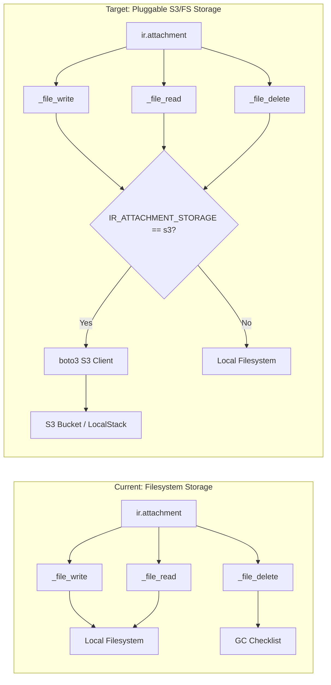

# Technical Specification

# 0. Agent Action Plan

## 0.1 Intent Clarification

### 0.1.1 Core Refactoring Objective

Based on the prompt, the Blitzy platform understands that the refactoring objective is to migrate the Odoo 19.0 attachment filestore from its current local filesystem-backed binary storage to a pluggable S3-compatible object storage backend, using the `boto3` AWS SDK with configurable `endpoint_url` override. The S3 backend activates exclusively when the environment variable `IR_ATTACHMENT_STORAGE=s3` is set; when unset, the existing filesystem behavior is preserved with zero behavioral change.

- **Refactoring type:** Tech stack migration — introducing an S3-compatible storage layer into an existing monolithic attachment subsystem
- **Target repository:** Same repository (`blitzy-public-samples/blitzy-odoo`, branch `19.0`)
- **Scope of code change:** Surgical — only three methods (`_file_write`, `_file_read`, `_file_delete`) in a single model file are modified, plus new test infrastructure and dependency declarations

The refactoring goals, restated with enhanced clarity:

- **G1 — S3 Read/Write/Delete:** Implement S3 object operations within the existing `ir.attachment` model's `_file_write`, `_file_read`, and `_file_delete` methods, using `boto3.client('s3')` with `endpoint_url` override for LocalStack/AWS portability
- **G2 — Environment-Driven Activation:** The S3 backend activates only when `IR_ATTACHMENT_STORAGE=s3`; all other values (or unset) preserve the existing filesystem path without any S3 calls
- **G3 — Bucket Auto-Provisioning:** On Odoo startup, the configured S3 bucket is created idempotently via `create_bucket` (no-op if the bucket already exists), requiring zero manual provisioning steps
- **G4 — LocalStack Validation Harness:** A new `tests/s3_integration/` test suite validates all S3 operations against the existing LocalStack Community Edition submodule at `blitzy-localstack/` (pinned commit `9536c7a`), with a health-check readiness gate and per-operation performance assertions (≤500ms)
- **G5 — Functional Parity:** All existing Odoo tests pass unmodified; no changes to PostgreSQL schema, ORM field definitions, `ir.attachment` public API signatures, frontend layer, or XML-RPC/JSON-RPC behaviors

Implicit requirements surfaced:

- The `boto3` S3 client must be lazily instantiated (not at module import time) to avoid import failures when `boto3` is not installed or S3 is not configured
- S3 key format must mirror the filesystem path pattern: `{checksum[:2]}/{checksum}` to maintain consistency with the existing `_get_path` logic
- Error handling for `_file_read` on missing S3 keys must return a graceful error (not an unhandled `botocore.exceptions.ClientError`), matching the existing filesystem fallback that logs and returns `b''`
- The `_mark_for_gc` and `_gc_file_store` garbage collection mechanisms are filesystem-specific and remain unchanged; S3 delete operations occur directly via `_file_delete`

### 0.1.2 Technical Interpretation

This refactoring translates to the following technical transformation strategy:

The current Odoo attachment storage architecture uses a filesystem-backed model where binary attachment data is written to `{filestore_dir}/{checksum[:2]}/{checksum}` via Python's `open()` builtin. The `_storage()` method reads from `ir.config_parameter` to determine whether attachments are stored in the filesystem (`file`) or database (`db`). The refactoring introduces a third storage mode (`s3`) controlled entirely by environment variable, bypassing the existing `ir.config_parameter` mechanism for the S3 path.

**Current architecture → Target architecture:**



**Transformation rules:**

- Each of the three `_file_*` methods gains an `if os.environ.get('IR_ATTACHMENT_STORAGE') == 's3'` guard at the top; the S3 path executes `boto3` operations, and the `else` branch preserves the original filesystem logic verbatim
- The `boto3` client is constructed using environment variables (`AWS_ENDPOINT_URL`, `AWS_ACCESS_KEY_ID`, `AWS_SECRET_ACCESS_KEY`, `AWS_DEFAULT_REGION`) with defaults suitable for LocalStack dev/test
- Every change to `ir_attachment.py` is annotated with the inline comment: `# S3 storage backend — see IR_ATTACHMENT_STORAGE env var`

## 0.2 Source Analysis

### 0.2.1 Comprehensive Source File Discovery

The following source files have been identified through systematic repository inspection as the complete set of files relevant to this refactoring exercise. The repository is rooted at `blitzy-public-samples/blitzy-odoo` on branch `19.0`.

**Primary file requiring modification:**

| File | Lines | Role | Modification Scope |
|------|-------|------|-------------------|
| `odoo/addons/base/models/ir_attachment.py` | 948 | Core attachment model with `_file_write`, `_file_read`, `_file_delete` methods | Lines 133–162: insert S3 branching logic in three methods |

**Key methods in `ir_attachment.py` targeted for refactoring:**

- `_file_read(self, fname, size=None)` (line 134): Currently opens a file from the local filestore path via `open(full_path, 'rb')`. The S3 branch will call `s3_client.get_object(Bucket=bucket, Key=fname)` and return the body bytes.
- `_file_write(self, bin_value, checksum)` (line 145): Currently computes a path via `_get_path()` and writes bytes via `open(full_path, 'wb')`. The S3 branch will call `s3_client.put_object(Bucket=bucket, Key=key, Body=bin_value)` where key is `{checksum[:2]}/{checksum}`.
- `_file_delete(self, fname)` (line 160): Currently delegates to `_mark_for_gc(fname)` for deferred filesystem cleanup. The S3 branch will call `s3_client.delete_object(Bucket=bucket, Key=fname)` for immediate deletion.

**Dependency manifest requiring update:**

| File | Role | Modification |
|------|------|-------------|
| `requirements.txt` | Python dependency pins with version-conditional markers | Append `boto3>=1.34.0` and `localstack-client>=2.0.0` |

**VCS configuration requiring update:**

| File | Role | Modification |
|------|------|-------------|
| `.gitignore` | Git exclusion rules | Append `.env` entry to prevent secrets from being committed |

**Existing submodule (read-only — NOT modified):**

| Path | Role | Status |
|------|------|--------|
| `blitzy-localstack/` | LocalStack Community Edition submodule (pinned at commit `9536c7a`) | Reference-only; provides CLI at `blitzy-localstack/bin/localstack` and testing utilities at `blitzy-localstack/localstack-core/localstack/testing/` |
| `.gitmodules` | Git submodule registry pointing to `blitzy-localstack` | Unchanged |

### 0.2.2 Current Structure Mapping

```
Current Repository Structure (relevant paths):
blitzy-odoo/
├── .gitignore                                     (to be updated — add .env)
├── .gitmodules                                    (unchanged — references blitzy-localstack)
├── requirements.txt                               (to be updated — add boto3, localstack-client)
├── setup.py                                       (unchanged)
├── odoo/
│   ├── release.py                                 (unchanged — MIN_PY_VERSION=(3,10))
│   └── addons/
│       └── base/
│           ├── models/
│           │   ├── __init__.py                    (unchanged)
│           │   └── ir_attachment.py               (TO BE MODIFIED — 948 lines)
│           └── tests/
│               ├── __init__.py                    (unchanged)
│               └── test_*.py                      (unchanged — all existing tests preserved)
├── blitzy-localstack/                             (submodule — DO NOT MODIFY)
│   ├── bin/
│   │   └── localstack                            (CLI entrypoint — used to start LocalStack)
│   └── localstack-core/
│       └── localstack/
│           └── testing/                           (test utilities — imported by conftest.py)
│               ├── pytest/fixtures.py
│               └── aws/util.py
└── tests/                                         (DOES NOT EXIST — to be created)
    └── s3_integration/                            (to be created)
        ├── conftest.py                            (to be created)
        └── test_s3_attachment.py                  (to be created)
```

### 0.2.3 Source File Inventory

Every source file requiring attention in this refactoring, comprehensively listed:

| # | File Path | Exists | Action |
|---|-----------|--------|--------|
| 1 | `odoo/addons/base/models/ir_attachment.py` | Yes | Modify — add S3 branching in `_file_write`, `_file_read`, `_file_delete` |
| 2 | `requirements.txt` | Yes | Modify — append `boto3>=1.34.0`, `localstack-client>=2.0.0` |
| 3 | `.gitignore` | Yes | Modify — append `.env` exclusion |
| 4 | `tests/s3_integration/conftest.py` | No | Create — LocalStack fixtures, health check gate |
| 5 | `tests/s3_integration/test_s3_attachment.py` | No | Create — 6 mandatory test scenarios |
| 6 | `.env.example` | No | Create — documents all required env vars with dev defaults |
| 7 | `docker-compose.yml` | No | Create — optional convenience for full stack startup |

## 0.3 Scope Boundaries

### 0.3.1 Exhaustively In Scope

**Source transformations:**

- `odoo/addons/base/models/ir_attachment.py` — S3 branching logic in `_file_write`, `_file_read`, `_file_delete`; lazy `boto3` client instantiation; bucket auto-creation on startup; inline comment annotations on all changes

**Dependency updates:**

- `requirements.txt` — add `boto3>=1.34.0` and `localstack-client>=2.0.0` as new runtime dependencies

**VCS configuration:**

- `.gitignore` — append `.env` to prevent environment secrets from being committed

**New test infrastructure:**

- `tests/s3_integration/conftest.py` — pytest fixtures for LocalStack S3 client, bucket provisioning, health-check readiness gate (polling `http://localhost:4566/_localstack/health` for `s3: available` with 30-second timeout), and performance timing utilities
- `tests/s3_integration/test_s3_attachment.py` — six mandatory test scenarios: bucket auto-creation, file write, file read integrity (SHA1 verification), file delete, missing file graceful error, filesystem fallback when `IR_ATTACHMENT_STORAGE` is unset

**Environment documentation:**

- `.env.example` — documents all six required environment variables (`IR_ATTACHMENT_STORAGE`, `AWS_S3_BUCKET`, `AWS_ENDPOINT_URL`, `AWS_ACCESS_KEY_ID`, `AWS_SECRET_ACCESS_KEY`, `AWS_DEFAULT_REGION`) with dev/test defaults

**Convenience infrastructure:**

- `docker-compose.yml` — optional docker-compose file for full-stack startup (LocalStack container + any supporting services)

### 0.3.2 Explicitly Out of Scope

The following items are explicitly excluded from this refactoring as mandated by the user's Minimal Change Mandate and System Boundaries:

- **`blitzy-localstack/` submodule** — no files, the pinned commit `9536c7a`, or `.gitmodules` may be modified
- **All Odoo addon business logic** outside the three `_file_*` methods in `ir_attachment.py` — no changes to any other method, model, or module
- **PostgreSQL schema** — no DDL changes, no new tables, no column additions
- **ORM field definitions** — the `ir.attachment` model fields (`store_fname`, `db_datas`, `checksum`, `file_size`, etc.) remain unchanged
- **`ir.attachment` public API signatures** — `_file_write(bin_data, checksum)`, `_file_read(fname, bin_size)`, and `_file_delete(fname)` signatures are immutable
- **Existing Odoo test suite** — zero modifications to any test file under `odoo/addons/base/tests/` or `addons/*/tests/`; all existing tests must continue passing
- **Frontend/JavaScript layer** — no changes to any `.js`, `.xml`, `.scss`, or template files
- **`odoo-bin` entrypoint** — the server startup script is untouched
- **Authentication and session management** — no changes to `odoo/http.py`, session handling, or any auth-related modules
- **All XML-RPC and JSON-RPC endpoint behaviors** — external API contracts unchanged
- **Unrelated code refactoring** — no cleanup, optimization, or restructuring of code outside the explicitly listed files
- **Features beyond S3 filestore switching** — no additional storage backends, no CDN integration, no caching layers

## 0.4 Target Design

### 0.4.1 Refactored Structure Planning

The target structure introduces minimal additions to the existing repository while maintaining its established conventions. All new files are placed at predictable locations, and all modifications are confined to the boundaries declared in the System Boundaries specification.

```
Target Repository Structure (changes highlighted):
blitzy-odoo/
├── .env.example                                   [CREATE] — env var documentation with dev defaults
├── .gitignore                                     [UPDATE] — append .env exclusion
├── .gitmodules                                    [UNCHANGED]
├── docker-compose.yml                             [CREATE] — optional full-stack convenience file
├── requirements.txt                               [UPDATE] — add boto3, localstack-client
├── setup.py                                       [UNCHANGED]
├── odoo/
│   ├── release.py                                 [UNCHANGED]
│   └── addons/
│       └── base/
│           ├── models/
│           │   ├── __init__.py                    [UNCHANGED]
│           │   └── ir_attachment.py               [UPDATE] — S3 backend in _file_write,
│           │                                          _file_read, _file_delete
│           └── tests/                             [UNCHANGED — all existing tests preserved]
├── blitzy-localstack/                             [UNCHANGED — submodule at commit 9536c7a]
└── tests/
    └── s3_integration/
        ├── conftest.py                            [CREATE] — LocalStack fixtures, health gate
        └── test_s3_attachment.py                  [CREATE] — 6 mandatory test scenarios
```

### 0.4.2 Web Search Research Conducted

The following research was conducted to validate version compatibility and best practices:

- **boto3 version verification:** The `boto3` package at version `>=1.34.0` is compatible with Python 3.12. The currently available version on PyPI is 1.42.58, confirming the `>=1.34.0` floor is valid and widely available.
- **localstack-client version verification:** The `localstack-client` package at version `>=2.0.0` is a lightweight wrapper around `boto3` that configures endpoints for LocalStack. The latest version is 2.11 on PyPI, confirming the `>=2.0.0` floor is valid.
- **pytest-odoo version verification:** The `pytest-odoo` plugin (latest version 2.1.3) enables running Odoo's unittest-based tests with the pytest CLI. It supports Python 3.8–3.12.
- **pytest version verification:** The `pytest>=8.0` requirement is compatible with the installed version (9.0.2). The latest stable version is 9.0.2, released December 2025.

### 0.4.3 Design Pattern Applications

The refactoring applies the following design patterns to ensure clean architecture within the minimal change constraint:

- **Strategy Pattern (Implicit):** The `_file_write`, `_file_read`, and `_file_delete` methods act as a strategy interface. The environment variable `IR_ATTACHMENT_STORAGE` selects between the S3 strategy and the filesystem strategy at runtime, without requiring subclassing or dependency injection frameworks.

- **Lazy Initialization:** The `boto3` S3 client is instantiated on first use rather than at module import time. This prevents import errors when `boto3` is not installed (e.g., in environments not using S3) and avoids unnecessary resource allocation.

- **Idempotent Initialization:** The bucket auto-creation uses `create_bucket` wrapped in a try/except for `BucketAlreadyOwnedByYou` / `BucketAlreadyExists`, ensuring repeated calls are safe and produce no side effects.

- **Environment-Based Configuration:** All S3 connection parameters are sourced from environment variables with sensible dev/test defaults (LocalStack endpoint, `test` credentials, `us-east-1` region), following the twelve-factor app methodology.

- **Graceful Degradation:** When S3 is unreachable or a key is missing, the system returns a controlled error response rather than propagating unhandled exceptions, mirroring the existing filesystem behavior that logs errors and returns `b''`.

### 0.4.4 S3 Client Configuration Design

The `boto3` client construction follows the exact specification provided:

```python
boto3.client(
    's3',
    endpoint_url=os.environ.get('AWS_ENDPOINT_URL', 'http://localhost:4566'),
    aws_access_key_id=os.environ.get('AWS_ACCESS_KEY_ID'),
    aws_secret_access_key=os.environ.get('AWS_SECRET_ACCESS_KEY'),
    region_name=os.environ.get('AWS_DEFAULT_REGION', 'us-east-1')
)
```

**Environment variable mapping:**

| Variable | Dev/Test Default | Production | Purpose |
|----------|-----------------|------------|---------|
| `IR_ATTACHMENT_STORAGE` | `s3` | `s3` | Activates S3 backend when set to `s3` |
| `AWS_S3_BUCKET` | `odoo-attachments` | Real bucket name | Target S3 bucket for attachment storage |
| `AWS_ENDPOINT_URL` | `http://localhost:4566` | Unset (uses AWS default) | S3 endpoint override for LocalStack |
| `AWS_ACCESS_KEY_ID` | `test` | Real AWS key | AWS authentication credential |
| `AWS_SECRET_ACCESS_KEY` | `test` | Real AWS secret | AWS authentication credential |
| `AWS_DEFAULT_REGION` | `us-east-1` | Target region | AWS region for S3 operations |

## 0.5 Transformation Mapping

### 0.5.1 File-by-File Transformation Plan

The complete file transformation map covers every file in scope. All changes are executed in a single phase — no multi-phase execution.

| Target File | Transformation | Source File | Key Changes |
|-------------|---------------|-------------|-------------|
| `odoo/addons/base/models/ir_attachment.py` | UPDATE | `odoo/addons/base/models/ir_attachment.py` | Add `import os, boto3` at top; add S3 client lazy initialization helper; insert `if os.environ.get('IR_ATTACHMENT_STORAGE') == 's3'` branch in `_file_write` (lines 145–157), `_file_read` (lines 134–142), `_file_delete` (lines 160–162); add bucket auto-creation call; annotate each change with `# S3 storage backend — see IR_ATTACHMENT_STORAGE env var` |
| `requirements.txt` | UPDATE | `requirements.txt` | Append two new dependency lines: `boto3>=1.34.0` and `localstack-client>=2.0.0` at end of file |
| `.gitignore` | UPDATE | `.gitignore` | Append `.env` entry to the dotfiles section to prevent environment secrets from being committed |
| `tests/s3_integration/conftest.py` | CREATE | `blitzy-localstack/localstack-core/localstack/testing/pytest/fixtures.py` | Create pytest conftest importing LocalStack testing utilities from `blitzy-localstack/localstack-core/localstack/testing/`; implement `s3_client` fixture with `boto3.client('s3', endpoint_url=...)` configuration; implement `s3_bucket` fixture for idempotent bucket creation; implement health-check readiness gate polling `http://localhost:4566/_localstack/health` for `s3: available` within 30s timeout (exit with `pytest.skip` on failure); implement performance timing utility |
| `tests/s3_integration/test_s3_attachment.py` | CREATE | `odoo/addons/base/models/ir_attachment.py` | Create 6 test functions: `test_bucket_auto_creation`, `test_file_write`, `test_file_read_integrity`, `test_file_delete`, `test_missing_file_error`, `test_filesystem_fallback`; each test uses fixtures from `conftest.py`; performance assertions via `time.monotonic()` delta ≤500ms |
| `.env.example` | CREATE | — | Create documentation file listing all 6 environment variables with dev/test defaults and inline comments explaining each |
| `docker-compose.yml` | CREATE | `blitzy-localstack/docker-compose.yml` | Create convenience docker-compose file defining a LocalStack service using `localstack/localstack` image with port `4566` exposed and environment defaults |

### 0.5.2 Cross-File Dependencies

**Import statement updates in `ir_attachment.py`:**

- FROM (current imports, line 1–27):
  ```python
  import base64
  import hashlib
  import os
  # ... existing imports
  ```
- TO (added imports):
  ```python
  import boto3  # S3 storage backend
  import logging
  ```

The `boto3` import should be guarded or use lazy loading to avoid hard failures in environments where S3 is not configured:
- FROM: direct top-level `import boto3`
- TO: conditional import within the S3 code path, or a try/except block at module level with a fallback flag

**Test file imports in `conftest.py`:**

- `import boto3` — for S3 client construction
- `import pytest` — for fixture decorators and `pytest.skip`
- `import requests` — for health endpoint polling (or `urllib.request`)
- `import time` — for readiness timeout and performance assertions
- `import os` — for environment variable access

**Test file imports in `test_s3_attachment.py`:**

- `import hashlib` — for SHA1 integrity verification
- `import time` — for performance timing assertions
- `import os` — for environment variable manipulation in fallback test
- `import pytest` — for test parametrization and markers

**Configuration file relationships:**

- `.env.example` → `.env` (user copies and customizes for local development)
- `requirements.txt` → `pip install -r requirements.txt` (installs `boto3` and `localstack-client`)
- `docker-compose.yml` → LocalStack container startup (alternative to `blitzy-localstack/bin/localstack start -d`)

### 0.5.3 Wildcard Patterns

Wildcard patterns are used sparingly and only with trailing patterns as required:

- `tests/s3_integration/*.py` — covers both `conftest.py` and `test_s3_attachment.py` in the new test directory
- `odoo/addons/base/models/ir_attachment.py` — single file, no wildcard needed
- `requirements.txt` — single file, no wildcard needed

### 0.5.4 One-Phase Execution

The entire refactoring is executed by Blitzy in ONE phase. All seven files (3 updated + 4 created) are processed in a single pass:

- Phase 1 (only phase): Update `ir_attachment.py`, `requirements.txt`, `.gitignore`; create `conftest.py`, `test_s3_attachment.py`, `.env.example`, `docker-compose.yml`

## 0.6 Dependency Inventory

### 0.6.1 Key Private and Public Packages

All packages listed below are public PyPI packages. No private dependencies are introduced by this refactoring.

| Package Registry | Package Name | Version | Purpose | Status |
|-----------------|--------------|---------|---------|--------|
| PyPI | `boto3` | `>=1.34.0` | AWS SDK for Python — S3 `put_object`, `get_object`, `delete_object`, `create_bucket` operations | New dependency — to be added to `requirements.txt` |
| PyPI | `localstack-client` | `>=2.0.0` | Lightweight Python client providing `boto3` endpoint auto-configuration for LocalStack | New dependency — to be added to `requirements.txt` |
| PyPI | `pytest` | `>=8.0` | Test framework for running `tests/s3_integration/` validation suite | Dev dependency — already installed (v9.0.2) |
| PyPI | `pytest-odoo` | `>=2.0.0` | Pytest plugin for running Odoo's unittest-based addon tests | Dev dependency — used for existing test compatibility validation |
| Local (editable) | `localstack-core` | Pinned (commit `9536c7a`) | LocalStack core package installed from submodule via `pip install -e blitzy-localstack/localstack-core/` | Existing submodule — editable install required for test utilities |
| PyPI | `botocore` | (transitive via boto3) | Low-level AWS SDK foundation — provides `ClientError` exception handling | Transitive dependency — installed automatically with `boto3` |
| PyPI | `psycopg2` | `==2.9.9` (for Python 3.12) | PostgreSQL adapter — unchanged, listed for completeness | Existing dependency — unchanged |
| PyPI | `Werkzeug` | `==3.0.1` (for Python 3.12) | WSGI toolkit — unchanged, listed for completeness | Existing dependency — unchanged |

### 0.6.2 Dependency Updates

**Import Refactoring:**

The only file requiring import additions is `odoo/addons/base/models/ir_attachment.py`. No existing import statements are changed or removed — only additions are made.

- `odoo/addons/base/models/ir_attachment.py` — add conditional `boto3` import for S3 client operations

**Files requiring import additions (new files):**

- `tests/s3_integration/conftest.py` — new file with imports for `boto3`, `pytest`, `time`, `os`, and LocalStack testing utilities
- `tests/s3_integration/test_s3_attachment.py` — new file with imports for `hashlib`, `time`, `os`, `pytest`

**No existing import statements are modified or removed across the entire codebase.**

### 0.6.3 External Reference Updates

**Configuration files updated:**

| File | Change Type | Description |
|------|------------|-------------|
| `requirements.txt` | Append | Add `boto3>=1.34.0` and `localstack-client>=2.0.0` as new lines at end of file |
| `.gitignore` | Append | Add `.env` to dotfiles exclusion section |

**New configuration files created:**

| File | Description |
|------|-------------|
| `.env.example` | Documents all required environment variables with dev/test defaults |
| `docker-compose.yml` | Optional convenience file for Docker-based LocalStack startup |

**Build and packaging files — no changes:**

- `setup.py` — unchanged (does not need to list `boto3` since it is a runtime optional dependency)
- `setup.cfg` — unchanged
- `ruff.toml` — unchanged
- `.gitmodules` — unchanged

**CI/CD files — no changes:**

- No `.github/workflows/` files are modified (no CI pipeline changes required)

## 0.7 Refactoring Rules

### 0.7.1 Refactoring-Specific Rules

The following rules are explicitly mandated by the user and must be strictly observed throughout implementation:

- **Maintain all public API contracts:** The method signatures `_file_write(bin_data, checksum)`, `_file_read(fname, bin_size)`, and `_file_delete(fname)` are immutable and must not change in any way (parameter names, types, return types, or ordering)
- **Preserve all existing functionality:** When `IR_ATTACHMENT_STORAGE` is not set to `s3`, the existing filesystem behavior executes identically to the current implementation — S3 code paths must not be invoked
- **Ensure all existing tests continue passing:** Zero modifications to any existing test file; the full Odoo test suite must pass unmodified after the refactoring
- **All XML-RPC and JSON-RPC endpoint behaviors unchanged:** No observable behavioral difference in any external API endpoint
- **Inline comment annotation:** Every change to `ir_attachment.py` must include the comment: `# S3 storage backend — see IR_ATTACHMENT_STORAGE env var`

### 0.7.2 Special Instructions and Constraints

- **Minimal Change Mandate:** Make only the changes explicitly listed in the System Boundaries section. Do not refactor unrelated code, add features beyond S3 filestore switching, or modify existing tests
- **Submodule immutability:** The `blitzy-localstack/` submodule, its pinned commit `9536c7a`, and `.gitmodules` must not be touched under any circumstances
- **When multiple implementation approaches exist, choose the one requiring the fewest modifications to existing files** — this is a guiding principle for all implementation decisions
- **Fewest-files principle:** The implementation must minimize the number of lines changed in `ir_attachment.py` while achieving full S3 functionality
- **No new Odoo addon module creation:** The S3 backend is implemented directly in the existing `ir_attachment.py`, not as a separate Odoo addon
- **No PostgreSQL schema changes:** No new tables, columns, or index changes
- **No frontend changes:** No JavaScript, XML template, or SCSS modifications

### 0.7.3 Validation Requirements

All six test scenarios in `tests/s3_integration/test_s3_attachment.py` serve as a 100% gate — every scenario must pass:

| # | Scenario | Pass Condition |
|---|----------|----------------|
| 1 | Bucket auto-creation | Bucket exists after Odoo init, idempotent on repeat calls |
| 2 | File write | Object exists in S3 at expected key `{checksum[:2]}/{checksum}` after `_file_write` |
| 3 | File read integrity | Content retrieved by `_file_read` matches original via SHA1 hash comparison |
| 4 | File delete | Object absent from S3 after `_file_delete` |
| 5 | Missing file error | `_file_read` on nonexistent key raises graceful error, not unhandled exception |
| 6 | Filesystem fallback | When `IR_ATTACHMENT_STORAGE` is unset, existing filesystem path executes and S3 is not called |

**Performance requirements:**

- Each S3 operation in tests must complete in ≤500ms (asserted via `time.monotonic()` delta)

**Health-check readiness gate:**

- `conftest.py` must poll `http://localhost:4566/_localstack/health` for `s3: available` status within 30 seconds
- If health check fails, the test suite exits with `pytest.skip("LocalStack S3 not available")` — no hanging

**End-to-end setup sequence (must complete in ≤5 minutes from clean clone):**

```
git clone ... && cd blitzy-odoo
git submodule update --init --recursive
cp .env.example .env
pip install -r requirements.txt
pip install -e blitzy-localstack/localstack-core/
blitzy-localstack/bin/localstack start -d
pytest tests/s3_integration/ -v
```

### 0.7.4 Additional User-Provided Rules

- **No private dependencies:** All packages must be available on public PyPI or public GitHub
- **Prerequisites assumed:** Docker (for LocalStack), Python 3.12, git ≥2.13 (submodule support)
- **S3 key format:** Must follow `{checksum[:2]}/{checksum}` pattern, mirroring filesystem directory scatter
- **Bucket name:** Sourced from `AWS_S3_BUCKET` environment variable, defaulting to `odoo-attachments`
- **`boto3` client configuration:** Must use `endpoint_url` override pattern for LocalStack/AWS portability as specified in the Technical Specifications

## 0.8 References

### 0.8.1 Codebase Files and Folders Searched

The following files and folders were inspected during the analysis phase to derive the conclusions documented in this Agent Action Plan:

| # | Path | Type | Purpose of Inspection |
|---|------|------|----------------------|
| 1 | `` (repository root) | Folder | Root-level structure discovery — identified all top-level files and directories |
| 2 | `odoo/addons/base/models/ir_attachment.py` | File | Primary modification target — full 948-line analysis of `_file_write` (L145–157), `_file_read` (L134–142), `_file_delete` (L160–162), `_storage()` (L75–76), `_filestore()` (L79–80), `_get_path()` (L119–131), `_mark_for_gc()` (L164–175), `_gc_file_store()` (L178–207) |
| 3 | `requirements.txt` | File | Current dependency manifest analysis — confirmed no existing `boto3` or `localstack-client` entries; verified version-conditional Python markers pattern |
| 4 | `.gitignore` | File | Current VCS exclusion rules — confirmed `.env` not yet listed; identified dotfiles section structure |
| 5 | `.gitmodules` | File | Submodule registry — confirmed `blitzy-localstack` submodule URL and path |
| 6 | `setup.py` | File | Packaging configuration — identified `MIN_PY_VERSION`, `python_requires`, and `install_requires` |
| 7 | `odoo/release.py` | File | Version metadata — confirmed `version_info = (19, 0, 0, FINAL, 0, '')` and `MIN_PY_VERSION = (3, 10)` |
| 8 | `blitzy-localstack/` | Folder | Submodule root — verified structure, bin/ CLI, localstack-core/ testing utilities |
| 9 | `blitzy-localstack/bin/` | Folder | CLI entrypoints — confirmed `localstack` binary, `docker-entrypoint.sh` |
| 10 | `blitzy-localstack/localstack-core/localstack/testing/` | Folder | Test utilities — cataloged available modules (`pytest/fixtures.py`, `aws/util.py`, `config.py`) |
| 11 | `blitzy-localstack/localstack-core/localstack/testing/pytest/fixtures.py` | File | Pytest fixtures — identified `s3_vhost_client`, `aws_client_factory`, `aws_client_no_retry` patterns |
| 12 | `blitzy-localstack/localstack-core/localstack/testing/aws/util.py` | File | AWS utility functions — identified `base_aws_session()`, `boto3` client construction patterns |
| 13 | `blitzy-localstack/pyproject.toml` | File | LocalStack package metadata — confirmed `boto3==1.42.54` pinned in submodule dependencies |
| 14 | `odoo/addons/base/models/` | Folder | Model directory — confirmed `ir_attachment.py` location and sibling models |
| 15 | `odoo/addons/base/tests/` | Folder | Existing test directory — confirmed test files that must remain unchanged |
| 16 | `odoo/` | Folder | Core package — identified `__main__.py`, `orm/`, `http.py`, `tools/`, `release.py` |
| 17 | `tests/` | Folder (nonexistent) | Confirmed root-level `tests/` directory does not exist — must be created |

### 0.8.2 External Research Conducted

| # | Research Topic | Key Finding |
|---|---------------|-------------|
| 1 | boto3 PyPI latest version | v1.42.58 available; `>=1.34.0` floor confirmed valid for Python 3.12 |
| 2 | localstack-client PyPI latest version | v2.11 available; `>=2.0.0` floor confirmed valid; provides `boto3` endpoint auto-configuration wrapper |
| 3 | pytest-odoo PyPI latest version | v2.1.3 available; supports Python 3.8–3.12; enables running Odoo unittest tests via pytest CLI |
| 4 | pytest PyPI latest version | v9.0.2 installed; `>=8.0` requirement satisfied |

### 0.8.3 Attachments and External Resources

No user-provided attachments (files, Figma URLs, or external design resources) were provided for this project. All analysis is based on the repository source code and the user's refactoring prompt.

### 0.8.4 Git Context

| Attribute | Value |
|-----------|-------|
| Repository | `blitzy-public-samples/blitzy-odoo` |
| Branch | `19.0` |
| Submodule | `blitzy-localstack` at commit `9536c7a` |
| Latest commit | `7ec81405b38` — "localstack submodule add" |
| Python runtime | 3.12.3 (verified installed) |
| Odoo version | 19.0.0 FINAL (from `odoo/release.py`) |

