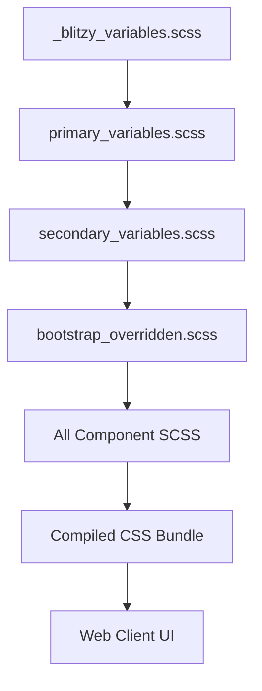
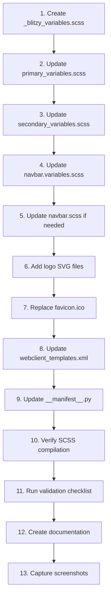

# Technical Specification

# 0. Agent Action Plan

## 0.1 Intent Clarification

### 0.1.1 Core Objective

Based on the provided requirements, the Blitzy platform understands that the objective is to **integrate Blitzy visual branding into the Odoo 19.0 web client** through direct asset modification. The implementation involves:

- **Complete Visual Rebrand**: Replace default Odoo branding with Blitzy brand identity across all user-facing web client touchpoints
- **Color Palette Override**: Implement the Blitzy design system color tokens (`#5B39F3` primary, `#94FAD5` accent mint, `#130342` dark background) throughout the SCSS variable hierarchy
- **Logo and Favicon Replacement**: Replace Odoo logos and favicon with Blitzy brand assets across login, navigation, and browser tab display
- **Typography Update**: Integrate Inter font family as the primary UI typeface
- **Button and Navigation Styling**: Apply Blitzy gradient patterns and glow effects to primary CTAs and navigation header
- **Minimal Change Philosophy**: Make only the absolutely necessary changes while preserving all existing Odoo functionality

**Implicit Requirements Detected:**
- Must maintain backward compatibility with all existing Odoo modules
- SCSS compilation must succeed without errors
- Asset bundling must complete successfully
- Mobile responsive breakpoints must be preserved
- LGPL license compliance requires preserving Odoo attribution in footer

### 0.1.2 Task Categorization

| Aspect | Classification |
|--------|----------------|
| **Primary Task Type** | Configuration / UI Customization |
| **Secondary Aspects** | Asset Management, Documentation |
| **Scope Classification** | Cross-cutting change (affects multiple UI touchpoints but limited to styling layer) |
| **Risk Level** | Low (CSS/SCSS only, no business logic changes) |
| **Reversibility** | High (changes are additive and can be reverted) |

### 0.1.3 Special Instructions and Constraints

**CRITICAL Directives from User:**

1. **Minimal Change Clause**: 
   - Make ONLY changes absolutely necessary for Blitzy branding
   - Do NOT refactor, optimize, or modify existing code unless directly required
   - Preserve all Odoo default behavior and interaction patterns

2. **File Type Restrictions**:
   - Modify ONLY SCSS/CSS files for color and style overrides
   - Replace ONLY static image assets (logos, favicons)
   - Do NOT modify Python code under any circumstances
   - Do NOT modify JavaScript application logic
   - Do NOT refactor existing SCSS structure—add overrides only

3. **Documentation Requirements**:
   - Create comprehensive screenshot documentation in `docs/branding/`
   - Capture 10 specific screens at 1920x1080 (plus mobile at 375x812)
   - Document all modified files with clear comments

4. **Attribution Requirement**:
   - Update footer to "Powered by Blitzy | Based on Odoo"
   - Preserve Odoo attribution per LGPL license requirements

**User-Provided Examples (Preserved Verbatim):**

```scss
// User Example: Primary Button Specification
.btn-primary {
    background-color: #5B39F3;
    color: #94FAD5;
    border: none;
    box-shadow: 0 0 32px 0 rgba(91, 57, 243, 0.8);
}

.btn-primary:hover {
    background: linear-gradient(61deg, #7A6DEC 14%, #5B39F3 63.32%, #4101DB 86%);
}
```

```scss
// User Example: Login Page Styles
.o_login_page {
    background: linear-gradient(180deg, #240086, #130342);
}
```

### 0.1.4 Technical Interpretation

These requirements translate to the following technical implementation strategy:

| Requirement | Technical Action | Target Component |
|-------------|------------------|------------------|
| Replace Odoo purple (#714B67/#71639e) with Blitzy purple | Override `$o-brand-odoo` and `$o-brand-primary` variables in `primary_variables.scss` | SCSS Variable Layer |
| Implement Blitzy gradient on navbar | Override `$o-navbar-background` with gradient in `navbar.variables.scss` | Navbar Component |
| Login page dark gradient background | Create login-specific styles in new Blitzy variables file | Login Page Template |
| Primary button glow effect | Add button override styles with box-shadow property | Button Component |
| Inter font integration | Add Google Fonts import and override `$o-font-family-sans-serif` | Typography System |
| Replace favicon | Replace `favicon.ico` in `addons/web/static/img/` | Static Assets |
| Update footer attribution | Modify `webclient_templates.xml` brand_promotion template | QWeb Templates |

**Implementation Approach Summary:**
- To achieve **color consistency**, we will create `_blitzy_variables.scss` containing all brand tokens, then modify `primary_variables.scss` to use these tokens with the `!default` pattern
- To achieve **navbar branding**, we will modify `navbar.variables.scss` to apply the gradient background and update text colors
- To achieve **button styling**, we will override the `$o-btns-bs-override` map in `primary_variables.scss` with Blitzy-specific button configurations
- To achieve **favicon replacement**, we will replace the existing `favicon.ico` file with Blitzy brand assets
- To achieve **documentation**, we will create a `docs/branding/` directory with README.md and screenshots subfolder

## 0.2 Repository Scope Discovery

### 0.2.1 Comprehensive File Analysis

**Repository Structure Overview:**
The Odoo 19.0 codebase follows a modular architecture with the web client assets centralized in `addons/web/`. The branding implementation targets the following file categories:

**SCSS Variable Files (Primary Targets):**

| File Path | Purpose | Branding Relevance |
|-----------|---------|-------------------|
| `addons/web/static/src/scss/primary_variables.scss` | Defines core brand colors (`$o-community-color`, `$o-brand-primary`, `$o-brand-secondary`) | PRIMARY - Must override for color branding |
| `addons/web/static/src/scss/secondary_variables.scss` | Defines derived colors, background colors, button overrides | HIGH - Contains `$o-webclient-background-color` |
| `addons/web/static/src/scss/bootstrap_overridden.scss` | Maps Odoo variables to Bootstrap (`$primary: $o-brand-primary`) | REFERENCE - Confirms variable mappings |
| `addons/web/static/src/scss/pre_variables.scss` | Bootstrap 5 pre-variable defaults | REFERENCE - Variable load order context |

**Webclient Component Files:**

| File Path | Purpose | Branding Relevance |
|-----------|---------|-------------------|
| `addons/web/static/src/webclient/navbar/navbar.variables.scss` | Navbar-specific variables (`$o-navbar-height`, `$o-navbar-background`) | HIGH - Navbar gradient override |
| `addons/web/static/src/webclient/navbar/navbar.scss` | Navbar styling implementation | MEDIUM - May need style additions |
| `addons/web/static/src/webclient/webclient.scss` | Root webclient styles | LOW - Review for global impacts |

**Template Files:**

| File Path | Purpose | Branding Relevance |
|-----------|---------|-------------------|
| `addons/web/views/webclient_templates.xml` | Login page template (`web.login`), layout template, footer/brand attribution | HIGH - Logo paths, footer text |

**Static Assets:**

| File Path | Purpose | Action Required |
|-----------|---------|-----------------|
| `addons/web/static/img/favicon.ico` | Browser tab favicon | REPLACE with Blitzy favicon |
| `addons/web/static/img/odoo_logo.svg` | Primary Odoo logo | REPLACE/ADD Blitzy logo |
| `addons/web/static/img/odoo_logo_dark.svg` | Dark variant logo | ADD Blitzy dark logo variant |

**Asset Bundle Configuration:**

| Bundle | Location in `__manifest__.py` | Relevance |
|--------|-------------------------------|-----------|
| `web._assets_primary_variables` | Lines ~350-370 | Core variable bundle - new Blitzy variables file must be added here |
| `web.assets_backend` | Lines ~50-150 | Backend application styles |
| `web.assets_frontend` | Lines ~200-250 | Frontend/login page styles |

### 0.2.2 Web Search Research Conducted

Based on web search research on Odoo SCSS best practices:

- **Variable Override Pattern**: Odoo uses a `!default` system where variables can be overridden by defining them before the default assignment. The asset bundle order determines which values take precedence.

- **Asset Bundle Architecture**: The `web._assets_primary_variables` bundle is specifically designed for brand color customization and is included in both backend and frontend bundles.

- **Bootstrap Integration**: Odoo maps its brand variables to Bootstrap variables in `bootstrap_overridden.scss`, so overriding `$o-brand-primary` automatically propagates to Bootstrap's `$primary`.

- **Minimal Change Best Practice**: Adding override files rather than modifying core files is the recommended approach for maintainability and upgrade compatibility.

### 0.2.3 Existing Infrastructure Assessment

**Project Structure:**
```
addons/web/
├── __manifest__.py          # Asset bundle definitions
├── controllers/             # NOT IN SCOPE (Python)
├── models/                  # NOT IN SCOPE (Python)
├── views/
│   └── webclient_templates.xml  # IN SCOPE (logo paths, footer)
└── static/
    ├── img/                 # IN SCOPE (logo/favicon assets)
    ├── fonts/               # REFERENCE (existing font infrastructure)
    └── src/
        ├── scss/            # IN SCOPE (variable overrides)
        ├── webclient/       # IN SCOPE (navbar styling)
        ├── public/          # REFERENCE (login.js - not to modify)
        └── core/            # REFERENCE (color definitions in JS)
```

**Existing Patterns and Conventions:**
- SCSS files use `$o-` prefix for Odoo-specific variables
- Bootstrap variables use standard `$` naming
- Asset bundles define file load order and dependencies
- `!default` flag allows variable overriding from earlier-loaded files

**Current Color Tokens (to be replaced):**

| Token | Current Value | Replacement (Blitzy) |
|-------|---------------|---------------------|
| `$o-community-color` | `#71639e` | `#5B39F3` |
| `$o-brand-primary` | `$o-community-color` | `#5B39F3` |
| `$o-brand-secondary` | `#017e84` | `#94FAD5` |
| `$o-webclient-background-color` | `#F7F8F7` | `#F4EFF6` |

**Font Infrastructure:**
- Current font stack: `$o-font-family-sans-serif` defaults to system fonts
- Google Fonts can be imported via SCSS `@import` or template `<link>` tag
- Inter font requires explicit import from Google Fonts CDN

## 0.3 File Transformation Mapping

### 0.3.1 File-by-File Execution Plan

| Target File | Transformation | Source File/Reference | Purpose/Changes |
|-------------|----------------|----------------------|-----------------|
| `addons/web/static/src/scss/_blitzy_variables.scss` | CREATE | User specification | New file containing all Blitzy brand token definitions (colors, gradients, typography, effects) |
| `addons/web/static/src/scss/primary_variables.scss` | UPDATE | `addons/web/static/src/scss/primary_variables.scss` | Override `$o-community-color`, `$o-brand-primary`, `$o-brand-secondary`, and font variables |
| `addons/web/static/src/scss/secondary_variables.scss` | UPDATE | `addons/web/static/src/scss/secondary_variables.scss` | Override `$o-webclient-background-color` and button styling maps |
| `addons/web/static/src/webclient/navbar/navbar.variables.scss` | UPDATE | `addons/web/static/src/webclient/navbar/navbar.variables.scss` | Override `$o-navbar-background` with Blitzy gradient |
| `addons/web/static/src/webclient/navbar/navbar.scss` | UPDATE | `addons/web/static/src/webclient/navbar/navbar.scss` | Add navbar text color and hover state overrides |
| `addons/web/views/webclient_templates.xml` | UPDATE | `addons/web/views/webclient_templates.xml` | Update logo paths, add Inter font link, update footer attribution text |
| `addons/web/__manifest__.py` | UPDATE | `addons/web/__manifest__.py` | Add `_blitzy_variables.scss` to `web._assets_primary_variables` bundle |
| `addons/web/static/img/blitzy-logo.svg` | CREATE | User brand assets | Primary Blitzy logo for general use (200x50px, transparent) |
| `addons/web/static/img/blitzy-logo-white.svg` | CREATE | User brand assets | White Blitzy logo for dark backgrounds (login page, navbar) |
| `addons/web/static/img/blitzy-logo-dark.svg` | CREATE | User brand assets | Dark Blitzy logo for light backgrounds |
| `addons/web/static/img/favicon.ico` | UPDATE | `addons/web/static/img/favicon.ico` | Replace with Blitzy favicon (16x16, 32x32, 48x48 multi-size ICO) |
| `addons/web/static/img/favicon.png` | CREATE | User brand assets | Blitzy favicon in PNG format (32x32) |
| `addons/web/static/img/blitzy-icon-192.png` | CREATE | User brand assets | PWA manifest icon (192x192) |
| `addons/web/static/img/blitzy-icon-512.png` | CREATE | User brand assets | PWA manifest icon (512x512) |
| `docs/branding/README.md` | CREATE | User specification | Branding implementation documentation with modified files list and color specifications |
| `docs/branding/screenshots/*.png` | CREATE | Runtime captures | 10 screenshots documenting branded UI (login, dashboard, views, etc.) |
| `addons/web/static/src/scss/bootstrap_overridden.scss` | REFERENCE | — | Reference for understanding Bootstrap variable mapping |
| `addons/web/static/src/scss/pre_variables.scss` | REFERENCE | — | Reference for variable load order |

### 0.3.2 New Files Detail

**`addons/web/static/src/scss/_blitzy_variables.scss`**
- Content type: SCSS variables/configuration
- Purpose: Central definition file for all Blitzy brand tokens
- Key sections:
  - Primary colors (`$blitzy-primary`, `$blitzy-primary-dark`, `$blitzy-primary-light`)
  - Accent colors (`$blitzy-accent-mint`, `$blitzy-accent-green`)
  - Background colors (`$blitzy-bg-dark`, `$blitzy-bg-light`)
  - Gradient definitions (`$blitzy-gradient-primary`, `$blitzy-gradient-accent`)
  - Typography (`$blitzy-font-family`)
  - Effects (`$blitzy-button-glow`, `$blitzy-text-glow`)

**`addons/web/static/img/blitzy-logo.svg`**
- Content type: SVG vector image
- Dimensions: 200x50px viewBox
- Purpose: Primary brand logo for navigation and general use
- Background: Transparent

**`addons/web/static/img/blitzy-logo-white.svg`**
- Content type: SVG vector image
- Dimensions: 200x50px viewBox
- Purpose: White variant for dark gradient backgrounds (login page)
- Background: Transparent

**`addons/web/static/img/favicon.ico`**
- Content type: Multi-size ICO file
- Dimensions: 16x16, 32x32, 48x48 embedded
- Purpose: Browser tab favicon
- Background: Transparent

**`docs/branding/README.md`**
- Content type: Markdown documentation
- Purpose: Implementation documentation and changelog
- Key sections:
  - Overview of branding implementation
  - Brand colors reference table
  - Screenshots gallery with descriptions
  - Modified files list with change descriptions
  - Validation checklist

### 0.3.3 Files to Modify Detail

**`addons/web/static/src/scss/primary_variables.scss`**
- Lines to update: Near top where `$o-community-color` is defined (line ~1-10)
- Changes:
  - Change `$o-community-color: #71639e` to `$o-community-color: #5B39F3`
  - Change `$o-brand-secondary` from `#017e84` to `#94FAD5`
  - Update font family variable to include Inter

**`addons/web/static/src/scss/secondary_variables.scss`**
- Lines to update: `$o-webclient-background-color` definition
- Changes:
  - Override webclient background to `#F4EFF6`
  - Add button styling overrides in `$o-btns-bs-override` map

**`addons/web/static/src/webclient/navbar/navbar.variables.scss`**
- Lines to update: `$o-navbar-background` definition (line ~3-5)
- Changes:
  - Replace solid color with Blitzy gradient: `linear-gradient(61deg, #7A6DEC 14%, #5B39F3 63.32%, #4101DB 86%)`

**`addons/web/views/webclient_templates.xml`**
- Sections to update:
  - `<template id="web.login_layout">` - Update logo path reference
  - `<template id="brand_promotion">` - Update footer attribution text
  - Add Inter font `<link>` tag in `<head>` template

**`addons/web/__manifest__.py`**
- Section to update: `web._assets_primary_variables` bundle definition
- Changes:
  - Add `web/static/src/scss/_blitzy_variables.scss` as first entry in bundle to ensure overrides take precedence

### 0.3.4 Configuration and Documentation Updates

**Configuration Changes:**

| Config File | Setting | Change |
|-------------|---------|--------|
| `addons/web/__manifest__.py` | `web._assets_primary_variables` | Add `_blitzy_variables.scss` to asset bundle list |

**Impact:** The new SCSS file will be compiled with the asset bundle, injecting Blitzy brand tokens into the CSS output. No runtime behavior changes.

**Documentation Updates:**

| Doc File | Sections to Add/Update |
|----------|----------------------|
| `docs/branding/README.md` | Complete new file with implementation details |
| `docs/branding/screenshots/` | 10 new screenshot files documenting branded UI |

### 0.3.5 Cross-File Dependencies

**Variable Propagation Chain:**
```
_blitzy_variables.scss (defines tokens)
    ↓
primary_variables.scss (uses tokens for $o-brand-*)
    ↓
bootstrap_overridden.scss (maps to Bootstrap $primary, $secondary)
    ↓
All component SCSS files (inherit Bootstrap/Odoo variables)
```

**Asset Bundle Load Order:**
```
1. _blitzy_variables.scss (Blitzy tokens - NEW)
2. primary_variables.scss (Core brand colors)
3. secondary_variables.scss (Derived colors)
4. pre_variables.scss (Bootstrap defaults)
5. bootstrap_overridden.scss (Bootstrap mappings)
```

**Template-Asset Coordination:**
- `webclient_templates.xml` must reference correct logo paths matching new image files
- Font import link must load before styles to prevent FOUT (Flash of Unstyled Text)

## 0.4 Dependency Inventory

### 0.4.1 Key Private and Public Packages

This implementation primarily involves SCSS styling changes and does not require installing new packages. The following existing dependencies are relevant:

| Registry | Package Name | Version | Purpose |
|----------|--------------|---------|---------|
| CDN | Google Fonts (Inter) | Latest | Typography - Inter font family import via CDN |
| npm (existing) | Bootstrap | 5.x (bundled with Odoo) | CSS framework - variables integration |
| pip (existing) | Odoo | 19.0 | Base platform - SCSS compilation |

**External Resource Addition:**

| Resource | URL | Purpose |
|----------|-----|---------|
| Inter Font | `https://fonts.googleapis.com/css2?family=Inter:wght@400;500;600;700&display=swap` | Blitzy typography integration |

### 0.4.2 Dependency Updates

**New Dependencies to Add:**
- **Google Fonts (Inter)**: External CDN import - Added via `<link>` tag in template, no package installation required

**Dependencies to Update:**
- None - No version changes required

**Dependencies to Remove:**
- None - All existing dependencies preserved

### 0.4.3 Import/Reference Updates

**SCSS Import Updates:**

The `_blitzy_variables.scss` file will be added to the asset bundle via `__manifest__.py`. No explicit `@import` statements are required in existing SCSS files due to Odoo's asset bundling system.

**Template Import Updates:**

In `addons/web/views/webclient_templates.xml`, add Google Fonts import:

```xml
<!-- Font import addition in head template -->
<link href="https://fonts.googleapis.com/css2?family=Inter:wght@400;500;600;700&amp;display=swap" 
      rel="stylesheet"/>
```

**Asset Bundle Registration:**

In `addons/web/__manifest__.py`, the new SCSS file must be registered:

```python
# Addition to web._assets_primary_variables bundle
'web._assets_primary_variables': [
    'web/static/src/scss/_blitzy_variables.scss',  # NEW - Blitzy brand tokens
    # ... existing entries
],
```

### 0.4.4 Static Asset Requirements

**Required Brand Assets (to be provided or generated):**

| Asset | Dimensions | Format | Background | Status |
|-------|------------|--------|------------|--------|
| Primary Logo | 200x50px | SVG | Transparent | TO CREATE |
| Logo White | 200x50px | SVG | For dark backgrounds | TO CREATE |
| Logo Dark | 200x50px | SVG | For light backgrounds | TO CREATE |
| Favicon | 16x16, 32x32, 48x48 | ICO | Transparent | TO CREATE |
| Favicon PNG | 32x32 | PNG | Transparent | TO CREATE |
| App Icon 192 | 192x192 | PNG | For PWA manifest | TO CREATE |
| App Icon 512 | 512x512 | PNG | For PWA manifest | TO CREATE |

**Asset File Naming Convention:**
- `blitzy-logo.svg` - Primary logo
- `blitzy-logo-white.svg` - White variant
- `blitzy-logo-dark.svg` - Dark variant
- `favicon.ico` - Multi-size favicon (replaces existing)
- `favicon.png` - PNG favicon variant
- `blitzy-icon-192.png` - PWA icon small
- `blitzy-icon-512.png` - PWA icon large

## 0.5 Implementation Design

### 0.5.1 Technical Approach

**Primary Objectives with Implementation Approach:**

| Goal | Action | Component | Specific Changes |
|------|--------|-----------|------------------|
| Establish brand color foundation | CREATE | `_blitzy_variables.scss` | Define all Blitzy color tokens, gradients, and effects as SCSS variables |
| Override core brand colors | MODIFY | `primary_variables.scss` | Replace `#71639e` with `#5B39F3`, `#017e84` with `#94FAD5` |
| Apply gradient navbar | MODIFY | `navbar.variables.scss` | Replace solid `$o-navbar-background` with gradient |
| Style primary buttons | MODIFY | `secondary_variables.scss` | Update `$o-btns-bs-override` map with glow effect |
| Integrate Inter typography | MODIFY | Templates + SCSS | Add font import link and update font variable |
| Replace logos and favicon | REPLACE/CREATE | `static/img/` directory | Add Blitzy SVG logos and multi-size favicon |
| Update footer attribution | MODIFY | `webclient_templates.xml` | Change footer text to "Powered by Blitzy \| Based on Odoo" |
| Document implementation | CREATE | `docs/branding/` | Create README.md and screenshot gallery |

**Logical Implementation Flow:**

1. **First, establish foundation** by creating `_blitzy_variables.scss` containing all brand tokens as the single source of truth for Blitzy colors
2. **Next, integrate tokens** by modifying `primary_variables.scss` to use Blitzy values, which propagates through Bootstrap mapping
3. **Then, customize components** by updating navbar variables and adding login page styles
4. **Subsequently, replace assets** by adding logo files and replacing favicon
5. **Finally, update templates** by modifying `webclient_templates.xml` for logo paths, font import, and footer text
6. **Conclude with documentation** by creating the `docs/branding/` directory with implementation notes and screenshots

### 0.5.2 Component Impact Analysis

**Direct Modifications Required:**

| Component | Aspect to Modify | Capability Enabled |
|-----------|------------------|-------------------|
| SCSS Variable Layer | `$o-brand-primary`, `$o-brand-secondary` | Global Blitzy color theme |
| Navbar Component | `$o-navbar-background` variable | Gradient header styling |
| Button Component | `$o-btns-bs-override` map | Glow effect on primary CTAs |
| Login Page | Background gradient, logo display | Branded authentication experience |
| Footer Template | Attribution text | Blitzy branding with LGPL compliance |

**Indirect Impacts and Dependencies:**

| Component | Required Update | Reason |
|-----------|-----------------|--------|
| All views using Bootstrap `$primary` | Automatic via variable cascade | Colors propagate through `bootstrap_overridden.scss` |
| Form buttons | Automatic via button map | Uses `$o-btns-bs-override` |
| Link colors | Automatic via `$o-main-link-color` | Derived from `$o-brand-primary` |
| Kanban cards | Automatic via Bootstrap | Uses Bootstrap color classes |

**No New Components Introduction:**
This implementation follows an override-only approach. No new components, modules, or JavaScript behaviors are created. All changes operate within existing SCSS variable and template systems.

### 0.5.3 User-Provided Examples Integration

The user's examples map directly to the implementation:

**Button Specification → SCSS Variable Override:**
```scss
// User example implementation in secondary_variables.scss
$o-btns-bs-override: (
  primary: (
    background-color: #5B39F3,
    color: #94FAD5,
    border-color: transparent,
  ),
) !default;
```

**Login Page Gradient → Login Template Styling:**
```scss
// User example implementation
.o_login_page {
    background: linear-gradient(180deg, #240086, #130342);
}
```

### 0.5.4 Critical Implementation Details

**Design Patterns Employed:**

- **Variable Override Pattern**: Using SCSS `!default` flag to allow brand tokens to cascade through the variable hierarchy
- **Asset Bundle Ordering**: Positioning `_blitzy_variables.scss` first in the bundle ensures its values take precedence
- **Progressive Enhancement**: Adding styles that enhance without breaking existing functionality

**Key Implementation Decisions:**

| Decision | Rationale |
|----------|-----------|
| Create separate `_blitzy_variables.scss` | Maintains separation of concerns; easier to update brand tokens in one place |
| Use CSS gradients for navbar | SVG or image-based gradients would require more invasive changes |
| Font via CDN link | Simpler than bundling font files; industry-standard approach |
| Override variables vs. add `!important` | Cleaner, more maintainable; follows Odoo best practices |

**Error Handling Considerations:**

- **Font Loading Fallback**: Font stack includes system fonts as fallback if Google Fonts CDN fails
- **Gradient Fallback**: Browsers without gradient support will show solid `$o-brand-primary` color
- **Logo Fallback**: SVG logos work across all modern browsers; no special fallbacks needed

**Data Flow:**



**Performance Considerations:**

- Google Fonts import uses `display=swap` to prevent render blocking
- No additional JavaScript introduced
- SCSS compilation produces optimized CSS output
- Asset bundling and minification handled by existing Odoo pipeline

## 0.6 Scope Boundaries

### 0.6.1 Exhaustively In Scope

**SCSS/CSS Files:**

| Pattern | Files Included | Purpose |
|---------|----------------|---------|
| `addons/web/static/src/scss/_blitzy_variables.scss` | New file | Blitzy brand token definitions |
| `addons/web/static/src/scss/primary_variables.scss` | Single file | Core brand color overrides |
| `addons/web/static/src/scss/secondary_variables.scss` | Single file | Background and button overrides |
| `addons/web/static/src/webclient/navbar/navbar.variables.scss` | Single file | Navbar gradient override |
| `addons/web/static/src/webclient/navbar/navbar.scss` | Single file | Navbar text color additions (if needed) |

**Static Assets:**

| Pattern | Files Included | Purpose |
|---------|----------------|---------|
| `addons/web/static/img/blitzy-logo*.svg` | 3 files | Logo variants (primary, white, dark) |
| `addons/web/static/img/favicon.ico` | Single file | Browser favicon replacement |
| `addons/web/static/img/favicon.png` | Single file | PNG favicon variant |
| `addons/web/static/img/blitzy-icon-*.png` | 2 files | PWA icons (192px, 512px) |

**Template Files:**

| Pattern | Files Included | Purpose |
|---------|----------------|---------|
| `addons/web/views/webclient_templates.xml` | Single file | Logo paths, font import, footer text |

**Configuration Files:**

| Pattern | Files Included | Purpose |
|---------|----------------|---------|
| `addons/web/__manifest__.py` | Single file | Asset bundle registration |

**Documentation:**

| Pattern | Files Included | Purpose |
|---------|----------------|---------|
| `docs/branding/README.md` | Single file | Implementation documentation |
| `docs/branding/screenshots/*.png` | 10 files | Visual validation screenshots |

### 0.6.2 Explicitly Out of Scope

**Python Files (DO NOT MODIFY):**

| Pattern | Reason |
|---------|--------|
| `odoo/**/*.py` | Core Odoo Python - user explicitly excluded |
| `addons/*/models/*.py` | All model definitions - business logic |
| `addons/*/controllers/*.py` | All controllers - API/routing logic |
| `addons/web/controllers/*.py` | Web controllers - preserved |

**JavaScript Files (DO NOT MODIFY):**

| Pattern | Reason |
|---------|--------|
| `addons/web/static/src/**/*.js` | All JavaScript - application logic preservation |
| `addons/web/static/src/public/login.js` | Login behavior - preserved |
| `addons/web/static/src/core/**/*.js` | Core JS components - preserved |

**View Definitions (DO NOT MODIFY):**

| Pattern | Reason |
|---------|--------|
| `addons/*/views/*.xml` | View definitions (except logo path updates in webclient_templates.xml) |

**Security and Data Files (DO NOT MODIFY):**

| Pattern | Reason |
|---------|--------|
| `addons/*/security/*.xml` | Security definitions |
| `addons/*/data/*.xml` | Data files |

**Report and Email Templates (DO NOT MODIFY):**

| Pattern | Reason |
|---------|--------|
| `addons/*/report/*.xml` | PDF report templates |
| `addons/*/static/src/xml/**/*.xml` | Component templates |

**Related Features NOT in Scope:**

- Performance optimizations beyond branding requirements
- Refactoring unrelated SCSS code
- JavaScript behavior modifications
- Dark mode implementation (unless existing)
- Report template color changes
- Email template color changes
- Third-party addon styling
- Module manifest changes (except asset bundle)
- Database migrations
- API endpoint changes

### 0.6.3 Boundary Decision Matrix

| Change Type | In Scope? | Rationale |
|-------------|-----------|-----------|
| SCSS variable override | ✅ YES | Core branding mechanism |
| New SCSS file creation | ✅ YES | Brand token centralization |
| Image asset replacement | ✅ YES | Logo/favicon branding |
| Template text change | ✅ YES | Footer attribution |
| Template logo path change | ✅ YES | Logo display |
| Asset bundle registration | ✅ YES | Required for SCSS loading |
| Python code change | ❌ NO | Explicitly excluded |
| JavaScript change | ❌ NO | Explicitly excluded |
| Module behavior change | ❌ NO | Functionality preservation |
| SCSS refactoring | ❌ NO | Add overrides only |
| Report styling | ❌ NO | User excluded |
| Email styling | ❌ NO | User excluded |

## 0.7 Execution Parameters

### 0.7.1 Special Execution Instructions

**Process-Specific Requirements:**

| Requirement | Description |
|-------------|-------------|
| SCSS-Only Approach | All color and style changes must be implemented through SCSS variable overrides, not inline styles or JavaScript |
| Asset-Only Replacement | Logo and favicon changes via file replacement, not template restructuring |
| Override Pattern | Add new override values rather than modifying existing variable assignments where possible |
| Documentation Required | Must create `docs/branding/` with README.md and 10 screenshots |
| Comment Annotations | All modified files must include clear comments indicating Blitzy branding changes |

**Quality Requirements:**

| Criteria | Validation Method |
|----------|-------------------|
| SCSS compiles without errors | Run Odoo asset compilation |
| No JavaScript console errors | Browser developer tools inspection |
| Asset bundling succeeds | Verify asset loading in browser |
| Page load time within 10% of baseline | Performance comparison |
| All modules load without errors | Test module installation |
| Mobile responsiveness preserved | Test at 375x812 viewport |

**Deployment Considerations:**

- Clear browser cache after deployment to ensure fresh assets load
- Restart Odoo service to regenerate SCSS compilation
- Verify asset bundle versions are updated

### 0.7.2 Constraints and Boundaries

**Technical Constraints:**

| Constraint | Impact |
|------------|--------|
| No Python modifications | All branding must be SCSS/template based |
| No JavaScript modifications | Cannot add dynamic branding behavior |
| LGPL compliance | Must preserve "Based on Odoo" attribution |
| Odoo asset pipeline | Must work within existing bundle system |
| Bootstrap 5 integration | Variables must map correctly to Bootstrap |

**Process Constraints:**

| Constraint | Guidance |
|------------|----------|
| Minimal change philosophy | Choose least invasive approach when options exist |
| Override-only SCSS | Do not restructure existing SCSS organization |
| No interface changes | Preserve all existing component behavior |
| Existing issues | Note but do not fix unrelated issues discovered |

**Output Constraints:**

| Constraint | Specification |
|------------|---------------|
| Logo formats | SVG for logos, ICO for favicon |
| Screenshot resolution | 1920x1080 for desktop, 375x812 for mobile |
| Documentation format | Markdown for README |
| Color values | Use exact HEX values from specification |

**Compatibility Requirements:**

| Requirement | Target |
|-------------|--------|
| Browser support | All browsers supported by Odoo 19.0 |
| Viewport support | Desktop (1920px+) and mobile (375px+) |
| Module compatibility | All existing Odoo modules must load |
| Theme compatibility | Must not break existing Odoo themes |

### 0.7.3 Validation Checklist

**Visual Validation:**

- [ ] Login page displays Blitzy gradient background (`#240086` → `#130342`)
- [ ] Login page shows Blitzy logo (not Odoo logo)
- [ ] Primary buttons use `#5B39F3` background with `#94FAD5` text
- [ ] Navigation header displays gradient background
- [ ] Favicon displays Blitzy icon in browser tab
- [ ] Inter font family loads and applies to UI text
- [ ] Footer shows "Powered by Blitzy | Based on Odoo"

**Functional Validation:**

- [ ] All existing Odoo modules load without errors
- [ ] User authentication works unchanged
- [ ] All menu navigation functions correctly
- [ ] Form submissions work unchanged
- [ ] Report generation works unchanged
- [ ] Mobile responsive breakpoints preserved

**Build Validation:**

- [ ] SCSS compiles without errors
- [ ] No JavaScript console errors introduced
- [ ] Asset bundling completes successfully
- [ ] Page load time within 10% of baseline

### 0.7.4 Execution Sequence Summary



## 0.8 Special Instructions

### 0.8.1 Task-Specific Requirements

The following directives are explicitly emphasized by the user and must be strictly followed:

**Minimal Change Discipline:**

> "Make only the changes that are absolutely necessary to implement Blitzy branding. Do not refactor, optimize, or modify existing code unless directly required for branding integration. Preserve all Odoo default behavior and interaction patterns."

| Directive | Implementation Guidance |
|-----------|------------------------|
| Modify only SCSS/CSS files for color and style overrides | Limit changes to `.scss` files in the identified paths |
| Replace only static image assets (logos, favicons) | Only add/replace files in `addons/web/static/img/` |
| Do not modify Python code under any circumstances | Zero `.py` file modifications |
| Do not modify JavaScript application logic | Zero `.js` file modifications |
| Do not refactor existing SCSS structure—add overrides only | Use variable overrides, not structural changes |
| Do not change existing component interfaces | Preserve all existing CSS class names and HTML structures |
| Preserve all Odoo default behavior exactly as-is | No functional changes to application behavior |
| Document every file modified with clear comments | Add `// Blitzy branding: [description]` comments |
| When multiple approaches exist, choose least invasive option | Prefer variable override over style rule addition |
| If you identify issues in existing code, note them but do not fix | Log issues separately, do not include fixes |

### 0.8.2 Color Specification Reference

**Primary Colors (use exact HEX values):**

| Token | HEX | Usage |
|-------|-----|-------|
| `--blitzy-primary` | `#5B39F3` | Primary brand color, buttons, links |
| `--blitzy-primary-dark` | `#4101DB` | Gradient endpoints, hover states |
| `--blitzy-primary-light` | `#7A6DEC` | Gradient start, lighter accents |
| `--blitzy-accent-mint` | `#94FAD5` | Button text, success states |
| `--blitzy-accent-green` | `#07FF97` | Gradient accent, active indicators |
| `--blitzy-bg-dark` | `#130342` | Dark mode backgrounds |
| `--blitzy-bg-darker` | `#240086` | Deep backgrounds, overlays |
| `--blitzy-bg-light` | `#F4EFF6` | Light mode backgrounds |
| `--blitzy-text-muted` | `#5F5B76` | Secondary text |
| `--blitzy-border` | `rgba(200, 191, 255, 0.45)` | Borders, dividers |

### 0.8.3 Gradient Specifications

**Use these exact gradient definitions:**

```scss
// Primary Brand Gradient - Use for primary CTAs and headers
$blitzy-gradient-primary: linear-gradient(61deg, #7A6DEC 14%, #5B39F3 63.32%, #4101DB 86%);

// Accent Gradient - Use for highlights and secondary elements  
$blitzy-gradient-accent: linear-gradient(271deg, #5B39F3 -11.94%, #94FAD5 70%, #07FF97);

// Background Gradient - Use for dark sections (login page)
$blitzy-gradient-bg: linear-gradient(180deg, #240086, #130342);

// Vertical Gradient - Use for vertical surfaces
$blitzy-gradient-vertical: linear-gradient(180deg, #561AD6, #240086);
```

### 0.8.4 Typography Specification

**Font Family Stack:**

```scss
$blitzy-font-family: 'Inter', ui-sans-serif, system-ui, sans-serif, 
    'Apple Color Emoji', 'Segoe UI Emoji', 'Segoe UI Symbol', 'Noto Color Emoji';
```

**Font Import:**

```html
<link href="https://fonts.googleapis.com/css2?family=Inter:wght@400;500;600;700&amp;display=swap" 
      rel="stylesheet"/>
```

### 0.8.5 Effect Specifications

**Button Glow Effect:**
```scss
$blitzy-button-glow: 0 0 32px 0 rgba(91, 57, 243, 0.8);
```

**Text Glow Effect:**
```scss
$blitzy-text-glow: 0 0 8px #5B39F3, 0 0 16px #5B39F3;
```

**Element Glow Effect:**
```scss
$blitzy-element-glow: 0 0 8px 0 rgba(255, 255, 255, 0.5), 
                      0 0 40px 0 #C5B7FF, 
                      0 0 80px 0 #5B39F3;
```

**Shadow Effect:**
```scss
$blitzy-shadow: 0 36px 100px 0 rgba(36, 0, 134, 0.5);
```

### 0.8.6 Attribution Requirement

**Footer Text (LGPL Compliance):**

Replace existing Odoo attribution with:

```
Powered by Blitzy | Based on Odoo
```

This maintains LGPL license compliance by preserving Odoo attribution while adding Blitzy branding.

### 0.8.7 Documentation Screenshot Requirements

**Required Screenshots (all at 1920x1080 except mobile):**

| # | Filename | Description |
|---|----------|-------------|
| 1 | `01-login-page.png` | Login/authentication screen with Blitzy gradient and logo |
| 2 | `02-dashboard.png` | Main dashboard after login showing branded navbar |
| 3 | `03-app-menu.png` | Application menu/launcher with Blitzy header |
| 4 | `04-list-view.png` | Standard list view with branded header |
| 5 | `05-form-view.png` | Form view with branded buttons |
| 6 | `06-kanban-view.png` | Kanban board with branded elements |
| 7 | `07-settings.png` | Settings page with branded sidebar |
| 8 | `08-user-menu.png` | User profile dropdown showing profile and logout |
| 9 | `09-search-panel.png` | Search/filter panel with branded controls |
| 10 | `10-mobile-responsive.png` | Mobile viewport (375x812) showing responsive header |

**Screenshot Capture Requirements:**

- Use browser at 100% zoom, no extensions visible
- Clear browser cache before capturing to ensure fresh assets load
- Use consistent test data across screenshots
- Include browser tab showing Blitzy favicon
- Capture both light mode default and any dark mode variants if applicable

