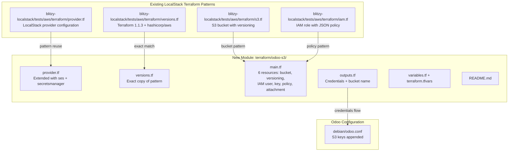

# Technical Specification

# 0. Agent Action Plan

## 0.1 Intent Clarification


### 0.1.1 Core Feature Objective

Based on the prompt, the Blitzy platform understands that the new feature requirement is to **provision an Amazon S3 bucket for Odoo file attachments using Terraform, targeting a LocalStack development environment**. Specifically, the platform must:

- **Create a self-contained Terraform module** at the path `./terraform/odoo-s3/` comprising seven files (`provider.tf`, `versions.tf`, `main.tf`, `outputs.tf`, `variables.tf`, `terraform.tfvars`, `README.md`) that together define all infrastructure-as-code for the S3 attachment storage subsystem
- **Provision exactly six AWS resources** against LocalStack (`localhost:4566`):
  - An S3 bucket named `odoo-attachments` with versioning enabled (via a separate `aws_s3_bucket_versioning` resource)
  - An IAM user named `odoo-s3` with a programmatic access key
  - An IAM policy granting `s3:GetObject`, `s3:PutObject`, `s3:DeleteObject`, and `s3:ListBucket` scoped to the bucket and its objects
  - An IAM user-policy attachment linking the policy to the user
- **Update the existing Odoo server configuration** in `./debian/odoo.conf` to include four S3 connection keys (`aws_access_key_id`, `aws_secret_access_key`, `aws_region`, `aws_s3_bucket`) accompanied by a comment indicating these are LocalStack development defaults to be overridden in production via environment variables
- **Preserve all existing test infrastructure** — zero modifications under `./blitzy-localstack/tests/`

Implicit requirements surfaced from analysis:

- The `provider.tf` must follow the **existing LocalStack provider pattern** discovered in `blitzy-localstack/tests/aws/terraform/provider.tf`, which uses `access_key = "test"`, `secret_key = "test"`, and multiple `skip_*` flags, while additionally including `ses` and `secretsmanager` service endpoints as specified by the user
- The `versions.tf` must **exactly replicate** the version constraints from `blitzy-localstack/tests/aws/terraform/versions.tf`, which pins `required_version = "1.1.3"` and uses `hashicorp/aws` as the provider source without a version pin
- The IAM policy must reference both the bucket ARN (for `s3:ListBucket`) and the objects ARN (`bucket/*` for `s3:GetObject`, `s3:PutObject`, `s3:DeleteObject`)
- The `terraform output -json` must expose credentials that can be extracted and used to perform a full S3 lifecycle test (upload, list, download, delete) against LocalStack
- The module must be fully **idempotent**: `terraform destroy` followed by `terraform apply` must both complete without error

### 0.1.2 Special Instructions and Constraints

- **Exact Provider Pattern**: The `provider.tf` must include `endpoint localhost:4566`, `access_key="test"`, `secret_key="test"`, `skip_credentials_validation=true`, `skip_requesting_account_id=true`, `skip_metadata_api_check=true`, `s3_force_path_style=true`, with `ses` and `secretsmanager` endpoints explicitly included alongside `s3` and `iam`
- **Versions Match Existing**: The `versions.tf` must be an exact copy of the pattern in `blitzy-localstack/tests/aws/terraform/versions.tf` (Terraform `1.1.3`, `hashicorp/aws` provider with no version constraint)
- **Sensitive Outputs**: The `iam_secret_access_key` output must be marked with `sensitive = true`
- **Do Not Touch**: Absolutely no files under `./blitzy-localstack/tests/` may be created, modified, or deleted — validation via `git diff --name-only` confirms zero modified files in that subtree
- **LocalStack Dev Comment**: The `debian/odoo.conf` additions must carry a comment noting these are LocalStack dev values to be overridden in production via environment variables

User Example (Validation sequence):
```
awslocal s3 ls                     → returns "odoo-attachments"
awslocal iam list-users            → returns "odoo-s3"
awslocal s3api get-bucket-versioning --bucket odoo-attachments → Status: Enabled
```

### 0.1.3 Technical Interpretation

These feature requirements translate to the following technical implementation strategy:

- To **provision the S3 attachment bucket**, we will create `./terraform/odoo-s3/main.tf` containing an `aws_s3_bucket` resource and a companion `aws_s3_bucket_versioning` resource to achieve exactly 6 plan additions
- To **create programmatic IAM access**, we will define `aws_iam_user`, `aws_iam_access_key`, `aws_iam_policy` (with a JSON policy document), and `aws_iam_user_policy_attachment` in the same `main.tf`
- To **configure the LocalStack provider**, we will create `./terraform/odoo-s3/provider.tf` following the pattern in `blitzy-localstack/tests/aws/terraform/provider.tf` but extending the endpoints block to include `ses` and `secretsmanager`
- To **parameterize the module**, we will create `variables.tf` with `bucket_name`, `iam_user_name`, and `aws_region` variables, and `terraform.tfvars` with their default values
- To **expose provisioned credentials**, we will create `outputs.tf` exporting `bucket_name`, `iam_access_key_id`, and `iam_secret_access_key` (sensitive)
- To **integrate with Odoo**, we will modify `debian/odoo.conf` by appending the four S3 keys under the existing `[options]` section
- To **document the module**, we will create `README.md` with prerequisites, init/plan/apply steps, `awslocal` verification commands, and Odoo connection instructions


## 0.2 Repository Scope Discovery


### 0.2.1 Comprehensive File Analysis

The following analysis was conducted by systematically exploring the repository using `get_source_folder_contents`, `read_file`, and `bash` across multiple directory levels. The repository is an Odoo 19.0 monolith with a `blitzy-localstack` submodule providing LocalStack AWS emulation.

**Existing files requiring modification:**

| File Path | Current Purpose | Required Change |
|-----------|----------------|-----------------|
| `debian/odoo.conf` | INI-format Debian package configuration template with `[options]` section containing `db_host`, `db_port`, `db_user`, `db_password`, `default_productivity_apps` | Append four S3 configuration keys (`aws_access_key_id`, `aws_secret_access_key`, `aws_region`, `aws_s3_bucket`) with a LocalStack dev comment |

**Reference files read for pattern extraction (read-only — not modified):**

| File Path | Pattern Extracted |
|-----------|-------------------|
| `blitzy-localstack/tests/aws/terraform/provider.tf` | LocalStack AWS provider block: `access_key="test"`, `secret_key="test"`, `skip_*` flags, endpoint block structure with `localhost:4566` |
| `blitzy-localstack/tests/aws/terraform/versions.tf` | Terraform version constraint `1.1.3`, `hashicorp/aws` provider source with no version pin |
| `blitzy-localstack/tests/aws/terraform/s3.tf` | S3 bucket resource pattern with `versioning { enabled = true }` block and variable-driven bucket name |
| `blitzy-localstack/tests/aws/terraform/iam.tf` | IAM resource pattern with heredoc JSON policy documents |

**Integration point discovery:**

- **Odoo attachment storage**: The `ir.attachment` model in `odoo/addons/base/` manages file storage; the S3 bucket is provisioned as the future backend for this model's file store
- **Cloud storage modules**: `addons/cloud_storage/` (v1.0) provides an existing abstraction for offloading chatter attachments to cloud providers (Azure, Google); the S3 module establishes the infrastructure layer that a future `cloud_storage_s3` addon could consume
- **LocalStack Docker service**: `blitzy-localstack/docker-compose.yml` exposes LocalStack at `127.0.0.1:4566` with persistent state volume mount — the Terraform module targets this endpoint
- **No existing `terraform/` directory**: Confirmed via filesystem inspection that no `terraform/` directory exists at the repository root; this module is entirely new

### 0.2.2 New File Requirements

**New source files to create:**

| File Path | Purpose |
|-----------|---------|
| `terraform/odoo-s3/provider.tf` | LocalStack-targeted AWS provider configuration with endpoints for `s3`, `iam`, `ses`, `secretsmanager` at `localhost:4566` |
| `terraform/odoo-s3/versions.tf` | Terraform and provider version constraints matching existing pattern (`required_version = "1.1.3"`) |
| `terraform/odoo-s3/main.tf` | Six AWS resource definitions: S3 bucket, bucket versioning, IAM user, IAM access key, IAM policy, user-policy attachment |
| `terraform/odoo-s3/outputs.tf` | Three outputs: `bucket_name`, `iam_access_key_id`, `iam_secret_access_key` (sensitive) |
| `terraform/odoo-s3/variables.tf` | Three variable declarations: `bucket_name` (string), `iam_user_name` (string), `aws_region` (string) |
| `terraform/odoo-s3/terraform.tfvars` | Default variable values: `bucket_name="odoo-attachments"`, `iam_user_name="odoo-s3"`, `aws_region="us-east-1"` |
| `terraform/odoo-s3/README.md` | Module documentation with prerequisites, init/plan/apply workflow, `awslocal` verification commands, and Odoo connection instructions |

### 0.2.3 Web Search Research Conducted

No external web search was required for this feature. All implementation patterns were derived from:

- The existing Terraform files in `blitzy-localstack/tests/aws/terraform/` which establish the LocalStack provider conventions
- The `blitzy-localstack/docker-compose.yml` confirming LocalStack endpoint and port bindings
- The `debian/odoo.conf` file providing the INI configuration structure
- Standard Terraform AWS provider resource documentation for `aws_s3_bucket`, `aws_s3_bucket_versioning`, `aws_iam_user`, `aws_iam_access_key`, `aws_iam_policy`, and `aws_iam_user_policy_attachment`


## 0.3 Dependency Inventory


### 0.3.1 Private and Public Packages

The Terraform module introduces infrastructure-only dependencies. No Python, npm, or other application-level packages are added.

| Registry | Package | Version | Purpose |
|----------|---------|---------|---------|
| HashiCorp Registry | `hashicorp/aws` | No version pin (matches existing `versions.tf`) | Terraform AWS provider for provisioning S3 bucket and IAM resources against LocalStack |
| HashiCorp Releases | `terraform` | `1.1.3` (exact, per `blitzy-localstack/tests/aws/terraform/versions.tf`) | Infrastructure-as-code runtime for planning and applying resource definitions |
| LocalStack | `localstack/localstack` (Docker image) | Latest (per `blitzy-localstack/docker-compose.yml`) | AWS service emulator exposing S3 and IAM APIs at `localhost:4566` |
| AWS CLI | `awscli-local` (`awslocal` wrapper) | Latest stable | CLI tool for verifying provisioned resources against LocalStack (validation only) |

### 0.3.2 Dependency Updates

**No existing dependency files require modification.** This feature introduces a new Terraform module at `./terraform/odoo-s3/` that is self-contained and does not alter:

- `requirements.txt` — No Python packages added
- `setup.py` — No `install_requires` changes
- `blitzy-localstack/pyproject.toml` — No LocalStack dependency changes
- `blitzy-localstack/requirements-*.txt` — No lock file updates

**Import Updates:** Not applicable — Terraform modules do not produce importable artifacts consumed by the Odoo Python runtime.

**External Reference Updates:**

| File | Update Type |
|------|------------|
| `debian/odoo.conf` | Add four new configuration keys under `[options]` for S3 connectivity; no import or dependency changes |
| `terraform/odoo-s3/README.md` | New documentation file referencing Terraform, LocalStack, and `awslocal` as operational prerequisites |


## 0.4 Integration Analysis


### 0.4.1 Existing Code Touchpoints

**Direct modification required:**

| File | Integration Point | Change Description |
|------|-------------------|-------------------|
| `debian/odoo.conf` | `[options]` section (after line 9, following `default_productivity_apps = True`) | Append a comment block and four S3 configuration keys: `aws_access_key_id`, `aws_secret_access_key`, `aws_region`, `aws_s3_bucket` |

**LocalStack service dependency:**

| Component | Endpoint | Dependency |
|-----------|----------|------------|
| `blitzy-localstack/docker-compose.yml` | `127.0.0.1:4566` (S3, IAM, SES, Secrets Manager) | The Terraform provider connects to this gateway; LocalStack must be running before `terraform apply` |
| S3 API | `http://localhost:4566` | Bucket creation, versioning, object CRUD operations |
| IAM API | `http://localhost:4566` | User creation, access key generation, policy attachment |

### 0.4.2 Upstream Pattern Alignment

The new Terraform module aligns with established patterns found in the repository:



### 0.4.3 Cross-Module Impact Assessment

| Odoo Component | Relationship to S3 Module | Impact Level |
|----------------|--------------------------|--------------|
| `ir.attachment` (`odoo/addons/base/models/ir_attachment.py`) | Stores file attachments; future S3 backend target | None — configuration only; no code change to attachment model |
| `addons/cloud_storage/` | Existing cloud storage abstraction for Azure and Google | None — S3 infra is ready for a future `cloud_storage_s3` addon but no addon code is created in this feature |
| `blitzy-localstack/docker-compose.yml` | Defines LocalStack container that serves as the target endpoint | None — no modification; the Terraform module consumes this as-is |
| `blitzy-localstack/tests/**/*` | Existing test infrastructure | None — explicitly excluded; zero files touched |


## 0.5 Technical Implementation


### 0.5.1 File-by-File Execution Plan

Every file listed below MUST be created or modified as specified.

**Group 1 — Terraform Module Foundation:**

| Action | File Path | Purpose |
|--------|-----------|---------|
| CREATE | `terraform/odoo-s3/versions.tf` | Declare `required_version = "1.1.3"` and `hashicorp/aws` provider source with no version pin — exact replica of `blitzy-localstack/tests/aws/terraform/versions.tf` |
| CREATE | `terraform/odoo-s3/provider.tf` | Configure the `aws` provider targeting LocalStack at `localhost:4566` with `access_key = "test"`, `secret_key = "test"`, `skip_credentials_validation = true`, `skip_requesting_account_id = true`, `skip_metadata_api_check = true`, `s3_force_path_style = true`, and endpoints for `s3`, `iam`, `ses`, `secretsmanager` |
| CREATE | `terraform/odoo-s3/variables.tf` | Define three input variables: `bucket_name` (string), `iam_user_name` (string), `aws_region` (string, default `"us-east-1"`) |
| CREATE | `terraform/odoo-s3/terraform.tfvars` | Set values: `bucket_name = "odoo-attachments"`, `iam_user_name = "odoo-s3"`, `aws_region = "us-east-1"` |

**Group 2 — Core Infrastructure Resources:**

| Action | File Path | Purpose |
|--------|-----------|---------|
| CREATE | `terraform/odoo-s3/main.tf` | Define all six resources: `aws_s3_bucket.odoo_attachments` (bucket named via `var.bucket_name`), `aws_s3_bucket_versioning.odoo_attachments` (status `"Enabled"`), `aws_iam_user.odoo_s3_user` (named via `var.iam_user_name`), `aws_iam_access_key.odoo_s3_key` (linked to IAM user), `aws_iam_policy.odoo_s3_policy` (JSON policy granting `s3:GetObject`, `s3:PutObject`, `s3:DeleteObject`, `s3:ListBucket` on bucket ARN and objects ARN), `aws_iam_user_policy_attachment.odoo_s3_attach` (binds policy to user) |
| CREATE | `terraform/odoo-s3/outputs.tf` | Export `bucket_name` (from bucket resource), `iam_access_key_id` (from access key), `iam_secret_access_key` (from access key, `sensitive = true`) |

**Group 3 — Odoo Configuration Integration:**

| Action | File Path | Purpose |
|--------|-----------|---------|
| MODIFY | `debian/odoo.conf` | Append S3 configuration block after the existing `default_productivity_apps = True` line: a comment noting LocalStack dev values, followed by `aws_access_key_id`, `aws_secret_access_key`, `aws_region`, `aws_s3_bucket` keys |

**Group 4 — Documentation:**

| Action | File Path | Purpose |
|--------|-----------|---------|
| CREATE | `terraform/odoo-s3/README.md` | Document prerequisites (Terraform 1.1.3, running LocalStack, awslocal CLI), init/plan/apply workflow, `awslocal` verification commands, and Odoo connection instructions |

### 0.5.2 Implementation Approach per File

**Establish module foundation** by creating `versions.tf` and `provider.tf` first, ensuring the Terraform runtime can initialize against LocalStack. The `versions.tf` structure is:

```hcl
terraform {
  required_providers {
    aws = { source = "hashicorp/aws" }
  }
  required_version = "1.1.3"
}
```

**Provision infrastructure** in `main.tf` with six resources. The IAM policy document uses a `jsonencode` function referencing the bucket ARN dynamically:

```hcl
resource "aws_iam_policy" "odoo_s3_policy" {
  name   = "odoo-s3-policy"
  policy = jsonencode({ ... })
}
```

**Expose credentials** via `outputs.tf` so downstream tooling (validation scripts, Odoo configuration) can extract the IAM access key ID and secret access key programmatically using `terraform output -json`.

**Integrate with Odoo** by appending to `debian/odoo.conf` under the `[options]` section. The new keys are placed after the existing `default_productivity_apps = True` line with a blank line separator and a comment:

```ini
; S3 storage – LocalStack dev defaults (override in production via env vars)
aws_access_key_id = test
aws_secret_access_key = test
aws_region = us-east-1
aws_s3_bucket = odoo-attachments
```

**Document the module** in `README.md` covering the full lifecycle from prerequisites through verification, including all `awslocal` commands specified in the validation sequence.

### 0.5.3 Resource Count Verification

The `terraform plan` output must show exactly **6 resource additions, 0 destructions**:

| # | Resource Type | Resource Name | Key Attributes |
|---|--------------|---------------|----------------|
| 1 | `aws_s3_bucket` | `odoo_attachments` | `bucket = "odoo-attachments"` |
| 2 | `aws_s3_bucket_versioning` | `odoo_attachments` | `versioning_configuration { status = "Enabled" }` |
| 3 | `aws_iam_user` | `odoo_s3_user` | `name = "odoo-s3"` |
| 4 | `aws_iam_access_key` | `odoo_s3_key` | `user = aws_iam_user.odoo_s3_user.name` |
| 5 | `aws_iam_policy` | `odoo_s3_policy` | `s3:GetObject, s3:PutObject, s3:DeleteObject, s3:ListBucket` |
| 6 | `aws_iam_user_policy_attachment` | `odoo_s3_attach` | `user = odoo_s3_user, policy_arn = odoo_s3_policy.arn` |


## 0.6 Scope Boundaries


### 0.6.1 Exhaustively In Scope

**All Terraform module files:**

| Pattern | Files |
|---------|-------|
| `terraform/odoo-s3/*.tf` | `provider.tf`, `versions.tf`, `main.tf`, `outputs.tf`, `variables.tf` |
| `terraform/odoo-s3/*.tfvars` | `terraform.tfvars` |
| `terraform/odoo-s3/*.md` | `README.md` |

**Odoo configuration integration:**

| Pattern | Files |
|---------|-------|
| `debian/odoo.conf` | Append S3 keys under `[options]` section |

**Validation touchpoints (read-only pattern references):**

| Pattern | Purpose |
|---------|---------|
| `blitzy-localstack/tests/aws/terraform/provider.tf` | Provider pattern reference |
| `blitzy-localstack/tests/aws/terraform/versions.tf` | Version constraint reference |
| `blitzy-localstack/tests/aws/terraform/s3.tf` | S3 resource pattern reference |
| `blitzy-localstack/tests/aws/terraform/iam.tf` | IAM resource pattern reference |
| `blitzy-localstack/docker-compose.yml` | LocalStack endpoint reference |

### 0.6.2 Explicitly Out of Scope

- **`blitzy-localstack/tests/**/*`** — Explicitly forbidden by user directive; zero files created, modified, or deleted in this subtree; validated via `git diff --name-only`
- **Odoo Python application code** — No modifications to `odoo/**/*.py`, `addons/**/*.py`, or any module source code; the Terraform module provisions infrastructure only
- **Cloud storage addon creation** — No `addons/cloud_storage_s3/` module is created; this feature provisions the S3 bucket and IAM credentials but does not implement the Odoo ORM integration layer
- **Production AWS configuration** — The Terraform module targets LocalStack only; no real AWS credentials, region configurations, or production IAM policies are created
- **Docker or container changes** — No modifications to `blitzy-localstack/Dockerfile`, `blitzy-localstack/docker-compose.yml`, or any containerization files
- **CI/CD pipeline updates** — No changes to `.github/` workflows or any automation pipelines
- **Python dependency changes** — No modifications to `requirements.txt`, `setup.py`, `setup.cfg`, or any `blitzy-localstack/requirements-*.txt` files
- **Performance optimizations** — No caching, CDN, or transfer acceleration configurations beyond the basic bucket provisioning
- **Bucket lifecycle policies, encryption, or logging** — Not specified in requirements; only versioning is enabled
- **Refactoring of existing Terraform code** — The reference files under `blitzy-localstack/tests/aws/terraform/` are read-only references and remain untouched


## 0.7 Rules for Feature Addition


### 0.7.1 Pattern Conformance

- **Provider Pattern Fidelity**: The `provider.tf` must replicate the exact structure from `blitzy-localstack/tests/aws/terraform/provider.tf` — same `skip_*` flags, same credential values (`"test"`/`"test"`), same `s3_force_path_style = true` — with the addition of `ses` and `secretsmanager` endpoints as specified by the user
- **Version Constraint Exactness**: The `versions.tf` must be an exact match to `blitzy-localstack/tests/aws/terraform/versions.tf` — `required_version = "1.1.3"`, `hashicorp/aws` with no version pin
- **INI Format Preservation**: Additions to `debian/odoo.conf` must follow the existing INI format conventions: active keys as `key = value`, comments prefixed with `;`, no section header duplication

### 0.7.2 Validation Sequence Compliance

All five validation gates defined by the user must pass:

- **INFRASTRUCTURE**: `terraform plan` shows exactly 6 additions, 0 destructions; `terraform apply` succeeds; `awslocal` commands confirm bucket, user, policy, and versioning status
- **INTEGRATION**: Full S3 object lifecycle (upload → list → download → verify → delete) succeeds using IAM credentials extracted from `terraform output -json`, not ambient credentials
- **IDEMPOTENCY**: `terraform destroy` followed by `terraform apply` both complete without error
- **ODOO CONFIG**: `debian/odoo.conf` contains all four S3 keys and the LocalStack dev comment
- **PRESERVATION**: `git diff --name-only` shows zero modified files under `./blitzy-localstack/tests/`

### 0.7.3 Security Considerations

- The `iam_secret_access_key` output must be marked `sensitive = true` in `outputs.tf` to prevent accidental exposure in Terraform logs
- The IAM policy follows the **principle of least privilege**: only `s3:GetObject`, `s3:PutObject`, `s3:DeleteObject`, and `s3:ListBucket` are granted, scoped exclusively to the `odoo-attachments` bucket and its objects
- The `debian/odoo.conf` comment explicitly instructs operators to override LocalStack dev credentials with production values via environment variables
- No wildcard `s3:*` or `iam:*` permissions are used in the policy document


## 0.8 References


### 0.8.1 Repository Files and Folders Searched

The following files and folders were retrieved and analyzed to derive the conclusions in this Agent Action Plan:

**Root-level exploration:**

| Path | Type | Purpose |
|------|------|---------|
| `` (repository root) | Folder | Top-level structure discovery — identified `blitzy-localstack/`, `debian/`, `odoo/`, `addons/`, `setup/`, and confirmed absence of `terraform/` directory |
| `requirements.txt` | File | Verified Python dependency manifest — confirmed no existing AWS/S3 Python packages; version-conditioned pins for Python 3.10–3.13 |
| `setup.py` | File | Confirmed `python_requires >= 3.10` (via `MIN_PY_VERSION`), `install_requires` list, and packaging structure |
| `.gitmodules` | File | Confirmed `blitzy-localstack` submodule URL and path |

**Debian packaging:**

| Path | Type | Purpose |
|------|------|---------|
| `debian/` | Folder | Structure discovery — single child `odoo.conf` |
| `debian/odoo.conf` | File | Read current INI content: `[options]` section with `db_host`, `db_port`, `db_user`, `db_password`, `default_productivity_apps`; identified insertion point for S3 keys |

**LocalStack submodule:**

| Path | Type | Purpose |
|------|------|---------|
| `blitzy-localstack/` | Folder | Structure discovery — identified Docker configs, documentation, tests, and LocalStack core |
| `blitzy-localstack/docker-compose.yml` | File | Confirmed LocalStack gateway at `127.0.0.1:4566` with persistent state volume |
| `blitzy-localstack/AGENTS.md` | File | Read development constraints and conventions for the LocalStack submodule |
| `blitzy-localstack/tests/aws/terraform/provider.tf` | File | Extracted LocalStack AWS provider pattern: credentials, skip flags, endpoint block |
| `blitzy-localstack/tests/aws/terraform/versions.tf` | File | Extracted exact version constraints: `required_version = "1.1.3"`, `hashicorp/aws` source |
| `blitzy-localstack/tests/aws/terraform/s3.tf` | File | Extracted S3 bucket resource pattern with inline versioning and variable-driven naming |
| `blitzy-localstack/tests/aws/terraform/iam.tf` | File | Extracted IAM role pattern with heredoc JSON policy documents |
| `blitzy-localstack/tests/` | Folder | Listed contents to confirm test structure — marked as do-not-touch |

**Odoo application (contextual, not modified):**

| Path | Type | Purpose |
|------|------|---------|
| `odoo/release.py` | File (grep) | Confirmed `MIN_PY_VERSION = (3, 10)` for runtime requirements |
| `addons/cloud_storage/__manifest__.py` | File | Reviewed existing cloud storage abstraction — confirmed it covers Azure and Google but not S3 |

**Filesystem searches conducted:**

| Search Command | Purpose | Result |
|---------------|---------|--------|
| `find / -name ".blitzyignore"` | Check for ignore patterns | No `.blitzyignore` files found |
| `find / -name "*.tf"` | Locate all Terraform files | 13 files found exclusively under `blitzy-localstack/tests/aws/terraform/` |
| `find . -name "terraform*"` | Check for existing Terraform directory | No results — confirmed module is entirely new |
| `grep -ril "s3\|aws_access_key"` in `odoo/` | Check for existing S3/AWS references in Odoo core | No relevant S3 integration found |
| `grep -ril "s3\|aws"` in `addons/` | Check for existing AWS references in addons | Matches limited to unrelated XML/UBL patterns, no S3 integration code |

### 0.8.2 Technical Specification Sections Referenced

| Section | Content Used |
|---------|-------------|
| 1.1 Executive Summary | Odoo 19.0 platform context, LGPL-3 license, production-stable release designation |
| 2.1 Feature Catalog | Feature F-042 (Cloud Storage) confirming existing Azure/Google cloud storage abstraction; `ir.attachment` model context |
| 3.6 Development & Deployment | Terraform 1.1.3 version, LocalStack Docker configuration, Debian packaging conventions |
| 8.1 Infrastructure Overview | Confirmed monolith architecture, LocalStack development environment topology |

### 0.8.3 Attachments and External Metadata

No user-provided attachments, Figma URLs, or external design assets were included with this feature request. The feature is entirely infrastructure-focused with no UI components.


